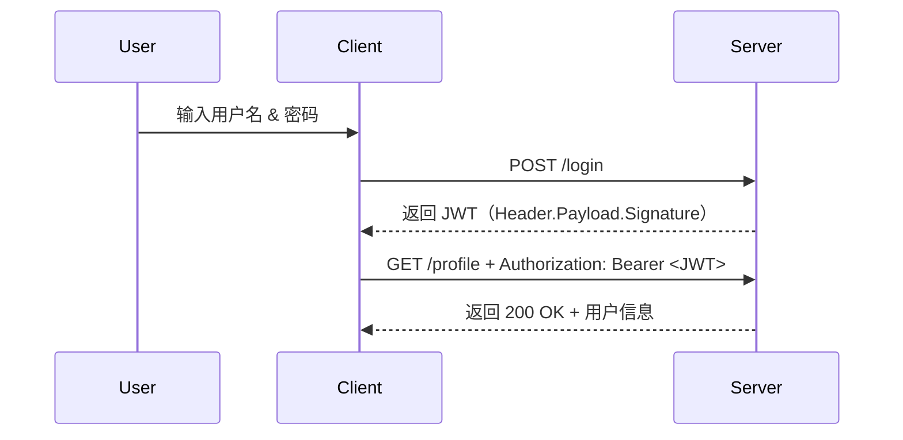
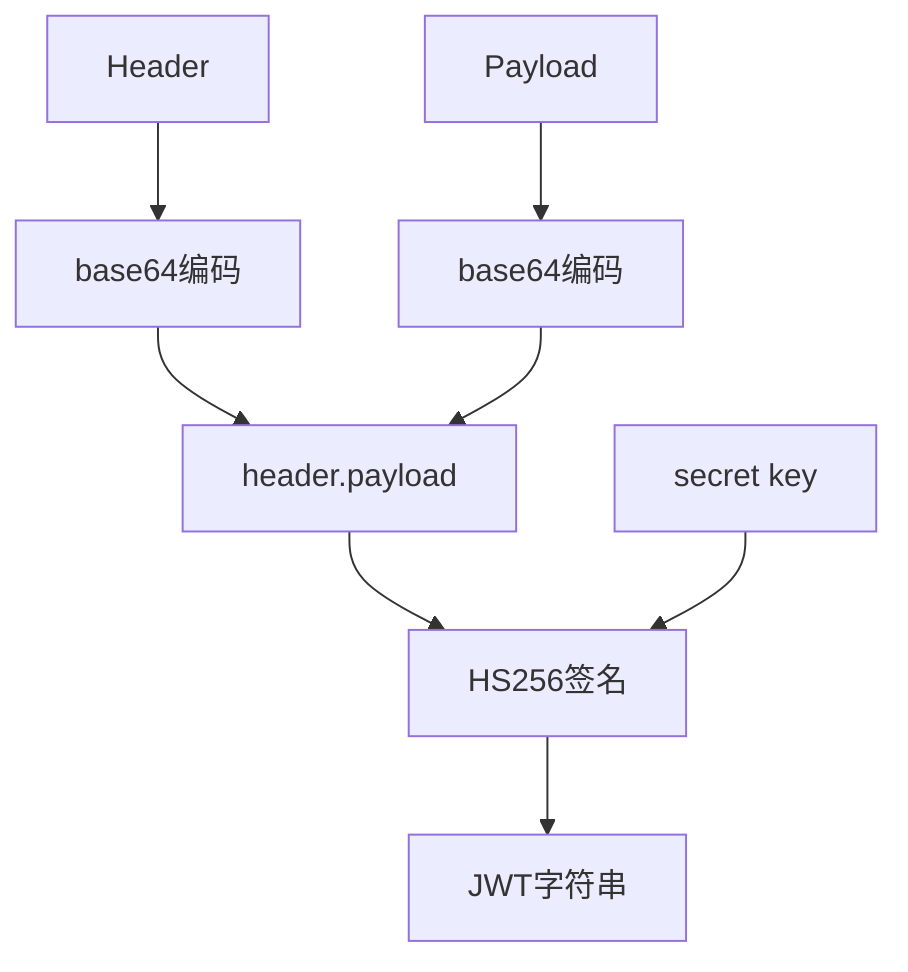
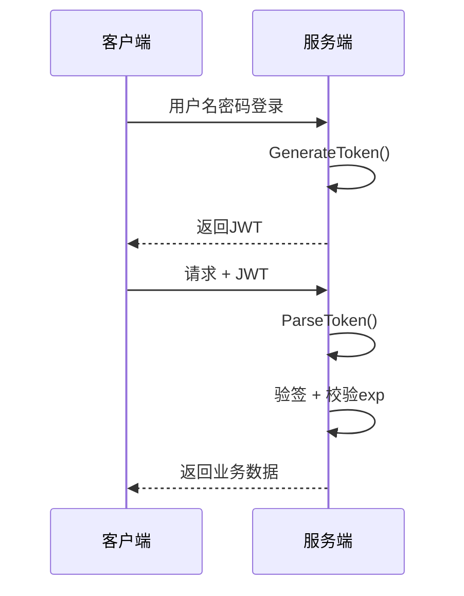
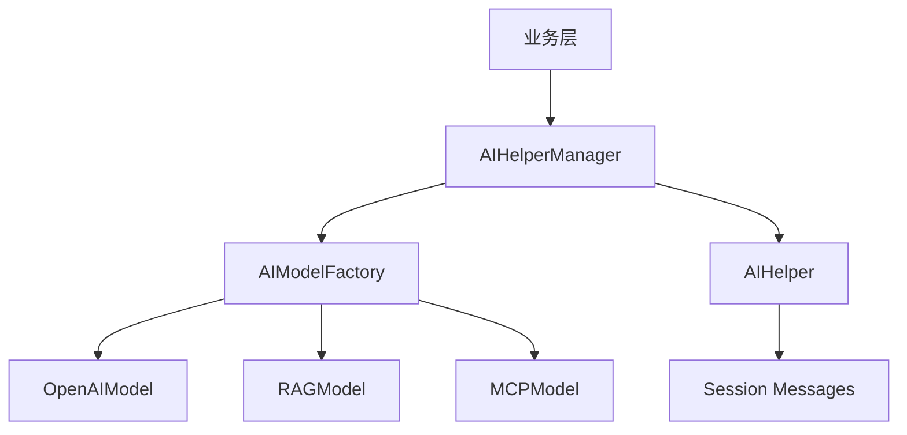
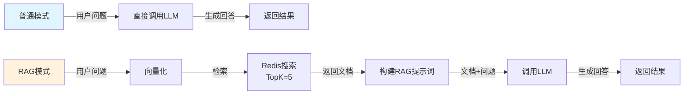
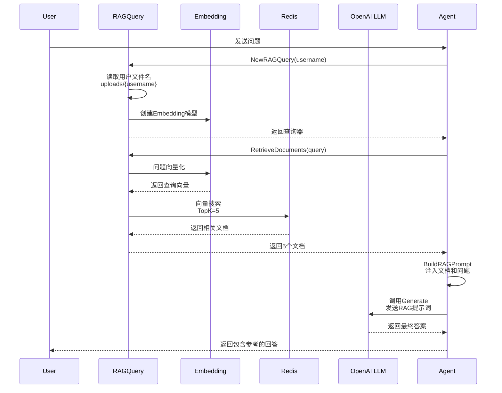
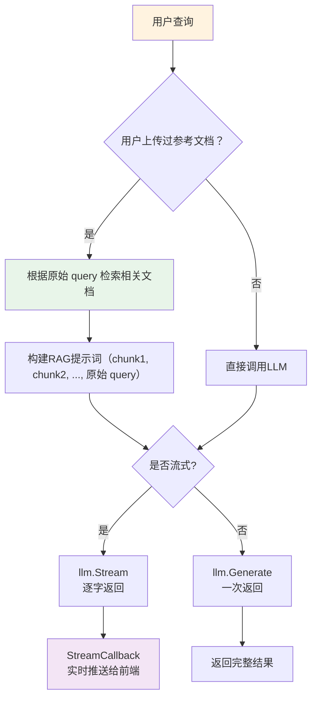
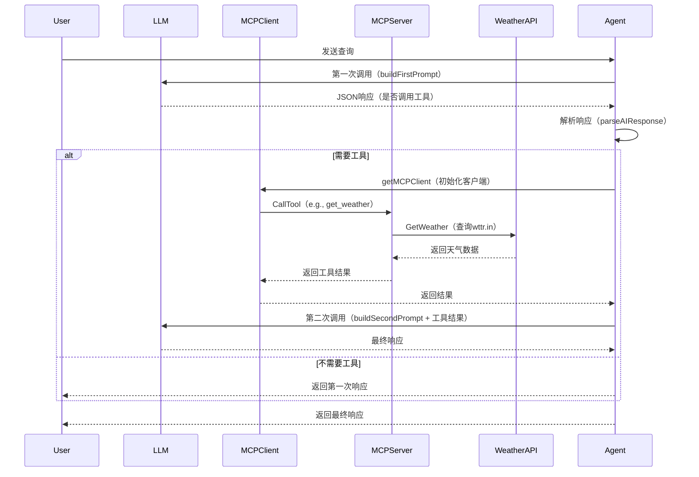

# 简历中对 GOGOAI 的描述

## 基于 Go 实现的 AI 应⽤服务平台        [Github地址](https://github.com/Tensort-cat/yuko-chat-frontend)	2026-01 - 2026-04

------

## 技术栈：Gin、GORM、Eino、RAG、MCP、Redis、MySQL、RabbitMQ、WebSocket、Vue

------

## 项⽬描述：

------

- 基于 Go 实现 AI 应⽤服务平台，使⽤ Gin 框架构建⾼性能 Web 服务

- 集成 AI 助⼿聊天、图像识别等功能，并开发 Vue 前端应⽤，⽀持⽤⼾注册登录、会话管理和多功能交互

- 聊天模式分为普通、RAG、MCP 三种模式，⽤⼾可根据需求⾃⾏选择模式

----

## 主要⼯作和难点：

- AI模型集成：通过 OpenAI API 协议调⽤腾讯混元⼤模型，实现同步和流式聊天功能，⽀持动态模型切换

- 图像识别功能：开发图像上传和识别模块，调⽤第三⽅服务处理图像数据，提供实时反馈。

- 设计模式：基于管理器模式设计 map[⽤⼾账号（唯⼀）]map[会话ID]*AIHelper* 的数据结构，使得系统的⽤⼾之间

- 环境隔离、⽤⼾⾃⾝各会话之间环境隔离

- ⽤⼾认证与会话管理：实现 JWT 令牌认证和会话管理，⽀持⽤⼾登录状态维护和权限控制

- 异步消息处理：集成 RabbitMQ 实现异步消息队列，⽀持⾼并发场景下的消息存储和消费

- ⽂本转语⾳：集成 TTS 服务，利⽤百度提供的 API 实现语⾳输出功能，⽅便特殊⼈群的使⽤

## 个⼈收获：

- AI集成实践：学习 AI 模型调⽤和流式响应处理，掌握了第三⽅ API 集成和实时数据流管理

- RAG 模块：深⼊理解向量数据库的构建与优化，掌握了知识检索与 AI 模型结合的最佳实践

- MCP 模块: 通过对 MCP 协议的学习和实践，了解了 AI 时代的⾼性能⽹络协议的设计与实现

- 模块化设计思维：采⽤⼯⼚模式和管理器模式，增强了对系统架构和代码可维护性的理解

- 安全认证实现：通过 JWT 实现⽤⼾认证，学习令牌⽣成、验证和安全存储，巩固了 Web 安全知识

-----

# Cookies 和 Session 

## 基本概念

1. Cookie：

   - **定义**：Cookie 是服务器发送到浏览器并**存储在本地**的一小段数据（键值对），用于跟踪用户状态。**Cookie** 是浏览器端的存储和传递**载体**（存Session ID或简单数据）。
   - **作用**：解决 **HTTP 无状态问题**，存储用户偏好或会话标识（如 Session ID）。
   - **工作原理**：服务器通过 **`Set-Cookie`** **响应头**下发数据，浏览器后续请求自动通过 **`Cookie`** **请求头**回传。

   

2. Session：

   - **定义**：Session 是服务器端维护的会话状态，通过唯一 ID 关联用户请求。
   - **作用**：存储敏感或临时数据（如用户登录状态），依赖 Session ID 与浏览器交互。
   - **工作原理**：服务器生成 Session ID 并通过 Cookie（如 `JSESSIONID`）下发，浏览器携带该 ID 以找回对应 Session 数据。

### Cookie 和 Session 的区别

- 如下表所示：

  | **维度**     | **Cookie**             | **Session**                    |
  | ------------ | ---------------------- | ------------------------------ |
  | **存储位置** | 浏览器端               | 服务器端                       |
  | **安全性**   | 较低（用户可篡改）     | 较高（服务端控制）             |
  | **数据类型** | 仅字符串               | 支持复杂对象（如 Java Object） |
  | **生命周期** | 可长期有效（手动设置） | 通常随会话结束失效             |
  | **性能影响** | 增加请求头大小         | 占用服务器资源                 |

  ----

## **Cookie 和 Session 的协作关系**：

- **典型场景**：
  服务器创建 Session 后，通过 `Set-Cookie: JSESSIONID=abc123carl` 下发 Session ID，浏览器后续请求携带该 Cookie 以维持会话。
- **无 Cookie 方案**：
  ① URL 重写：将 Session ID 嵌入 URL（如 `/path;jsessionid=abc123`），但安全性差。
  ② Token 替代：JWT 直接将 Session 数据编码到 Token 中，无需服务端存储。

----

## **现代架构中的演进**：

- **分布式 Session**：
  ① 问题：多服务器时 Session 如何共享？
  ② 方案：集中存储（如 Redis）+ Session ID 一致性哈希。
- **无状态设计**：
  ① 趋势：RESTful API 使用 JWT，完全摒弃服务端 Session。

----

# JWT（JSON Web Token） 概述

## 1. JWT 结构

JWT 由三部分组成：

```
Header.Payload.Signature
```

例如：

```
xxxxx.yyyyy.zzzzz
```

------

## 2. Payload 中直接存用户信息

例如：

```json
{
  "uid": 1001,
  "username": "zhangsan",
  "role": "admin",
  "exp": 1711111111
}
```

服务器不需要查 Redis。

------

## 3. JWT 工作流程



----

## 签名 & 验证流程（HS256为例）

**1. 签名生成**
令
H = Base64Url(Header)
P = Base64Url(Payload)
Secret = 服务器持有的密钥




**2. 验证流程**

1. 拆分 `Header.Payload.Signature`
2. 重新计算 `HMACSHA256(H+"."+P, Secret)`
3. 对比结果：

\- 相同：✅ 数据未被篡改
\- 不同：❌ 拒绝访问




----

## 优缺点总结

|                优点                |                缺点                |
| :--------------------------------: | :--------------------------------: |
|  无状态（Stateless），可水平扩展   |   无法即时「撤销」已签发的 Token   |
| 携带信息自包含，无需多次查询数据库 |    Token 泄露风险大，需妥善存储    |
| 支持跨域认证（适合微服务、移动端） | Payload 明文可读，敏感信息请勿存放 |

----

## JWT 与 Session 的对比

|      对比项      |     Session     |   JWT    |
| :--------------: | :-------------: | :------: |
|     状态存储     |     服务端      |  客户端  |
| 服务端是否存数据 |      需要       |  不需要  |
|    是否无状态    |       否        |    是    |
|      扩展性      |      较差       |    好    |
|    分布式支持    | 需要 Redis 共享 | 天然支持 |
|    服务端压力    |      较大       |   较小   |
|     主动失效     |      容易       |   较难   |
|      安全性      |      更高       |   略低   |
|    Token大小     |       小        |   较大   |

----

# 设计模式

## 什么是设计模式？

设计模式（Design Pattern）是前辈们对代码开发经验的总结，是解决特定问题的一系列套路。它不是语法规定，而是一套用来提高代码可复用性、可维护性、可读性、稳健性以及安全性的解决方案。

------

## 工厂模式（Factory Pattern）

工厂模式是一种创建型设计模式。

核心思想：

```text
不要在业务代码里直接 new 对象，
而是交给“工厂”统一创建。
```

这样可以：

- 解耦对象创建和对象使用
- 方便扩展
- 隐藏具体实现

------

### 一、为什么需要工厂模式

假设有：

```text
猫
狗
鸭子
```

如果业务代码里直接：

```go
dog := &Dog{}
cat := &Cat{}
```

那么：

- 代码和具体类型强耦合
- 后续新增动物时，需要修改很多地方
- 不利于扩展

于是：

```text
把“创建对象”这件事封装起来
```

这就是工厂模式。

------

## 二、简单工厂模式（最常见）

### 1. 结构

```text
接口（抽象产品）
    ↓
具体实现（具体产品）
    ↓
工厂统一创建对象
```

------

### 2. Go 示例

#### 定义接口

```go
package main

import "fmt"

type Animal interface {
	Speak()
}
```

------

#### 具体产品

```go
type Dog struct{}

func (d Dog) Speak() {
	fmt.Println("汪汪")
}

type Cat struct{}

func (c Cat) Speak() {
	fmt.Println("喵喵")
}
```

------

#### 工厂

```go
type AnimalFactory struct{}

func (f AnimalFactory) CreateAnimal(t string) Animal {
	switch t {
	case "dog":
		return Dog{}
	case "cat":
		return Cat{}
	default:
		return nil
	}
}
```

------

#### 使用

```go
func main() {
	factory := AnimalFactory{}

	dog := factory.CreateAnimal("dog")
	cat := factory.CreateAnimal("cat")

	dog.Speak()
	cat.Speak()
}
```

输出：

```text
汪汪
喵喵
```

------

### 三、工厂模式的优点

#### 1. 解耦

业务不关心对象怎么创建。

只关心：

```go
animal.Speak()
```

而不是：

```go
dog := Dog{}
```

------

### 2. 方便扩展

新增：

```text
Duck
```

只需要：

```go
case "duck":
    return Duck{}
```

------

#### 3. 隐藏实现细节

调用者只知道接口：

```go
Animal
```

不知道底层具体类型。

------

### 四、缺点

#### 工厂会越来越大

产品一多：

```go
switch ...
```

会特别长。

因此：

```text
简单工厂适合对象种类较少的场景
```

------

### 五、Go 中的典型应用

#### 1. 数据库驱动

例如：

```go
sql.Open("mysql", dsn)
sql.Open("postgres", dsn)
```

底层就是工厂思想。

------

#### 2. 日志库

根据配置创建：

```text
文件日志
控制台日志
Kafka日志
```

------

#### 3. Web 框架中间件

根据配置创建：

```text
Redis
MySQL
MongoDB
```

客户端只依赖接口。

------

### 六、面试简答版（推荐背诵）

```text
工厂模式是一种创建型设计模式。

核心思想是：
把对象创建过程封装到工厂中，
业务代码不直接 new 对象，
从而实现创建和使用解耦。

优点：
1. 解耦
2. 易扩展
3. 隐藏实现细节

缺点：
简单工厂会导致工厂类过于庞大。

Go 中常见于：
数据库驱动、日志组件、配置化对象创建等场景。
```

----

## 单例模式（Singleton Pattern）

### 1. 什么是单例模式

单例模式是一种创建型设计模式。

核心思想：

```
一个类（结构体）在整个程序运行期间只允许创建一个实例，
并提供一个全局访问入口。
```

例如：

- 数据库连接池
- Redis客户端
- 配置管理器
- 日志对象

通常都适合设计成单例。

------

### 2. 单例模式解决什么问题

避免：

```
重复创建对象
```

带来的：

- 资源浪费
- 状态不一致
- 并发问题

例如数据库连接：

```
如果每次请求都 new 一个数据库连接，
开销会非常大。
```

因此：

```
整个程序共享同一个实例
```

即可。

------

### 3. Go 单例模式实现（推荐写法）

#### 使用 `sync.Once`

这是 Go 中最标准、线程安全的单例实现。

```go
package main

import (
	"fmt"
	"sync"
)

type Singleton struct{}

var instance *Singleton
var once sync.Once

func GetInstance() *Singleton {
	once.Do(func() {
		instance = &Singleton{}
	})
	return instance
}

func main() {
	s1 := GetInstance()
	s2 := GetInstance()

	fmt.Println(s1 == s2) // true
}
```

------

### 4. sync.Once 的作用

```
once.Do(func(){})
```

保证：

```
无论多少个 goroutine 同时调用，
初始化代码都只会执行一次
```

因此：

```
天然并发安全
```

------

### 5. 单例模式特点

#### 优点

##### 节省资源

全局只创建一次对象。

------

##### 避免状态不一致

多个地方共享同一份数据。

------

##### 并发安全（配合 sync.Once）

适合高并发场景。

------

#### 缺点

##### 全局状态过多

容易导致：

```
模块耦合严重
```

------

##### 不利于测试

因为对象是全局共享的：

```
mock 不方便
```

------

### 6. 单例模式使用场景

常见于：

|     场景     |       原因       |
| :----------: | :--------------: |
| 数据库连接池 |    创建成本高    |
| Redis客户端  |   需要全局共享   |
|   配置中心   |   全局统一配置   |
|   日志系统   | 避免重复打开文件 |
| Goroutine 池 |   统一调度资源   |

------

### 7. 面试常问问题

#### 为什么单例模式需要加锁？

因为：

```
多个 goroutine 可能同时创建实例
```

导致：

```
创建出多个对象
```

------

#### 为什么推荐 sync.Once？

因为：

- 官方实现
- 并发安全
- 性能好
- 代码简洁

------

### 8. 一句话总结

```
单例模式 = 一个对象全局唯一 + 提供全局访问入口
```

Go 中通常使用：

```
sync.Once
```

实现线程安全单例。

----

## 管理器（Manager）模式

“**管理器模式**”不是23 种经典设计模式中的标准名称，但在实际开发中非常常见。它通常指一种**由一个管理器对象统一负责某类资源、对象或任务的创建、查询、更新、删除、调度与生命周期控制**的写法。

----

### 一个简单例子：任务管理器 `TaskManager`

假设你有一个系统，要管理很多任务：

- 创建任务
- 查询任务
- 列出所有任务
- 更新任务状态
- 删除任务

如果这些逻辑散落在各个地方，代码会越来越乱。
更好的做法是把这些职责收进一个 `TaskManager` 里。

下面是一个完整的 Go 示例。

```go
package main

import (
	"errors"
	"fmt"
	"sync"
	"sync/atomic"
	"time"
)

type TaskStatus string

const (
	TaskPending   TaskStatus = "pending"
	TaskRunning   TaskStatus = "running"
	TaskCompleted TaskStatus = "completed"
	TaskFailed    TaskStatus = "failed"
)

type Task struct {
	ID         string
	Name       string
	Status     TaskStatus
	CreatedAt  time.Time
	UpdatedAt  time.Time
}

type TaskManager struct {
	mu    sync.RWMutex
	tasks map[string]*Task
	seq   uint64
}

func NewTaskManager() *TaskManager {
	return &TaskManager{
		tasks: make(map[string]*Task),
	}
}

// CreateTask 创建一个新任务
func (m *TaskManager) CreateTask(name string) *Task {
	id := atomic.AddUint64(&m.seq, 1)
	now := time.Now()

	task := &Task{
		ID:        fmt.Sprintf("task-%d", id),
		Name:      name,
		Status:    TaskPending,
		CreatedAt: now,
		UpdatedAt: now,
	}

	m.mu.Lock()
	defer m.mu.Unlock()
	m.tasks[task.ID] = task
	return task
}

// GetTask 根据 ID 获取任务
func (m *TaskManager) GetTask(id string) (*Task, error) {
	m.mu.RLock()
	defer m.mu.RUnlock()

	task, ok := m.tasks[id]
	if !ok {
		return nil, errors.New("task not found")
	}

	// 返回副本，避免外部直接修改内部对象
	copyTask := *task
	return &copyTask, nil
}

// ListTasks 返回所有任务
func (m *TaskManager) ListTasks() []*Task {
	m.mu.RLock()
	defer m.mu.RUnlock()

	result := make([]*Task, 0, len(m.tasks))
	for _, task := range m.tasks {
		copyTask := *task
		result = append(result, &copyTask)
	}
	return result
}

// StartTask 将任务状态改为 running
func (m *TaskManager) StartTask(id string) error {
	return m.updateStatus(id, TaskRunning)
}

// CompleteTask 将任务状态改为 completed
func (m *TaskManager) CompleteTask(id string) error {
	return m.updateStatus(id, TaskCompleted)
}

// FailTask 将任务状态改为 failed
func (m *TaskManager) FailTask(id string) error {
	return m.updateStatus(id, TaskFailed)
}

// DeleteTask 删除任务
func (m *TaskManager) DeleteTask(id string) error {
	m.mu.Lock()
	defer m.mu.Unlock()

	if _, ok := m.tasks[id]; !ok {
		return errors.New("task not found")
	}

	delete(m.tasks, id)
	return nil
}

func (m *TaskManager) updateStatus(id string, status TaskStatus) error {
	m.mu.Lock()
	defer m.mu.Unlock()

	task, ok := m.tasks[id]
	if !ok {
		return errors.New("task not found")
	}

	task.Status = status
	task.UpdatedAt = time.Now()
	return nil
}

func main() {
	manager := NewTaskManager()

	t1 := manager.CreateTask("import user data")
	t2 := manager.CreateTask("generate report")

	_ = manager.StartTask(t1.ID)
	_ = manager.CompleteTask(t1.ID)
	_ = manager.FailTask(t2.ID)

	task, _ := manager.GetTask(t1.ID)
	fmt.Println("single task:", task.ID, task.Name, task.Status)

	fmt.Println("\nall tasks:")
	for _, t := range manager.ListTasks() {
		fmt.Printf("%s | %s | %s | created=%s\n",
			t.ID, t.Name, t.Status, t.CreatedAt.Format(time.RFC3339))
	}
}
```

------

#### 这个例子里，管理器到底做了什么

你可以把 `TaskManager` 看成一个“任务控制中心”。

它负责的不是“任务本身如何执行”，而是：

1. 保存任务
   - 用 `map` 统一管理所有任务
2. 保证线程安全
   - 用 `sync.RWMutex` 保护并发访问
3. 统一分配 ID
   - 外部不需要自己生成任务编号
4. 统一状态变更
   - 所有状态流转都走 `StartTask / CompleteTask / FailTask`
5. 隐藏内部实现
   - 外部只关心“创建、查询、修改、删除”
   - 不直接操作底层 map

这就是管理器模式最核心的价值：
 **把“管理规则”集中到一个地方，减少散乱和重复。**

------

### 为什么这种写法有用

如果没有管理器，你可能会在很多地方直接写：

- `map[string]*Task`
- `mutex`
- `status` 修改逻辑
- ID 生成逻辑
- 任务存在性检查

时间一长，就会出现：

- 重复代码多
- 状态流转不统一
- 并发安全难维护
- 业务规则分散，难以排查问题

而管理器把这些逻辑收拢后，代码会变成：

- 外部调用简单
- 规则集中
- 更容易测试
- 更容易扩展

------

### 什么时候适合用管理器模式

适合这类场景：

- 一类对象数量很多，需要统一维护
- 有明确生命周期的资源，比如连接、会话、任务、缓存条目
- 多处都要访问同一批对象
- 状态变化需要统一校验
- 需要线程安全控制

不太适合这类场景：

- 只是一个很轻量的小对象
- 没有统一管理需求
- 逻辑很简单，硬塞一个 Manager 反而显得臃肿

----

## GOGOAI 中是如何运用这些设计模式的

### 一、工厂模式在 GOGOAI 中的应用

GOGOAI 中最典型的工厂模式体现在：`AIModelFactory`

```go
// ModelCreator 定义模型创建函数类型（需要 context）
type ModelCreator func(ctx context.Context, config map[string]any) (AIModel, error)

// AIModelFactory AI模型工厂
type AIModelFactory struct {
	creators map[string]ModelCreator
}

var (
	globalFactory *AIModelFactory
	factoryOnce   sync.Once
)
```

它负责：

```text
根据不同模型类型，动态创建不同 AI 模型
```

例如项目中支持：

- OpenAI
- RAG 模型
- MCP 模型
- Ollama

对应代码：

```go
f.creators["1"] = func(...) {
    return NewOpenAIModel(ctx)
}

f.creators["2"] = func(...) {
    return NewAliRAGModel(ctx, username)
}

f.creators["3"] = func(...) {
    return NewMCPModel(ctx, username)
}
```

------

### 为什么这里适合用工厂模式

因为：

```text
不同 AI 模型的初始化逻辑差异很大
```

例如：

- OpenAI 只需要 ctx
- RAG 需要 username
- MCP 需要额外服务
- Ollama 需要 modelName 和 baseURL

如果业务层直接：

```go
NewOpenAIModel(...)
NewAliRAGModel(...)
```

会导致：

```text
业务代码与具体模型强耦合
```

后续新增模型时：

```text
很多地方都需要修改
```

------

### 工厂模式在项目中的核心价值

#### 1. 解耦模型创建与使用

业务层只需要：

```go
factory.CreateAIModel(...)
```

不需要关心：

```text
底层到底是 OpenAI 还是 RAG
```

------

#### 2. 支持模型扩展

新增模型时：

```go
RegisterModel(...)
```

即可完成扩展。

原有业务代码几乎不需要修改。

------

#### 3. 隐藏复杂初始化逻辑

例如：

```text
MCP 模型需要连接 MCP 服务
RAG 模型需要用户知识库
```

这些初始化细节都封装在工厂内部。

------

### CreateAIHelper 的设计

项目里还有：

```go
CreateAIHelper(...)
```

它实际上是：

```text
工厂 + 组合对象创建
```

不仅创建模型：

```go
AIModel
```

还进一步创建：

```go
AIHelper
```

属于一种：

```text
更高级的工厂封装
```

业务层直接：

```go
helper, _ := factory.CreateAIHelper(...)
```

即可拿到完整 AI 助手。

------

### 面试可回答

```text
在 GOGOAI 中，我使用工厂模式统一管理 AI 模型创建。

因为不同模型（OpenAI、RAG、MCP、Ollama）初始化逻辑差异较大，
如果业务层直接 new 对象，会导致代码强耦合。

因此我设计了 AIModelFactory：

1. 用 creators 保存不同模型创建函数
2. 根据 modelType 动态创建模型
3. 对外统一暴露 CreateAIModel 和 CreateAIHelper

这样业务层只依赖 AIModel 接口，
不依赖具体实现。

后续新增模型时，
只需要注册新的 creator 即可，
扩展性很好。
```

------

## 二、单例模式在 GOGOAI 中的应用

项目中的单例模式主要体现在：

```go
GetGlobalFactory()
GetGlobalManager()
```

分别对应：

- 全局 AIModelFactory
- 全局 AIHelperManager

------

### AIModelFactory 单例

代码：

```go
var (
    globalFactory *AIModelFactory
    factoryOnce   sync.Once
)

func GetGlobalFactory() *AIModelFactory {
    factoryOnce.Do(func() {
        globalFactory = &AIModelFactory{
            creators: make(map[string]ModelCreator),
        }
        globalFactory.registerCreators()
    })
    return globalFactory
}
```


这里使用：

```go
sync.Once
```

保证：

```text
整个系统只会创建一个 AIModelFactory
```

------

### 为什么工厂要做成单例

因为：

```text
工厂本质上属于全局配置中心
```

它维护：

```go
creators map[string]ModelCreator
```

如果多个地方重复创建工厂：

可能导致：

- 模型注册不一致
- creator 丢失
- 配置混乱

因此：

```text
整个系统共享一个工厂实例
```

最合理。

------

### AIHelperManager 单例

代码：

```go
var globalManager *AIHelperManager
var once sync.Once

func GetGlobalManager() *AIHelperManager {
    once.Do(func() {
        globalManager = NewAIHelperManager()
    })
    return globalManager
}
```

它保证：

```text
整个系统只有一个 AI 会话管理中心
```

------

### 为什么 Manager 要做成单例

因为它维护：

```go
map[用户名]map[SessionID]*AIHelper
```

如果存在多个 Manager：

会导致：

```text
同一个用户会话被分散管理
```

从而出现：

- 上下文丢失
- 会话错乱
- 状态不一致

因此：

```text
必须全局唯一
```

------

### sync.Once 的作用

项目中采用：

```go
sync.Once
```

而不是普通加锁。

因为：

```text
sync.Once 能保证初始化逻辑只执行一次
```

即使：

```text
多个 goroutine 并发调用
```

也不会重复创建实例。

这是 Go 中最标准的单例实现方式。 ([Go Patterns](https://golangpatterns.com/patterns/singleton/?utm_source=chatgpt.com))

------

### 面试可回答

```text
GOGOAI 中我将 AIModelFactory 和 AIHelperManager 都设计成了单例。

因为它们本质上属于全局资源管理组件：

1. Factory 负责维护所有模型 creator
2. Manager 负责维护所有用户会话

如果重复创建，会导致状态不一致。

因此我使用 sync.Once + 全局变量实现线程安全单例，
保证整个系统生命周期内只有一个实例。
```

------

## 三、管理器（Manager）模式在 GOGOAI 中的应用

项目中最核心的管理器模式是：

```go
AIHelperManager
```

它负责：

```text
统一管理 用户 -> 会话 -> AIHelper
```

关系。

结构：

```go
helpers map[string]map[string]*AIHelper
```

即：

```text
map[用户名][会话ID]AIHelper
```

------

### AIHelperManager 负责什么

它并不负责：

```text
AI 如何回答问题
```

而是负责：

```text
AIHelper 的生命周期管理
```

包括：

- 创建
- 查询
- 删除
- 会话维护
- 用户隔离
- 并发安全

这就是典型 Manager 模式。

------

### GetOrCreateAIHelper

这是整个管理器最核心的方法：

```go
GetOrCreateAIHelper(...)
```

它实现：

```text
如果会话存在 -> 直接返回
如果不存在 -> 自动创建
```

作用类似：

```text
会话缓存中心
```

------

### 为什么这里需要 Manager

因为 AI 对话系统存在：

```text
“会话上下文”
```

每个用户：

- 可以有多个 session
- 每个 session 都有独立消息历史
- 每个 session 都对应一个 AIHelper

如果没有统一 Manager：

业务层到处都要维护：

```go
map
mutex
session
helper
```

会导致：

- 状态混乱
- 上下文丢失
- 并发不安全
- 逻辑分散

因此：

```text
统一交给 AIHelperManager 管理
```

------

### Manager 中的并发安全

项目中使用：

```go
sync.RWMutex
```

保证：

```text
多个用户同时访问 session 时线程安全
```

例如：

- 创建会话
- 查询 helper
- 删除 session

都需要加锁。

------

### AIHelper 本身也是“会话对象”

AIHelper 中维护：

```go
messages []*model.Message
```

它实际上代表：

```text
一个 AI 会话上下文
```

并且内部也使用：

```go
sync.RWMutex
```

保护消息历史。

因此整个系统形成了：

```text
Manager 管理多个 Helper
Helper 管理单个 Session 的上下文
```

属于一种：

```text
分层管理结构
```

------

### Manager + Factory 的组合

项目中实际上是：

```text
Manager 负责“管理”
Factory 负责“创建”
```

例如：

```go
factory := GetGlobalFactory()

helper, err := factory.CreateAIHelper(...)
```

说明：

```text
Manager 不直接 new 对象
而是把创建职责交给 Factory
```

这是非常典型的：

```text
多设计模式协作
```

------

### 面试可回答

```text
GOGOAI 中我设计了 AIHelperManager 作为会话管理中心。

它统一维护：

map[用户名][SessionID]*AIHelper

每个 AIHelper 对应一个独立会话上下文。

Manager 负责：

1. 获取/创建会话
2. 管理会话生命周期
3. 用户隔离
4. 会话缓存
5. 并发安全

其中：

- Manager 负责管理
- Factory 负责创建
- AIHelper 负责维护单个 session 的上下文

整体形成了一套比较清晰的分层结构。
```

------

## 四、项目中这三种设计模式之间的关系

GOGOAI 中：

```text
Factory -> 负责创建对象
Manager -> 负责管理对象
Singleton -> 保证全局唯一
```

整体结构可以理解为：



其中：

```text
Factory 解决“怎么创建”
Manager 解决“怎么管理”
Singleton 解决“全局唯一”
```

这是项目里比较完整的一套工程化设计。

----

# 大模型应用开发

## 大模型应用的三层架构

### 第一层：模型

Claude Opus、Claude Sonnet、GPT-5-Codex、Cursor 家的 Composer——这些是模型。

**你可以把模型想成一个纯函数：给输入，返回输出。** 当然，现在的模型（Claude、GPT-5 这些）本身也有 tool use 能力——模型可以决定"我要读这个文件""我要跑这个命令"。但模型只是**发出指令**，真正去执行这些指令、把结果喂回来、再让模型继续推理，这个循环不在模型里。

模型的能力边界很清楚：**一次推理，输入一段文本，输出一段文本（可能包含工具调用指令）。** 你完全可以通过 API 直接调模型——发请求、拿响应、自己处理。很多人早期用 Claude 写代码就是这么干的：把代码贴进 API 请求，让它返回修改后的代码，然后自己复制出来。

但这样用很低效。模型要改三个文件，你就得贴三次、复制三次。模型说"我要跑一下测试"，它自己跑不了——得有人去执行这个命令，把结果贴回来，它才能继续。

这种"读文件 → 推理 → 写文件 → 跑工具 → 再推理"的循环，就是 agent loop。**模型负责决定做什么，内核负责执行和编排循环。** 这两层有重叠，不是完全解耦的——后面会讲到。


----

### 第二层：Agent 内核

**它决定了"拿到模型输出之后，怎么把它变成实际动作"。**

具体做的事：解析模型输出里的工具调用指令、实际执行这些工具（读文件、改文件、跑 shell 命令、搜代码）、把工具结果喂回给模型、管理上下文窗口的增长、判断任务什么时候算完成、处理出错和重试。

Claude Code 有自己的 agent 内核，Codex 有自己的，Cursor 有自己的。**这些内核设计上的差异，很多时候比模型本身的差异更影响体验。**

举个例子。Cursor 的 Composer 模型专门训练了"自总结"能力——上下文快满的时候模型会自己总结、压缩、继续干活。这听起来是模型的事，但要真正生效，agent 内核必须配合：在上下文触到某个阈值时暂停、提示模型总结、用压缩后的上下文继续循环。**模型和内核是共同设计出来的。**

认识到这一层的存在以后，很多现象就能解释了。

为什么同一个 Claude 模型，在 Claude.ai 网页聊天和在 Claude Code CLI 里用起来感觉完全不同？因为网页聊天的 agent 内核很轻——大概就能调用几个工具，循环也很短。Claude Code CLI 的内核复杂得多——完整的工具集、深度的循环、project 级的上下文管理、skills 和 subagents。**模型是同一个，内核不是。**

这也是为什么开头我说，同样的模型在对话框里和 CLI 里差别那么大——**不是模型变了，是 agent 内核不一样。**

更有意思的是反过来。**同一个 agent 内核，可以在多种外壳里跑。** Claude Code 的内核在 CLI、VS Code 插件、JetBrains 插件、桌面 app、网页云端、手机 app 里都是同一套，只是外面包的交互不同。所以你从 CLI 切到 IDE 插件时不会觉得在"重新学一个工具"——它们本来就是一个工具。


----

### 第三层：外壳

外壳是用户真正看到和摸到的那一层：CLI、桌面 app、网页、IDE 插件、手机端。它的任务是把 agent 内核的执行过程"翻译"成人类可感知的形式。

听起来好像是最没技术含量的一层，其实不是。**外壳决定了太多东西：** diff 怎么展示、工具输出怎么折叠、多任务怎么切换、流式输出怎么呈现、中断怎么处理。同一个 agent 内核，在不同外壳里的使用体验可能天差地别。

而且好的外壳不只是"翻译"，有些外壳会**反哺内核的能力**。比如 Cursor 编辑器外壳集成了 codebase 语义索引，这个索引能力直接影响 agent 内核搜代码的质量——外壳和内核的边界也没那么清晰。

以 Claude Code 为例。CLI 外壳给你的是一个文本流——看到什么就是模型看到什么，很原始、很直接。IDE 插件外壳把改动变成可审阅的 diff，还带行内建议。桌面 app 外壳把 agent 能力和聊天能力融在一起，让你可以一边闲聊一边派活。云端 Web 外壳则把整个 agent 运行环境托管到服务器上，你关掉电脑它也能继续跑。


----

## 什么是 Token

### Token 简述

**Token 是大模型计费的基本单位。** 你不是按"字"付费，也不是按"行"付费，而是按 token 付费。

那 token 和汉字是什么关系？

### 英文的 token

英文比较直观：**大约 1 个英文单词 = 1 个 token**。

```text
"Hello world"        → 2 tokens
"I love programming" → 3 tokens
```

短单词可能 1 个单词 = 1 token，长单词可能被拆成多个 token。比如 "unbelievable" 可能被拆成 "un" + "believ" + "able" = 3 tokens。

### 中文的 token

中文不是按"字"切分的，是按词频和组合切分的。**常见字通常 1 个字 = 1 个 token，生僻字或特殊组合可能 1 个字 = 2-3 个 token。**

实际测试结果（以 GLM/GPT 系列的 tokenizer 为例）：

| 内容                         | 字数            | Token 数   | 比例                      |
| ---------------------------- | --------------- | ---------- | ------------------------- |
| "你好世界"                   | 4 字            | ~4 tokens  | ~1 token/字               |
| "今天天气不错，适合出去散步" | 12 字（含标点） | ~12 tokens | ~1 token/字               |
| "RAG系统中的混合检索策略"    | 12 字           | ~14 tokens | ~1.2 token/字（中英混合） |
| "中华人民共和国国务院"       | 9 字            | ~5 tokens  | 专有名词可能合并          |

### 标点符号占几个 token？

**1 个标点 = 1 个 token**，和汉字一样。

```text
"，" → 1 token
"。" → 1 token
"！" → 1 token
```

但如果是连续标点或特殊符号，可能不一样：

```text
"..."  → 1 token（三个点被合并）
"。。。"→ 3 tokens（中文句号逐个计算）
```

### 代码的 token

代码的 token 化比较特殊，缩进、括号、关键字都算：

```python
def hello():
    print("hi")
```

这段代码大约 10-12 tokens：`def`、`hello`、`(`、`)`、`:`、`print`、`(`、`"`、`hi`、`"`、`)`……每个符号和关键字都算。

### 快速估算公式

**中文场景：1 个汉字 ≈ 1-1.5 个 token**

日常文本按 1:1 估算就够用，中英混合或专业术语多的文本按 1:1.5 估算更准。

**总之，大家可以这么记：1000 个汉字大概 1000-1500 个 token。**

----

### 一般计费方式

我们以 [GLM-5.1 (opens new window)](https://www.bigmodel.cn/invite?icode=h5645fTH07PKdN0cj%2FTnKmczbXFgPRGIalpycrEwJ28%3D)为例，给大家拆解一下，各个指标以及费用（下面在和 gpt、opus做对比）


### 输入单价（每百万 tokens）

| 上下文长度        | 价格 |
| ----------------- | ---- |
| 0 ~ 32K tokens    | ¥6   |
| 32K tokens 及以上 | ¥8   |

### 输出单价（每百万 tokens）

| 上下文长度        | 价格 |
| ----------------- | ---- |
| 0 ~ 32K tokens    | ¥24  |
| 32K tokens 及以上 | ¥28  |

### 缓存相关

| 项目                             | 价格              |
| -------------------------------- | ----------------- |
| 缓存存储（每百万 tokens / 小时） | 限时免费          |
| 缓存命中（0~32K）                | ¥1.3 / 百万tokens |
| 缓存命中（32K+）                 | ¥2 / 百万tokens   |

看到这个表，你可能有两个疑问：**为什么输入和输出价格差这么多？为什么上下文越长越贵？** 下面逐个讲。

------

## 3. 输入和输出为什么价格不一样？

[GLM-5.1 (opens new window)](https://www.bigmodel.cn/invite?icode=h5645fTH07PKdN0cj%2FTnKmczbXFgPRGIalpycrEwJ28%3D)的输出价格是输入的 **4 倍**。这不是智谱故意坑你，是输出确实比输入费算力。

**输入是"读"**——模型把你的 prompt 过一遍，计算出每一层的表示，这就完了。相当于看一篇文章，看完了就有印象了。

**输出是"写"**——模型每生成一个 token，都要把整个上下文重新算一遍（从第一个字到最后生成的字），才能决定下一个字是什么。生成 1000 个输出 token，相当于把整个输入重新算了 1000 遍。

```text
输入 1000 tokens：算 1 遍
输出 1000 tokens：算 1000 遍
```

所以输出贵 4 倍，不是 1000 倍，是因为有 KV Cache 优化——模型把输入部分算过的结果缓存起来了，不用从头重算，但输出部分还是要逐 token 生成，计算量依然远大于输入。

**面试可能会问**：为什么输出比输入贵？——答案就是上面说的，输出是自回归生成，每步都要重新计算，输入只需要前向传播一次。

------

## 4. 上下文长度为什么影响价格？

32K 以下输入单价 ¥6，32K 以上 ¥8，涨了 33%。为什么？

**Transformer 的注意力机制，计算量和序列长度的平方成正比。**

```text
输入 1K tokens → 计算量 ∝ 1K² = 100万
输入 32K tokens → 计算量 ∝ 32K² = 10.24亿
输入 128K tokens → 计算量 ∝ 128K² = 1638.4亿
```

从 1K 到 32K，计算量不是 32 倍，是 **1024 倍**。

所以长上下文的单价更高，是在覆盖额外的计算成本。这不是智谱一家这么干，所有大模型厂商的长上下文定价都比短上下文贵，原因都一样。

----

### 缓存机制

### 什么时候用得上缓存？

**RAG 系统**是最典型的场景。

RAG 系统每次请求的 prompt 长这样：

```text
[系统提示词] + [检索到的文档] + [用户问题]
```

其中系统提示词每次都一样，检索到的文档大部分时候也差不多（同一个知识库，文档更新不频繁）。唯一变的就是用户的提问。

如果不缓存，每次请求都要把整个 prompt 从头算一遍，系统提示词和文档部分明明每次都一样，却重复计算，白花钱。

### 缓存存储 = 把算过的结果存下来

**缓存存储**就是把模型对输入的计算结果（KV Cache）存到磁盘上，下次请求如果输入前面部分一样，直接复用，不用重新算。

当前限时免费，存储本身不花钱。

### 缓存命中 = 复用了存下来的结果

**缓存命中**就是新请求的输入前缀和之前缓存的完全一致，这部分 token 按更低的价格计费：

|                  | 正常输入价格    | 缓存命中价格      | 省了多少 |
| ---------------- | --------------- | ----------------- | -------- |
| 短上下文（<32K） | ¥6 / 百万tokens | ¥1.3 / 百万tokens | **78%**  |
| 长上下文（≥32K） | ¥8 / 百万tokens | ¥2 / 百万tokens   | **75%**  |

省 3/4 的钱，效果非常明显。

### 举个例子


你做了一个 RAG 系统，每次请求的 prompt 组成：

```text
系统提示词：1000 tokens（每次一样）
检索文档：8000 tokens（大部分时候一样）
用户问题：200 tokens（每次不同）
模型输出：1000 tokens
```

**不用缓存：**

```text
输入费用 = (1000 + 8000 + 200) ÷ 1,000,000 × ¥6 = ¥0.0552
输出费用 = 1000 ÷ 1,000,000 × ¥24 = ¥0.024
总费用 = ¥0.0792
```

**用缓存（9000 tokens 命中）：**

```text
缓存命中费用 = 9000 ÷ 1,000,000 × ¥1.3 = ¥0.0117
正常输入费用 = 200 ÷ 1,000,000 × ¥6 = ¥0.0012
输出费用 = 1000 ÷ 1,000,000 × ¥24 = ¥0.024
总费用 = ¥0.0369
```

**省了 53%**。请求量越大省得越多，一天 10 万次请求的话，一个月能省几千块。

----

# 大模型应用的业务全景图


----

# 同步、异步与流式输出

## 同步调用

最直观的方式。你发出请求，然后程序挂起等待，直到模型把完整内容全部生成完毕，才把结果一次性返回给你。

（你去奶茶店点了一杯奶茶，点单后没有离开，而是站在柜台前一直等待，直到店员做好奶茶、递给你，你才转身离开。这个过程中，你（客户端）的所有动作都被“等待奶茶”阻塞了——不能去做其他事，只能等。）

它的优点在于逻辑简单，代码好写，调试方便。但在模型生成期间，调用方什么都做不了。如果模型需要10秒才能生成完一篇文章，调用方就得等10秒。适合内部脚本、批处理任务、测试和原型阶段、对实时性没有要求的后台任务。

----

## 异步调用

异步的核心思路是：把**提交任务**和**拿结果**分开来做。

比如你提交了一个生成任务，系统立刻返回一个任务ID（"你的单号是 XX，已受理"），接下来你的程序不用等着，可以继续做别的事。过一段时间，你再去查询这个ID对应的任务有没有完成，或者系统主动回调通知你。

（你去奶茶店点单后，店员给你一个取号器，告诉你“做好了会叫号”，你可以拿着取号器去旁边坐着刷手机、做其他事，不用一直站在柜台前等；等取号器响了，你再去柜台拿奶茶。）

适用任务耗时长，不希望占用请求线程，可以接受延迟交付结果的场景。

> ⚠️ **常见误区：** 很多人以为"异步"就等于"更快"。并不是。异步解决的是**资源利用率**的问题（让程序不用傻等），而不是让模型生成更快。首字延迟和总耗时，异步并不比同步短。

------

## 流式输出（Streaming）

流式才是今天大部分对话类 AI 产品背后真正在用的方式。

它的原理是：模型**生成一个 token，就立刻发送一个 token**，不等全部生成完才返回。客户端收到第一个 token 后，就可以开始渲染展示，用户会看到文字一个字一个字地"打印"出来。

（你去奶茶店点了一杯奶茶，店员没有等完全做好再递给你，而是边做边给你：先把空杯子递给你，再倒入茶汤，最后加入珍珠、奶盖，每一步都实时反馈给你，你能全程看到奶茶的制作过程，不用等到最后才拿到完整的奶茶。）

这不是前端的"打字机动画特效"，而是真实的数据流。后端在持续往前端推数据，前端在持续渲染。

技术上，流式输出依赖的是**SSE（Server-Sent Events）**。


----

## 面试可能怎么问？

*Q：你们的产品为什么要用流式输出，而不是等生成完再返回？*

参考思路：从用户体验角度切入——流式可以大幅降低 TTFT（首 token 延迟），用户不需要等待完整内容就能开始阅读，主观上感受到系统响应很快。同时流式允许用户提前打断不合适的输出，提升交互效率。

*Q：流式输出的技术原理是什么？*

参考思路：大模型是自回归生成的，每次生成一个token，流式就是利用HTTP的分块传输（chunked transfer）或SSE（Server-Sent Events）机制，将每个token生成后立刻推送给客户端，而不是缓冲全部结果再一次性发送。

*Q：什么场景下不该用流式？*

参考思路：当下游逻辑依赖完整输出时，比如需要做JSON解析、结构化提取、或者把完整文本存入数据库，流式反而引入额外复杂度，这时同步调用更合适。

Q: SSE是建立在TCP之上的，TCP本身也是流式传输，也有长连接，为什么还要用SSE而不是直接用TCP？（分层回答）

- SSE 和 TCP 不是同一层的东西

  TCP 是传输层协议，它只负责：

  ```
  可靠传输、流量控制、重传、长连接
  ```

  本质上 TCP 提供的是：

  ```
  可靠字节流
  ```

  但它并不关心：

  - 消息怎么组织
  - 浏览器怎么消费
  - 如何自动重连
  - 如何做事件回调

  这些都是应用层需要解决的问题。

  而 SSE（Server-Sent Events）是：

  ```
  基于 HTTP/TCP 的 应用层 服务器推送协议
  ```

  它主要解决的是：

  ```
  浏览器如何以标准化方式持续接收服务端事件
  ```

  ------

  并且浏览器其实不能直接操作 TCP Socket。

  前端 JS 里没有类似 `new TCPConnection()` 的接口

  浏览器只允许：

  - HTTP
  - WebSocket
  - SSE
  - WebRTC

  这些安全协议。

  所以 Web 场景下，如果想做服务端推送，就必须基于这些协议

- 浏览器原生支持事件流

  前端只需要：

  ```javascript
  const es = new EventSource("/sse")
  ```

  就能持续接收服务端消息。

  浏览器还帮你实现了：

  - 自动重连
  - 事件解析
  - 长连接维护

- 裸用 TCP 实现流式输出非常困难，需要自己实现：

  1. 消息边界
  2. 重连
  3. 协议解析等

  复杂度非常高，而直接在应用层使用基于 HTTP 的SSE，部署成本很低

----

# Function Calling

## 什么是 Tool / Function

在大模型应用的语境下，**Tool（工具）** 或 **Function（函数）**，本质上是**一段预先定义好的代码逻辑**，大模型本身并不执行它，而是**告诉应用程序该执行哪段代码**。

Function Calling即调用外部函数。

我们知道大模型是在一个巨大的静态数据集上训练的。知识、能力、精确性都有局限性。如deepseekR1在2025年发布时，其训练数据截止于2023年12月，单从数据来看，再聪明的模型肯定不知道未来发生了什么。

Function Calling就是给这个聪明的“大脑”配备了“手”和“脚”，让它能够与外部世界互动，从而克服上述局限性。

----

## 和普通问答的区别

|     维度     | 普通问答 (Chat Completion)  |            Function Calling (Tool Use)             |
| :----------: | :-------------------------: | :------------------------------------------------: |
| **输出内容** |       纯自然语言文本        | **结构化数据** (JSON/Object)，明确指定函数名和参数 |
| **知识来源** | 仅依赖训练数据 (截止训练日) |          **实时外部数据** (通过工具获取)           |
|  **准确性**  |     容易幻觉 (瞎编数据)     |          **高可信度** (基于真实 API 返回)          |
| **执行动作** |   无法执行动作，只能“说”    |       可以**触发行动** (下单、发邮件、查库)        |
|  **可控性**  |    输出格式难以严格约束     |      输出格式**严格遵循 JSON**，便于程序解析       |
| **典型场景** |   闲聊、写作、翻译、总结    |      查询实时信息、操作业务系统、多步任务规划      |

----

## 模型“调用工具”本质上发生了什么


**第一步：开发者定义和提供工具（Functions）**

在最开始，你需要告诉大模型它有哪些“工具”可用。这就像你给一个助手一个工具箱，并告诉他每个工具的作用。

**第二步：大模型响应，返回函数调用指令**

当用户提出一个请求（例如：“北京现在多少度？”），你的应用程序将用户的问题和上述工具列表一起发送给大模型。大模型在处理请求后，会识别出它需要调用一个外部工具来获取信息。它的响应不会是常规的文本回复，而是一个结构化的函数调用参数。

**第三步：应用程序执行函数并再次调用大模型**

这是整个流程中最关键的步骤。你的应用程序代码接收到大模型的响应后，需要完成检查响应、解析指令、执行函数、再次调用大模型等工作。

**最后一步**：大模型接收到所有这些信息后，会利用函数执行的结果，生成一个自然流畅的最终回复给用户：“北京今天天气晴朗，气温25摄氏度。”

----

## 为什么 Function Calling 是 Agent 的基础？

如果说大模型是“大脑”，那么 Function Calling 就是“神经系统”，连接着大脑和手脚（工具）。没有它，Agent 就只是一个“只会动嘴不会动手”的小笨蛋。

----

### 1. “被动回答”->“主动行动”

没有 Function Calling：你问它“怎么订会议室？”，它会给你写一篇《订会议室指南》。有了 Function Calling后：你问它“帮我订明天下午 3 点的 A 会议室”，它会调用开发者设定好的函数`book_room(time="15:00", room="A")`，真正完成预订，并返回订单号。

这就是Agent（智能体）产生的质变——能够感知环境并采取行动以实现目标的实体。

----

### 2. 复杂任务规划的前提 (ReAct 模式)

高级Agent往往需要多步推理（Plan & Solve）。例如：“分析上个月销售数据，如果低于目标，就给销售经理发邮件。”这需要模型具备链式调用能力，连续准确地**选择工具**并**提取参数**：

1. 先调用 `query_sales_data(month="last")`。
2. **根据返回结果进行逻辑判断**（模型内部推理）。
3. 如果条件满足，再调用 `send_email(to="manager", content=...)`。

如果Function Calling不准，整个链条就会断裂。

----

### 3. 解决“幻觉”与“时效性”的有效方案

Agent 的核心价值是解决实际问题，而实际问题往往涉及私有数据或实时状态。

靠微调（Fine-tuning）让模型记住所有库存信息？不可能，数据天天变。靠 Prompt 把几百万行数据塞进去？nonono，上下文有限且昂贵。通过 Function Calling，让模型在需要时按需定向查询。这让 Agent 拥有了“无限的知识库”和“实时的感知力”。

----

## 面试可能怎么问？

1. **“请简述 Function Calling 的工作流程。”**

   不要只说“模型调函数”。要强调“模型结构化输出（JSON） -> 程序拦截并执行 -> 结果回传 -> 模型生成最终回复”的流程。

2. **“如果模型调用了错误的工具，或者参数提取错了，怎么办？”**

   提到**重试机制**（让模型根据错误信息重新思考）、**Few-Shot Prompting**（在提示词中给出正确调用的示例）、以及**工具描述的优化**（更清晰的参数定义）等。

3. **“Function Calling和普通的Prompt指示（如‘请调用 API’）有什么区别？”**

   强调**结构化输出**和**可靠性**。普通指示模型可能会编造 API 调用过程，而 Function Calling 强制模型输出符合 Schema 的 JSON，程序可精准解析执行。

----

# RAG

## 大模型局限性


----

### 1. 幻觉问题（Hallucination）

大模型的本质是一个概率语言模型，它在生成每个 token 时做的是"预测下一个最可能的词"，而不是"从知识库里查询正确答案"。

这意味着当它不知道答案时，它不会说"我不知道"——它会生成一个"听起来最合理"的答案。这个答案可能完全是捏造的，但语气坚定、格式工整，让人难以判断真假。

在企业场景里，幻觉的危害远比"回答错误"更严重——它会以可信的方式传播错误信息，而用户毫不知情。

----

### 2. 私有知识问题

大模型是在公开数据上训练的。你们公司的内部文档、客户合同、产品手册、会议记录，这些内容它从未见过，也不可能知道。

有人会想：那把文档全部放进 Prompt 里呢？对于少量文档这是可行的，但当文档量达到几百份、几千份时，token 成本和上下文长度都会成为瓶颈。而且模型在极长上下文里的注意力会严重稀释，对中间内容的利用率极低。

----

### 3. 知识更新问题

模型的训练是有截止日期的，通常落后现实 6 个月到一年。产品价格变了、政策修订了、新的竞争对手出现了——这些模型全不知道。

你不可能每隔几个月就重新训练一遍模型来"更新知识"，这在成本和时间上都不可接受。

----

### 4. 可追溯性问题

当模型给出一个答案时，它无法告诉你"这句话来自哪份文档的第几页"。对于法律、医疗、金融等对准确性要求极高的场景，没有来源引用的答案往往是不可接受的。

----

## RAG 是什么？怎么解决上述局限性？

RAG 的全称是 Retrieval-Augmented Generation，检索增强生成。它的核心思路非常直觉：**在让模型回答之前，先去知识库里检索出最相关的内容，把这些内容作为上下文一起喂给模型，让模型"看着资料"来回答。**

下面这张图展示了 RAG 如何对应地解决上面四个问题：


**对幻觉问题：** 检索到的原文片段作为上下文传入模型，模型被要求"根据以下资料回答"，而不是凭空生成。有了事实依据的约束，幻觉概率大幅降低——但注意，不是归零，这个后面会讲。

**对私有知识问题：** 知识库完全由你自己构建和维护，可以包含任何内部文档。模型不需要知道这些内容，只需要在被检索到的片段基础上进行推理和组织语言。

**对知识更新问题：** 更新知识库不需要重新训练模型，只需要更新文档、重新做向量化索引即可。知识的新鲜度完全由知识库决定，和模型训练截止日期解耦。

**对可追溯性问题：** 每次检索都能知道具体命中了哪份文档的哪个片段，可以在答案里附上引用来源，用户可以自行核查。

----

## 适用场景

- **知识密集型的问答系统**：比如企业内部知识库、产品手册问答、法律法规查询——这类场景对事实准确性要求高，内容量大，且需要明确的来源追溯。

- **内容频繁更新的业务**：比如新闻摘要、竞品分析、政策解读——这类场景下知识库可以持续接入实时数据，而模型本身不需要动。

- **长尾事实查询**：比如"我们公司在上海的办公地址是什么""这个合同的甲方是谁"——这类问题的答案藏在特定文档里，必须检索才能找到。

----

## RAG 的完整链路


----

## Chunk 相关

### Chunk 策略

#### 策略一：固定长度切分（Fixed-size Chunking）

最简单粗暴的方式：按字符数或 token 数固定切，每个 chunk 固定 512 个 token，切完拉倒。

优点是实现极简，不需要理解文档结构。缺点同样明显：它完全不管语义边界，可能把一句话从中间切断，把一个完整的论述拆成两半。

实际工程中，这种方式通常只用于原型阶段的快速验证，不适合生产环境。

#### 策略二：递归字符切分（Recursive Character Splitting）

这是目前工程实践中最常用的基础策略，LangChain 的 `RecursiveCharacterTextSplitter` 就是这个思路。

核心思路是：按优先级尝试不同的分隔符切分。先尝试用段落分隔符（`\n\n`）切，如果切出来的 chunk 还是太大，再用换行符（`\n`）切，还是太大就用句号切，以此递归，直到每个 chunk 都在目标大小以内。

相比固定长度切分，这种方式更倾向于在自然的语义边界处断开，同时还能控制 chunk 的上限大小。在大多数普通文本场景下，这是一个不错的默认选择。

#### 策略三：语义切分（Semantic Chunking）

更进一步的方式：不依赖固定分隔符，而是真正理解文本语义，在"话题转变"的地方切分。

具体做法是：把文档按句子分割，然后计算相邻句子之间的语义相似度（用 Embedding 模型），当相似度出现明显跌落时，就认为这里发生了话题转换，在此处切开。

优点是切分结果的语义完整性最好，每个 chunk 内部讨论的主题相对聚焦。缺点是需要对全文做 Embedding 计算，处理速度慢，成本更高，而且切出来的 chunk 大小很不规则。

#### 策略四：结构感知切分（Structure-aware Chunking）

当文档有明确的层级结构时（比如 Markdown 文档有标题层级、法律文件有条款编号、代码有函数边界），按结构切分往往是最优选择。

比如一篇技术文档，按 `#`、`##`、`###` 级别的标题切分，每个二级标题下的内容作为一个 chunk。这样每个 chunk 天然对应一个有意义的主题，检索精准度往往最高。

对于代码文件，按函数或类的边界切分；对于 PDF 报告，识别出页码和章节标题再切分——这些都属于结构感知切分。

下面这张图展示了同一段文本用不同策略切出来的结果差异：


----

### Chunk 的重要参数—— Overlap（重叠）

设想一段文字，中间某句话恰好落在两个 chunk 的边界：前半句在 chunk 1，后半句在 chunk 2。当用户提问这句话相关的内容时，单独检索到 chunk 1 或 chunk 2，拿到的都是一半，信息不完整，生成的答案就会出错。

Overlap 的解决思路是：相邻 chunk 之间保留一段重叠的内容。比如 chunk 大小设为 512 token，overlap 设为 64 token，那么 chunk 2 的前 64 个 token 和 chunk 1 的后 64 个 token 是完全相同的。

这样，边界附近的信息在两个 chunk 里都有备份，不管检索命中哪个，都能拿到完整的上下文。


----

### Chunk 过大和过小的问题

**Chunk 过小：**

单个 chunk 的语义不完整，孤立一句话往往没有足够的上下文让模型理解。比如检索结果里出现:

"是的，这种做法符合规范。"

符合什么规范？完全不知道。同时，chunk 太小意味着要切出大量 chunk，索引规模膨胀，检索速度也会变慢。

**Chunk 过大：**

每个 chunk 里包含的话题太多，和用户问题的相关度被稀释。假设 chunk 是 2000 token 的长段落，用户只关心其中 50 个 token 的内容，但这 2000 token 都会被塞进 Context，占用宝贵的上下文窗口，同时让模型的注意力难以聚焦。另外，chunk 越大，它的向量表示就越"平均化"，语义越模糊，检索精准度越低。

**关于 chunk 大小的经验值：**

没有通用的最优大小，但实践中一些常用的参考范围是：对话型问答场景通常在 256～512 token；知识库检索通常在 512～1024 token；长文档摘要场景可以到 1500～2000 token。这些都是估计，需要根据实际业务效果调整。

----

### Embedding 模型

#### Embedding 到底是什么？

Embedding 是一种将文本（或图片、音频等）映射到高维向量空间的技术。一个句子经过 Embedding 模型处理后，会变成一个由几百到几千个浮点数组成的数组，比如 `[0.23, -0.87, 0.14, ..., 0.56]`（维度通常是 384、768 或 1536 维）。

关键不在于这串数字本身，而在于它在空间里的**位置**：语义相似的文本，它们的向量在这个高维空间里彼此距离近；语义不相关的文本，距离远。

这是 Embedding 的核心承诺：**用空间距离来表达语义相似度。**

下面这张图用二维空间来直觉化这件事。真实的向量是几百到几千维，但投影到二维平面后，语义聚类的模式仍然清晰可见：


图中的每个点都是一段文本经过 Embedding 后在向量空间中的位置。真实维度远不止两维（通常是几百到几千维），但语义聚类的规律是一致的：出行报销类的文档彼此靠近，动物类、编程类各自聚集。

用户的 Query 向量化后，系统计算它与所有文档向量的距离，找到最近的几个，这就是向量检索的本质

----

### Embedding 不是生成文本，是在压缩语义

这里有一个经常被混淆的概念，值得单独说清楚。

生成式大模型（如 GPT、Claude）的目标是**输出文字**，给你一段输入，生成下一段内容。

Embedding 模型的目标完全不同——它的输出不是文字，而是一个**向量表示**，目的是把一段文字的"语义"压缩到一个固定维度的数字数组里，保留语义信息，丢掉格式和措辞细节。

同一个语义，即使换各式各样的说法，经过一个好的 Embedding 模型，得到的向量应该非常接近。这就是语义搜索能跨越措辞差异找到相关内容的根本原因。

----

### Embedding 和 Rerank 有什么区别？

二者在 RAG 链路中扮演不同的角色，简单说：Embedding 负责"粗筛"，Rerank 负责"精排"。

下面这张图展示了两者在链路中的位置和工作机制对比：两者的核心差异在于建模方式：


Embedding 使用**双塔模型（Bi-Encoder）**：Query 和每个文档片段各自独立经过模型编码成向量，然后通过向量距离（余弦相似度）来衡量相关性。这种方式的最大优势是文档向量可以**离线预计算**，存入向量库，检索时只需计算 Query 向量并做近似最近邻搜索，速度极快，可以在毫秒内从百万量级文档里完成召回。

Rerank 使用**交叉编码器（Cross-Encoder）**：把 Query 和每个候选文档片段**拼接在一起**，作为一个整体输入模型，模型直接输出一个相关性分数。这种方式让模型能看到 Query 和文档之间的完整交互，语义理解更深，精准度更高——但代价是无法预计算，每次都需要逐对推理，只适合对少量候选（top-20 以内）做精排。

实际 RAG 系统里，两者是流水线关系：Embedding 先从全量文档里快速召回 top-K（可能是 20-50 个），Rerank 再从这些候选里精选出最相关的 top-N（通常 3-5 个）传入 LLM 的 Context。

----

## RAG 性能出问题怎么诊断？

**第一步：判断是检索问题还是生成问题。**

最简单的方法：手动查看检索结果。把用户的问题直接查向量库，看看返回的 top-K chunk 里有没有包含正确答案。

- 如果 top-K chunk 里有正确答案，但最终生成的回答是错的 → 生成侧问题
- 如果 top-K chunk 里根本没有正确答案 → 检索侧问题

**第二步：在检索侧，进一步定位。**

召回率评估：对一批"已知有答案"的问题，统计正确 chunk 是否出现在 top-K 结果里（Recall@K）。如果 Recall@K 低，进一步分析是 Embedding 问题（语义匹配差）还是文档覆盖问题（相关内容根本没有入库）。

检索结果质量评估：查看 top-K 结果的相似度分数分布——如果分数普遍很低，说明 Embedding 语义空间不匹配；如果分数高但内容无关，说明 Embedding 模型在当前领域理解有偏差。

**第三步：在生成侧，进一步定位。**

把正确的 chunk 手动构造 Prompt 喂给模型，看模型能否正确回答。如果可以，说明是检索问题（找对了内容模型能用好）；如果不行，说明是 Prompt 设计或模型能力问题。


----

## GOGOAI 中 RAG 模式下的 Agent 调用链

RAG模式分为两个阶段：**索引阶段**（离线）和**查询阶段**（在线运行）。

---

#### **第一阶段：索引阶段（离线）**

这个阶段发生在用户上传文件时：

1. **创建索引器** → `NewRAGIndexer(filename, embeddingModel)`
   - 初始化Embedding模型（将文本转换为向量）
   - 初始化Redis索引结构
   - 配置索引器的文档存储方式

2. **调用IndexFile** → 读取文件 → 文本切块 → 向量化 → 存储到Redis
   - 每个文本块被向量化后存储为Redis Hash
   - Redis中的数据结构：`{filename}:{doc_id}` → `{"content": 文本, "vector": 向量, "metadata": 元数据}`

---

#### **第二阶段：查询阶段（运行时）**

这是你选中代码的核心逻辑，又分为几个步骤：

**步骤1: 初始化RAG查询器**

```
NewRAGQuery(ctx, username)
  → 读取用户上传目录: uploads/{username}/
  → 找到用户的文件名
  → 创建Embedding模型（与索引阶段相同的模型）
  → 创建Redis Retriever（远程搜索所有向量）
  → 返回RAGQuery实例
```

**步骤2: 检索相关文档**
```
RetrieveDocuments(ctx, query)
  → 用户问题转向量（embedding模型）
  → Redis向量搜索（计算相似度，返回TopK=5）
  → 返回最相关的5个文档片段
```

**步骤3: 构建增强提示词**
```
BuildRAGPrompt(query, docs)
  → 将检索到的文档内容插入提示词
  → 构建包含"参考文档"部分的新提示词
  → 新提示词 = "文档片段1\n...\n文档片段5\n用户问题"
```

**步骤4: 调用LLM生成回答**
```
llm.Generate(ctx, ragMessages)
  → LLM基于"参考文档+用户问题"生成回答
  → 返回最终响应
```

---

#### **错误处理与降级策略**

代码中有两层降级：

1. **无文件情况**：如果用户没有上传文件，直接使用原始问题调用LLM
2. **检索失败**：如果Redis检索失败，也降级为原始问题

---

#### **流程对比：普通模式 vs RAG模式**



#### **RAG完整调用链时序图**



#### **关键数据结构流转**

```
用户问题
    ↓
Embedding模型转换
    ↓
Query Vector (向量)
    ↓
Redis相似度搜索
    ↓
Top-5 文档列表
    ↓
构建RAG提示词：
  参考文档：
  [文档1]：xxx
  [文档2]：xxx
  ...
  [文档5]：xxx
  
  用户问题：xxx
    ↓
调用LLM
    ↓
最终回答
```

#### **关键组件详解**

| 组件 | 作用 | 关键文件 |
|------|------|--------|
| **Embedding** | 文本→向量转换（维度=1536） | `rag.go` - `embeddingArk.NewEmbedder()` |
| **Redis** | 向量存储和相似度搜索 | redis.go |
| **Retriever** | 向量检索引擎（基于Redis） | `rag.go` - `redisRetriever.NewRetriever()` |
| **提示词工程** | 将文档注入提示词 | `rag.go` - `BuildRAGPrompt()` |
| **LLM** | 最终答案生成 | `model.go` - `llm.Generate()` |

#### **流式响应与普通响应的区别**



---

#### **与MCP模式的对比**

| 特性 | MCP模式 | RAG模式 |
|:----:|:------:|:------:|
| **核心机制** | AI决策是否调用工具 | 自动检索相关文档 |
| **调用次数** | 可能2次LLM调用 | 1次LLM调用 |
| **外部依赖** | HTTP MCP服务器 | Redis向量数据库 |
| **适用场景** | 需要实时查询天气、API等 | 基于知识库的Q&A |
| **文档处理** | 无 | 需要离线索引 |

----

## 面试可能怎么问？

**Q：为什么有了大模型还需要 RAG？**

参考思路：大模型有几个局限性——幻觉、私有知识盲区、知识时效性、无法溯源。RAG 通过在回答前先检索外部知识库，把相关文档片段注入上下文，让模型"看资料回答"，从而有针对性地缓解以上问题。

**Q：RAG 能解决幻觉问题吗？**

参考思路：能显著缓解，但无法根治。有了检索到的事实作为锚点，模型乱编的概率大幅降低，且答案可以附上来源供核查。但模型仍然可能在检索结果上做出错误推理，或者在检索质量差时进行"补充生成"。RAG 降低幻觉概率，不消灭幻觉根因。

**Q：什么场景下你会推荐用 RAG，什么场景下不用？**

参考思路：适合 RAG 的是知识密集、内容频繁更新、需要溯源的场景，比如企业知识库问答、法规查询。不适合的是创意生成、强推理任务、以及模型训练数据已良好覆盖的稳定领域——在这些场景下，RAG 只是增加延迟和成本，没有实质收益。

**Q：请描述一个完整的 RAG 链路。**

参考思路：分两段回答。

离线侧：文档加载 → 清洗预处理 → Chunking → Embedding 向量化 → 存入向量数据库（同时存元数据）。

在线侧：用户 Query →（可选 Query 改写）→ Query 向量化→向量检索召回 top-K →（可选混合检索、Rerank 精排）→ 拼装 Context + Prompt → LLM 生成 → 输出带来源引用的答案。

**Q：RAG 里哪些环节最影响效果？**

参考思路：

离线侧最关键的是 Chunking 策略（决定检索粒度）和 Embedding 模型选型（决定语义理解质量）。

在线侧最关键的是 Prompt 设计（引导模型正确利用上下文）。其中文档质量是前提，再好的系统也处理不好乱码和结构混乱的输入。

**Q：Embedding 模型在离线和在线需要保持一致吗？为什么？**

参考思路：必须一致。

Embedding 模型把文本映射到一个高维向量空间，不同模型的向量空间是不同的。离线用 A 模型建的索引，在线用 B 模型生成 Query 向量，两者处于不同空间，余弦相似度计算完全失去意义，检索结果会非常混乱。

**Q：你们项目里 chunk 是怎么切的？**

参考思路：

选择了递归切分，先按 \n\n 切，再按 \n，再按句号，最后 token。

例如："我们的文档是用户上传的 txt 或 md 格式的文档，所以用了递归切分，从\n\n→\n→。→token这样递归，当一个 chunk 超过规定的 chunk size 时，就进入下一级的递归，否则直接结束，其中 overlap = 50 chars"

**Q：chunk 过大过小分别有什么问题？**

参考思路：

过小会导致语义不完整，单个 chunk 缺乏上下文，向量表示语义模糊，检索精准度低。

过大会导致 Context 里的噪声增多，模型注意力被分散，同时每个 chunk 的向量是多话题混合的平均，语义匹配变差。两个方向的问题都直接影响最终的生成质量。

**Q：为什么要设置 overlap？**

参考思路：overlap 是为了防止重要信息落在 chunk 边界被割裂，通过让相邻 chunk 共享一段内容来保证边界附近的信息在两侧都能被完整检索到。

**Q：Embedding 模型怎么选？**

参考思路：从四个维度回答。第一，语言场景——中文业务优先选中文优化模型（BGE、M3E），不要直接用英文通用模型；第二，输入长度——模型的最大 token 限制直接决定 chunk 大小的上限；第三，向量维度——根据存储资源和精度要求权衡，768 维通常是合理起点；第四，任务类型——非对称检索（短 Query 找长文档）和对称检索（相似问题匹配）的最优模型不同，要看具体业务场景。

**Q：Embedding 和 Rerank 有什么区别？**

参考思路：Embedding（双塔/Bi-Encoder）对 Query 和文档**分别独立**编码成向量，通过向量相似度召回，优点是文档向量可离线预计算、检索极快，可处理百万量级，适合粗筛；Rerank（Cross-Encoder）把 Query 和每个候选文档**拼接后联合**输入，直接输出相关性分数，模型能看到两者的深度交互，精准度更高，但无法预计算、需逐对推理，只适合对少量候选做精排。两者是流水线关系：Embedding 粗筛召回候选池，Rerank 精排过滤出最终传给 LLM 的上下文。

**Q：为什么rag模块要用 Redis 做向量数据库，为什么不直接用mysql？**

RAG 的核心是“向量相似度检索”，而 Redis 天然更适合做高并发、低延迟的内存级检索；MySQL 更偏传统关系型查询。
Redis 对向量检索、缓存、实时性支持更好，尤其适合 AI 场景下的毫秒级召回，而 MySQL 做大规模向量相似搜索时性能和扩展性通常不如专门的向量数据库。

**Q：你们 RAG 系统答不准，你会怎么排查？**

参考思路：

先从检索侧、生成侧做分析。手动查看 top-K 检索结果——如果答案在里面，说明是生成侧问题（Prompt、上下文噪声、引用约束、模型能力）；如果答案不在里面，说明是检索侧问题（召回率低、Embedding 选型、Chunk 质量、文档覆盖）。然后用 召回率Recall@K （在 top-K 个检索结果中，正确 chunk 出现的比例）等指标量化，再针对性地调整。

**Q：如何评估 RAG 系统的召回效果？**

参考思路：

构造评估集——选取一批"已知有答案的问题"及其对应的正确 chunk，然后计算 Recall@K。K 通常取 5 或 10。一般而言，如果 Recall@5 低于 70%，说明检索侧有明显问题，需要优先优化。

----

# OpenAI API 协议

OpenAI API 是 OpenAI 公司定义的一套与**大语言模型交互的 HTTP API 接口规范**。由于其先发优势和广泛的应用场景，这套协议已经成为**事实上的行业标准**。

**1. 行业标准地位**

目前主流的大模型几乎都已经完全兼容 OpenAI 的接口规范。这意味着：

- 学会一套 API，就能调用市面上几乎所有大模型
- 代码迁移成本极低，只需更换 `base_url` 和 `api_key`
- 各种智能体框架都基于此协议进行封装

**2. 框架生态支持**

主流智能体框架都对此协议进行了深度封装：

- **Spring AI** / **Spring AI Alibaba**：Java 生态首选
- **LangChain**：Python/JavaScript 生态最流行
- **AutoGen**：微软开源的多智能体框架
- **LlamaIndex**：专注于 RAG 应用开发

但无论框架如何封装设计，最终都会归结为**向大模型的 API 接口发送一个格式化的 HTTP 请求**。甚至，我们可以只用一个 HttpClient 就能开展智能体应用开发。

**3. 中转站生态**

目前主流的 API 中转站都兼容 OpenAI 协议：

- **New API**：开源的一站式 API 管理/分发系统
- **One API**：New API 的前身
- 各种商业中转服务

----

# MCP 协议

**MCP（Model Context Protocol，模型上下文协议）**是一种开放协议，旨在实现大型语言模型（LLM） 应用与外部数据源、工具和服务之间的无缝集成，类似于网络中的 HTTP 协议或邮件中的 SMTP 协议。

MCP 协议通过标准化模型与外部资源的交互方式，提升 LLM 应用的功能性、灵活性和可扩展性。

MCP 通过标准化人工智能应用生态系统中的通信规则，为开发者提供了一个统一、高效且可互操作的开发环境。


----

## MCP 的架构

1. **主机（Host）**：主机是期望从服务器获取数据的人工智能应用，例如一个集成开发环境（IDE）、聊天机器人等。主机负责初始化和管理客户端、处理用户授权、管理上下文聚合等。
2. **客户端（Client）**：客户端是主机与服务器之间的桥梁。它与服务器保持一对一的连接，负责消息路由、能力管理、协议协商和订阅管理等。客户端确保主机和服务器之间的通信清晰、安全且高效。
3. **服务器（Server）**：服务器是提供外部数据和工具的组件。它通过工具、资源和提示模板为大型语言模型提供额外的上下文和功能。例如，一个服务器可以提供与Gmail、Slack等外部服务的API调用。
4. **基础协议（Base Protocol）**：基础协议定义了主机、客户端和服务器之间如何通信。它包括消息格式、生命周期管理和传输机制等。

MCP 就像 USB-C 一样，可以让不同设备能够通过相同的接口连接在一起。


----

## MCP 的关键特性

1. **标准化接口**：定义统一的接口和协议，确保 LLM 与外部资源的兼容性。
2. **动态集成**：支持 LLM 动态访问和集成外部数据源和工具。
3. **上下文感知**：支持动态管理对话上下文，提升多轮对话的连贯性。
4. **开放性和可扩展性**：支持第三方开发者为 LLM 应用扩展功能和资源。

------

## MCP 的应用场景

1. **增强型问答系统**：通过集成外部数据源，提供实时、准确的答案。
2. **智能助手**：通过集成工具和服务，执行复杂任务（如预订、计算、搜索等）。
3. **知识管理**：通过集成文档库和数据库，提供专业领域的知识支持。
4. **多轮对话**：通过上下文管理，实现连贯的多轮对话。

------

## MCP 的优缺点

#### 优点：

1. **功能扩展**：通过集成外部资源，显著扩展 LLM 应用的功能。
2. **灵活性**：支持动态访问和集成多种数据源和工具。
3. **开放性**：标准化协议支持第三方开发和集成。

#### 缺点：

1. **复杂性**：需要设计和维护与外部资源的交互逻辑。
2. **性能开销**：访问外部资源可能引入额外的延迟。

----

## GOGOAI 中的 MCP

#### 1. **初始化阶段**
- **MCPModel创建**：在`model.go`的`NewMCPModel`中，创建MCP模型实例。它初始化一个OpenAI兼容的LLM（用于生成响应），并设置MCP服务器的URL（`http://localhost:8081/mcp`）。
- **MCP客户端懒加载**：在`getMCPClient`中，如果客户端未创建，则使用`client.go`的`NewMCPClient`创建HTTP传输客户端，并通过`Initialize`方法连接到MCP服务器（`server.go`中的`StartServer`启动的服务器）。

#### 2. **响应生成阶段（GenerateResponse方法）**
- **第一次LLM调用**：Agent接收用户消息，构建第一次提示词（`buildFirstPrompt`），要求AI以固定JSON格式响应（指示是否调用工具）。调用LLM生成响应。
- **解析AI响应**：使用`parseAIResponse`解析JSON，检查是否需要工具调用（`IsToolCall`字段）。如果不需要，直接返回响应。
- **工具调用准备**：如果需要，获取MCP客户端（`getMCPClient`），然后调用`callMCPTool`执行工具。

#### 3. **工具调用阶段**
- **MCP工具执行**：`callMCPTool`使用`client.go`的`CallTool`方法，向MCP服务器发送工具请求（例如`get_weather`工具）。服务器（`server.go`）处理请求，调用`WeatherAPIClient.GetWeather`从wttr.in API获取天气数据，返回结果。
- **结果处理**：工具结果返回给Agent。

#### 4. **最终响应阶段**
- **第二次LLM调用**：构建第二次提示词（`buildSecondPrompt`），将工具结果注入其中，再次调用LLM生成最终响应。
- **返回响应**：Agent返回最终的AI响应。

#### 5. **流式响应（StreamResponse）**
- 类似`GenerateResponse`，但第二次调用使用流式接口（`llm.Stream`），逐步返回内容。

整个链路依赖于MCP协议：Agent（客户端） -> MCP服务器 -> 外部API（wttr.in）。错误处理包括工具调用失败时回退到第一次响应。

以下是调用链的简化Mermaid图（使用`sequenceDiagram`表示时序）：



这个图展示了核心流程：Agent作为中介，通过LLM决策是否调用MCP工具。如果需要，工具链路会扩展到外部服务。


