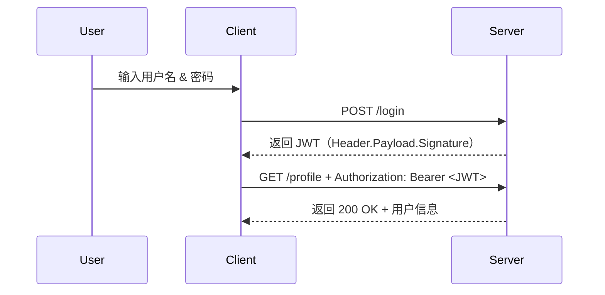
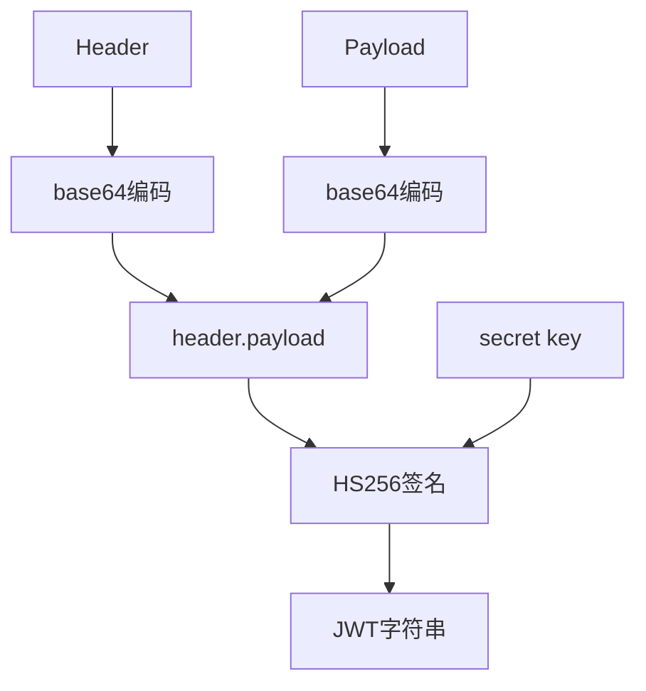
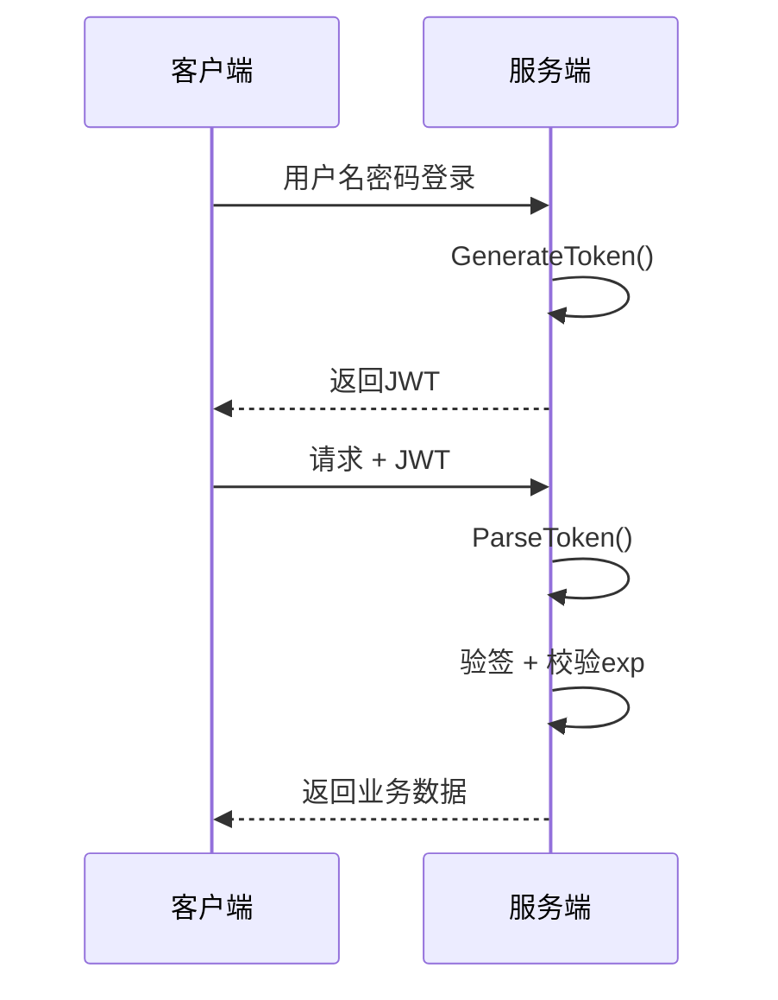

# 简历中对 GOGOAI 的描述

## GOGOAI 基于 Go 实现的 AI 应⽤服务平台 	2026-01 - 2026-04

------

## 技术栈：Gin、GORM、Eino、RAG、MCP、Redis、MySQL、RabbitMQ、WebSocket、Vue

------

## 项⽬描述：

------

基于 Go 实现 AI 应⽤服务平台，使⽤ Gin 框架构建⾼性能 Web 服务

集成 AI 助⼿聊天、图像识别等功能，并开发 Vue 前端应⽤，⽀持⽤⼾注册登录、会话管理和多功能交互

聊天模式分为普通、RAG、MCP 三种模式，⽤⼾可根据需求⾃⾏选择模式

主要⼯作和难点：

AI模型集成：通过 OpenAI API 协议调⽤腾讯混元⼤模型，实现同步和流式聊天功能，⽀持动态模型切换

图像识别功能：开发图像上传和识别模块，调⽤第三⽅服务处理图像数据，提供实时反馈。

设计模式：基于管理器模式设计 map[⽤⼾账号（唯⼀）]map[会话ID]*AIHelper* 的数据结构，使得系统的⽤⼾之间

环境隔离、⽤⼾⾃⾝各会话之间环境隔离

⽤⼾认证与会话管理：实现 JWT 令牌认证和会话管理，⽀持⽤⼾登录状态维护和权限控制

异步消息处理：集成 RabbitMQ 实现异步消息队列，⽀持⾼并发场景下的消息存储和消费

⽂本转语⾳：集成 TTS 服务，利⽤百度提供的 API 实现语⾳输出功能，⽅便特殊⼈群的使⽤

个⼈收获：

AI集成实践：学习 AI 模型调⽤和流式响应处理，掌握了第三⽅ API 集成和实时数据流管理

RAG 模块：深⼊理解向量数据库的构建与优化，掌握了知识检索与 AI 模型结合的最佳实践

MCP 模块: 通过对 MCP 协议的学习和实践，了解了 AI 时代的⾼性能⽹络协议的设计与实现

模块化设计思维：采⽤⼯⼚模式和管理器模式，增强了对系统架构和代码可维护性的理解

安全认证实现：通过 JWT 实现⽤⼾认证，学习令牌⽣成、验证和安全存储，巩固了 Web 安全知识

-----

# Cookies 和 Session 

## 基本概念

1. Cookie：

   - **定义**：Cookie 是服务器发送到浏览器并**存储在本地**的一小段数据（键值对），用于跟踪用户状态。**Cookie** 是浏览器端的存储和传递**载体**（存Session ID或简单数据）。
   - **作用**：解决 **HTTP 无状态问题**，存储用户偏好或会话标识（如 Session ID）。
   - **工作原理**：服务器通过 **`Set-Cookie`** **响应头**下发数据，浏览器后续请求自动通过 **`Cookie`** **请求头**回传。

   

2. Session：

   - **定义**：Session 是服务器端维护的会话状态，通过唯一 ID 关联用户请求。
   - **作用**：存储敏感或临时数据（如用户登录状态），依赖 Session ID 与浏览器交互。
   - **工作原理**：服务器生成 Session ID 并通过 Cookie（如 `JSESSIONID`）下发，浏览器携带该 ID 以找回对应 Session 数据。

### Cookie 和 Session 的区别

- 如下表所示：

  | **维度**     | **Cookie**             | **Session**                    |
  | ------------ | ---------------------- | ------------------------------ |
  | **存储位置** | 浏览器端               | 服务器端                       |
  | **安全性**   | 较低（用户可篡改）     | 较高（服务端控制）             |
  | **数据类型** | 仅字符串               | 支持复杂对象（如 Java Object） |
  | **生命周期** | 可长期有效（手动设置） | 通常随会话结束失效             |
  | **性能影响** | 增加请求头大小         | 占用服务器资源                 |

  ----

## **Cookie 和 Session 的协作关系**：

- **典型场景**：
  服务器创建 Session 后，通过 `Set-Cookie: JSESSIONID=abc123carl` 下发 Session ID，浏览器后续请求携带该 Cookie 以维持会话。
- **无 Cookie 方案**：
  ① URL 重写：将 Session ID 嵌入 URL（如 `/path;jsessionid=abc123`），但安全性差。
  ② Token 替代：JWT 直接将 Session 数据编码到 Token 中，无需服务端存储。

----

## **现代架构中的演进**：

- **分布式 Session**：
  ① 问题：多服务器时 Session 如何共享？
  ② 方案：集中存储（如 Redis）+ Session ID 一致性哈希。
- **无状态设计**：
  ① 趋势：RESTful API 使用 JWT，完全摒弃服务端 Session。

----

# JWT（JSON Web Token） 概述

## 1. JWT 结构

JWT 由三部分组成：

```
Header.Payload.Signature
```

例如：

```
xxxxx.yyyyy.zzzzz
```

------

## 2. Payload 中直接存用户信息

例如：

```
{
  "uid": 1001,
  "username": "zhangsan",
  "role": "admin",
  "exp": 1711111111
}
```

服务器不需要查 Redis。

------

## 3. JWT 工作流程



----

## 签名 & 验证流程（HS256为例）

**1. 签名生成**
令
H = Base64Url(Header)
P = Base64Url(Payload)
Secret = 服务器持有的密钥




**2. 验证流程**

1. 拆分 `Header.Payload.Signature`
2. 重新计算 `HMACSHA256(H+"."+P, Secret)`
3. 对比结果：

\- 相同：✅ 数据未被篡改
\- 不同：❌ 拒绝访问




----

## 优缺点总结

|                 优点                  |                 缺点                  |
| :-----------------------------------: | :-----------------------------------: |
|  1. 无状态（Stateless），可水平扩展   |   1. 无法即时「撤销」已签发的 Token   |
| 2. 携带信息自包含，无需多次查询数据库 |    2. Token 泄露风险大，需妥善存储    |
| 3. 支持跨域认证（适合微服务、移动端） | 3. Payload 明文可读，敏感信息请勿存放 |

----

## JWT 与 Session 的对比

|      对比项      |    Session     |   JWT    |
| :--------------: | :------------: | :------: |
|     状态存储     |     服务端     |  客户端  |
| 服务端是否存数据 |      需要      |  不需要  |
|    是否无状态    |       否       |    是    |
|      扩展性      |      较差      |    好    |
|    分布式支持    | 需要 Redis共享 | 天然支持 |
|    服务端压力    |      较大      |   较小   |
|     主动失效     |      容易      |   较难   |
|      安全性      |      更高      |   略低   |
|    Token大小     |       小       |   较大   |

----

# 设计模式

## 什么是设计模式？

设计模式（Design Pattern）是前辈们对代码开发经验的总结，是解决特定问题的一系列套路。它不是语法规定，而是一套用来提高代码可复用性、可维护性、可读性、稳健性以及安全性的解决方案。

----

## 工厂模式


----

## 单例模式


----

## 管理器（Manager）模式


----

# 大模型应用开发

## 大模型应用的三层架构

### 第一层：模型

----

### 第二层：Agent 内核

----

### 第三层：外壳

----

## 什么是 Token

### Token 简述

----

### 一般计费方式

----

### 缓存机制

----

# 大模型应用的业务全景图


----

# 同步、异步与流式输出

## 同步调用

----

## 异步调用

----

## 流式输出

----

## 面试可能怎么问？

*Q：你们的产品为什么要用流式输出，而不是等生成完再返回？*

参考思路：从用户体验角度切入——流式可以大幅降低 TTFT（首 token 延迟），用户不需要等待完整内容就能开始阅读，主观上感受到系统响应很快。同时流式允许用户提前打断不合适的输出，提升交互效率。

*Q：流式输出的技术原理是什么？*

参考思路：大模型是自回归生成的，每次生成一个token，流式就是利用HTTP的分块传输（chunked transfer）或SSE（Server-Sent Events）机制，将每个token生成后立刻推送给客户端，而不是缓冲全部结果再一次性发送。

*Q：什么场景下不该用流式？*

参考思路：当下游逻辑依赖完整输出时，比如需要做JSON解析、结构化提取、或者把完整文本存入数据库，流式反而引入额外复杂度，这时同步调用更合适。

----

# Function Calling

## 什么是 Tool / Function

----

## 和普通问答的区别

----

## 模型“调用工具”本质上发生了什么


**第一步：开发者定义和提供工具（Functions）**

在最开始，你需要告诉大模型它有哪些“工具”可用。这就像你给一个助手一个工具箱，并告诉他每个工具的作用。

**第二步：大模型响应，返回函数调用指令**

当用户提出一个请求（例如：“北京现在多少度？”），你的应用程序将用户的问题和上述工具列表一起发送给大模型。大模型在处理请求后，会识别出它需要调用一个外部工具来获取信息。它的响应不会是常规的文本回复，而是一个结构化的函数调用参数。

**第三步：应用程序执行函数并再次调用大模型**

这是整个流程中最关键的步骤。你的应用程序代码接收到大模型的响应后，需要完成检查响应、解析指令、执行函数、再次调用大模型等工作。

**最后一步**：大模型接收到所有这些信息后，会利用函数执行的结果，生成一个自然流畅的最终回复给用户：“北京今天天气晴朗，气温25摄氏度。”

----

## 为什么 Function Calling 是 Agent 的基础？

如果说大模型是“大脑”，那么 Function Calling 就是“神经系统”，连接着大脑和手脚（工具）。没有它，Agent 就只是一个“只会动嘴不会动手”的小笨蛋。

----

### 1. “被动回答”->“主动行动”

没有 Function Calling：你问它“怎么订会议室？”，它会给你写一篇《订会议室指南》。有了 Function Calling后：你问它“帮我订明天下午 3 点的 A 会议室”，它会调用开发者设定好的函数`book_room(time="15:00", room="A")`，真正完成预订，并返回订单号。

这就是Agent（智能体）产生的质变——能够感知环境并采取行动以实现目标的实体。

----

### 2. 复杂任务规划的前提 (ReAct 模式)

高级Agent往往需要多步推理（Plan & Solve）。例如：“分析上个月销售数据，如果低于目标，就给销售经理发邮件。”这需要模型具备链式调用能力，连续准确地**选择工具**并**提取参数**：

1. 先调用 `query_sales_data(month="last")`。
2. **根据返回结果进行逻辑判断**（模型内部推理）。
3. 如果条件满足，再调用 `send_email(to="manager", content=...)`。

如果Function Calling不准，整个链条就会断裂。

----

### 3. 解决“幻觉”与“时效性”的有效方案

Agent 的核心价值是解决实际问题，而实际问题往往涉及私有数据或实时状态。

靠微调（Fine-tuning）让模型记住所有库存信息？不可能，数据天天变。靠 Prompt 把几百万行数据塞进去？nonono，上下文有限且昂贵。通过 Function Calling，让模型在需要时按需定向查询。这让 Agent 拥有了“无限的知识库”和“实时的感知力”。

----

## 面试可能怎么问？

1. **“请简述 Function Calling 的工作流程。”**

   不要只说“模型调函数”。要强调“模型结构化输出（JSON） -> 程序拦截并执行 -> 结果回传 -> 模型生成最终回复”的流程。

2. **“如果模型调用了错误的工具，或者参数提取错了，怎么办？”**

   提到**重试机制**（让模型根据错误信息重新思考）、**Few-Shot Prompting**（在提示词中给出正确调用的示例）、以及**工具描述的优化**（更清晰的参数定义）等。

3. **“Function Calling和普通的Prompt指示（如‘请调用 API’）有什么区别？”**

   强调**结构化输出**和**可靠性**。普通指示模型可能会编造 API 调用过程，而 Function Calling 强制模型输出符合 Schema 的 JSON，程序可精准解析执行。

----

# RAG

## 大模型局限性


----

### 1. 幻觉问题（Hallucination）

大模型的本质是一个概率语言模型，它在生成每个 token 时做的是"预测下一个最可能的词"，而不是"从知识库里查询正确答案"。

这意味着当它不知道答案时，它不会说"我不知道"——它会生成一个"听起来最合理"的答案。这个答案可能完全是捏造的，但语气坚定、格式工整，让人难以判断真假。

在企业场景里，幻觉的危害远比"回答错误"更严重——它会以可信的方式传播错误信息，而用户毫不知情。

----

### 2. 私有知识问题

大模型是在公开数据上训练的。你们公司的内部文档、客户合同、产品手册、会议记录，这些内容它从未见过，也不可能知道。

有人会想：那把文档全部放进 Prompt 里呢？对于少量文档这是可行的，但当文档量达到几百份、几千份时，token 成本和上下文长度都会成为瓶颈。而且模型在极长上下文里的注意力会严重稀释，对中间内容的利用率极低。

----

### 3. 知识更新问题

模型的训练是有截止日期的，通常落后现实 6 个月到一年。产品价格变了、政策修订了、新的竞争对手出现了——这些模型全不知道。

你不可能每隔几个月就重新训练一遍模型来"更新知识"，这在成本和时间上都不可接受。

----

### 4. 可追溯性问题

当模型给出一个答案时，它无法告诉你"这句话来自哪份文档的第几页"。对于法律、医疗、金融等对准确性要求极高的场景，没有来源引用的答案往往是不可接受的。

----

## RAG 是什么？怎么解决上述局限性？

RAG 的全称是 Retrieval-Augmented Generation，检索增强生成。它的核心思路非常直觉：**在让模型回答之前，先去知识库里检索出最相关的内容，把这些内容作为上下文一起喂给模型，让模型"看着资料"来回答。**

下面这张图展示了 RAG 如何对应地解决上面四个问题：


**对幻觉问题：** 检索到的原文片段作为上下文传入模型，模型被要求"根据以下资料回答"，而不是凭空生成。有了事实依据的约束，幻觉概率大幅降低——但注意，不是归零，这个后面会讲。

**对私有知识问题：** 知识库完全由你自己构建和维护，可以包含任何内部文档。模型不需要知道这些内容，只需要在被检索到的片段基础上进行推理和组织语言。

**对知识更新问题：** 更新知识库不需要重新训练模型，只需要更新文档、重新做向量化索引即可。知识的新鲜度完全由知识库决定，和模型训练截止日期解耦。

**对可追溯性问题：** 每次检索都能知道具体命中了哪份文档的哪个片段，可以在答案里附上引用来源，用户可以自行核查。

----

## 适用场景

----

## 不适用场景

----

## 面试可能怎么问？

**Q：为什么有了大模型还需要 RAG？**

参考思路：大模型有几个局限性——幻觉、私有知识盲区、知识时效性、无法溯源。RAG 通过在回答前先检索外部知识库，把相关文档片段注入上下文，让模型"看资料回答"，从而有针对性地缓解以上问题。

**Q：RAG 能解决幻觉问题吗？**

参考思路：能显著缓解，但无法根治。有了检索到的事实作为锚点，模型乱编的概率大幅降低，且答案可以附上来源供核查。但模型仍然可能在检索结果上做出错误推理，或者在检索质量差时进行"补充生成"。RAG 降低幻觉概率，不消灭幻觉根因。

**Q：什么场景下你会推荐用 RAG，什么场景下不用？**

参考思路：适合 RAG 的是知识密集、内容频繁更新、需要溯源的场景，比如企业知识库问答、法规查询。不适合的是创意生成、强推理任务、以及模型训练数据已良好覆盖的稳定领域——在这些场景下，RAG 只是增加延迟和成本，没有实质收益。

----

