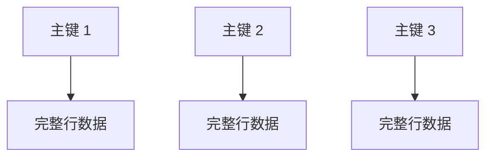
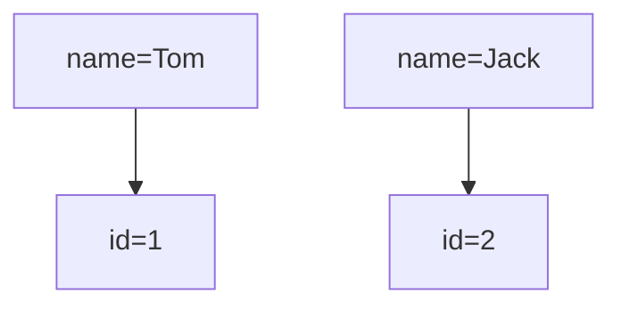
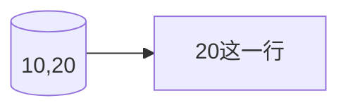

# InnoDB 聚簇索引、二级索引、回表、覆盖索引

## 1. 聚簇索引（Clustered Index）

InnoDB 的数据是“**按照主键顺序存储**”的。

也就是说：

- 主键索引的叶子节点
- 存放的不是“指针”
- 而是“整行数据”

因此：

> InnoDB 的主键索引本身就是数据文件

这就是聚簇索引。

------

### 聚簇索引结构



例如：

| id   | name | age  |
| ---- | ---- | ---- |
| 1    | Tom  | 20   |
| 2    | Jack | 21   |

实际存储类似：

```text
1 -> (1, Tom, 20)
2 -> (2, Jack, 21)
```

------

## 2. 二级索引（Secondary Index）

除了主键索引以外的索引，都叫二级索引。

比如：

```sql
create index idx_name on user(name);
```

此时：

```text
name -> 主键id
```

注意：

> 二级索引叶子节点存的不是整行数据，而是主键值。

------

### 二级索引结构



------

## 3. 回表（非常高频面试点）

假设 SQL：

```sql
select * from user where name = 'Tom';
```

执行过程：

### 第一步

先走二级索引：

```text
name=Tom -> id=1
```

### 第二步

再根据主键 id=1

去聚簇索引查完整数据。

这个动作：

> 就叫回表

------

## 回表流程图


------

## 4. 覆盖索引（优化重点）

如果查询的数据：

> 在索引里已经全部存在

那么就不需要回表。

例如：

```sql
select id from user where name='Tom';
```

因为：

二级索引本来就存：

```text
name -> id
```

所以：

不需要再查聚簇索引。

这就是：

> 覆盖索引

------

## 覆盖索引的核心价值

减少：

- 一次 B+ 树查询
- 随机 IO
- 回表成本

因此性能会明显提升。

------

# B+ 树适合索引的原因

数据库索引要求：

- 查询快
- 范围查询快
- 磁盘 IO 少
- 排序能力强

B+ 树正好满足。

------

# B+ 树核心特点


> ​											**聚簇索引** (注意叶子节点构成一个循环链表)


> ​														**二级索引, 非聚簇**


> ​										**InnoDB 存储引擎在页面 (Page) 级别实现的 B+ 树索引结构**

## 1. 多叉树，高度低

B+ 树一个节点可以存很多 key。

例如：

- 一个节点 16KB
- 一个 key 16B

则一个节点能存上千个 key。

因此树高很低：

```text
千万数据
可能只需要3~4层
```

所以：

磁盘 IO 次数非常少。

------

## 2. 叶子节点形成链表

B+ 树叶子节点天然有序：


因此：

范围查询极强：

```sql
where id between 100 and 200
```

可以顺序扫描。

------

## 3. 非叶子节点不存数据

B+ 树：

- 非叶子节点只存 key
- 不存完整数据

所以：

一个节点能放更多 key。

树更矮。

IO 更少。

------

# 为什么用 B+ 树不用 B 树

## B 树的问题

B 树：

- 每个节点都存数据
- 导致节点能存的 key 变少
- 树更高

------

## 对比

| 对比项     | B树    | B+树     |
| ---------- | ------ | -------- |
| 非叶子节点 | 存数据 | 不存数据 |
| 树高度     | 更高   | 更低     |
| 范围查询   | 较差   | 很强     |
| 顺序扫描   | 不方便 | 天然链表 |
| 磁盘IO     | 更多   | 更少     |

------

## 为什么数据库特别喜欢 B+ 树

1. 高效的磁盘 I/O：
   - 数据库索引的查找过程涉及大量的磁盘 I/O 操作。B+ 树通过其**高扇出**特性，使得树的高度非常低。同时，B+ 树的节点大小通常被设计为与磁盘页的大小一致，这样一次磁盘读取就可以加载一个完整的节点，减少了磁盘的**寻道次数**。
   - B+树的**非叶子节点只存储索引键**，不存储实际数据，可以在每个节点中存储更多的键，进一步提高了扇出，降低了树的高度，从而最大限度地减少了磁盘 I/O，这是提升查询效率的关键。
 2. 卓越的范围查询性能：
  - B+ 树的**所有叶子节点都通过链表连接**。这个特性对于数据库中常见的范围查询（例如 `WHERE price BETWEEN 100 AND 200`）非常有利。因为一旦通过索引找到范围的**起始叶子节点**，就可以沿着叶子节点链表进行**顺序遍历**，无需回溯到父节点，大大提高了范围查询的效率。相比之下，B 树由于数据分布在所有节点，进行范围查询时需要进行中序遍历，效率相对较低。
3. 稳定的查询效率：
  - 在 B+ 树中，**所有数据都存储在叶子节点，并且所有叶子节点都在同一层**。这意味着任何一次索引查找，从根节点到目标叶子节点的路径长度都是相同的。因此，B+ 树的查询性能相对稳定，不会出现像二叉查找树那样因数据分布不均导致的性能波动。
4. 更适合磁盘存储和查找：
  - 我们上面提到，B+ 树的非叶子节点只存储索引键，不存储实际数据记录。这就使得单个节点可以存储更多的索引键，从而提高了树的扇出，降低了树的高度。这种**结构**非常适合磁盘存储，因为**一次磁盘读取可以加载更多的索引信息**，减少了查找过程中需要进行的磁盘 I/O 次数。相比之下，B 树的非叶子节点也存储数据，导致每个节点存储的键更少，树的高度更高，磁盘 I/O 次数可能更多。

----

# 什么时候需要创建索引？

- **在 WHERE 子句中经常使用的列：** 当查询需要根据某个列进行筛选时，在该列上创建索引可以快速定位符合条件的记录，避免全表扫描。
- **在 JOIN 操作中经常使用的连接列：** 在表与表之间进行关联查询时，如果连接列上创建了索引，可以显著提高连接效率。
- **在 ORDER BY 或 GROUP BY 子句中经常使用的列：** 如果查询结果需要按照某些列进行排序或分组，这些列上的索引可以加速这些操作，甚至避免额外的排序或分组步骤。
- **数据量较大的表：** 对于包含大量数据的表，索引带来的性能提升会更加明显。
- **主键和唯一约束对应的列：** 数据库会自动为这些列创建索引，以保证数据的唯一性并加速查找。
- **外键约束对应的列：** 在外键列上创建索引通常可以提高关联查询的效率。
- **慢查询日志：** 开启数据库的慢查询日志，监控执行时间超过阈值的查询语句，找出性能瓶颈。**（慢 sql 解决方案之一）**
- **EXPLAIN 命令：** 使用 `EXPLAIN` 命令分析慢查询语句的执行计划，查看是否使用了索引，以及索引的使用情况。根据执行计划来判断是否需要创建或优化索引。**（慢 sql 解决方案之一）**

----

# 什么时候不需要创建索引？

1. **数据量小的表：** 对小表创建索引可能带来额外开销，全表扫描可能更快。
2. **写入操作频繁的表：** 索引维护增加插入、更新、删除开销，影响写性能。
3. **区分度低的列：** 对于数据重复率高（如性别）的列，索引无法有效过滤数据。
4. **不常用于查询的列：** 索引利用率低，建立索引会浪费资源。
5. **查询返回大部分数据的场景：** 即使有索引，优化器也可能选择全表扫描。
6. **查询条件无法利用索引：** 例如在索引列上使用函数或模糊匹配。

----

# 索引相关追问

**面试官可能的追问1：** “创建索引一定会提高查询性能吗？有没有例外情况？”

- **简答：** 不一定。对于数据量很小的表，索引带来的开销可能大于性能提升。另外，如果查询条件不能有效地利用索引（例如对索引列进行函数操作、使用 `LIKE '%keyword'` 进行模糊匹配等），索引也可能失效。

**面试官可能的追问2：** “在多列上创建联合索引时，需要注意什么？”

- **简答：** 创建联合索引时需要注意**列的顺序**，并遵循**最左前缀原则**。将最常用于查询条件的列放在联合索引的最左边，可以更有效地利用索引。

**面试官可能的追问3：** “除了创建索引，还有哪些方法可以优化数据库查询性能？”

- **简答：** 除了创建索引，还可以通过优化 SQL 语句（避免全表扫描、减少不必要的数据返回）、优化数据库结构（如表设计、字段类型）、调整数据库配置参数、使用缓存、读写分离等方法来优化查询性能。

**面试官可能的追问4：**什么叫索引区分度？

- **简答：**可以理解为索引列中“不重复值”占总记录数的比例，比如性别、用户状态（可能只有在线、不在线和封禁），他们不适合做索引，因为做了也很大可能触发全表扫描。

**面试官可能的追问5：**第一条sql通过主键索引查找更新数据，第二条通过联合索引查找更新，两条语句查询过程加锁的区别？

- 通过主键索引更新时，InnoDB 会直接在聚簇索引定位数据，并对主键索引记录加 X 行锁，不需要回表，锁范围最小，并发性能最好。

  通过联合索引更新时，InnoDB 会先在二级索引上查找并加锁，然后根据二级索引保存的主键值回表，再对聚簇索引记录加锁，因此会同时涉及二级索引锁和主键锁。

  如果查询条件不是唯一等值匹配，还可能触发 next-key lock，锁住索引区间来防止幻读，因此锁范围更大，也更容易发生死锁。

------

# 事务隔离级别、MVCC 作用

SQL 标准四种隔离级别：（从上到下隔离强度逐渐增强）

|           隔离级别           | 脏读 | 不可重复读 | 幻读     |                              注                              |
| :--------------------------: | ---- | ---------- | -------- | :----------------------------------------------------------: |
| Read Uncommitted（读未提交） | 有   | 有         | 有       | 任何事务对数据的修改都会第一时间暴露给其他事务，即使事务还没有提交 |
|   Read Committed（读提交）   | 无   | 有         | 有       |             事务只能读到其他事务已经提交过的数据             |
| Repeatable Read（可重复读）  | 无   | 无         | 基本解决 | 事务过程中不会读到其他事务对已有数据的修改，即使其他事务已提交 |
|    Serializable（串行化）    | 无   | 无         | 无       |                                                              |

MySQL InnoDB 默认：

```text
Repeatable Read
```

------

# MVCC 的作用

MVCC：

> Multi-Version Concurrency Control
> 多版本并发控制

核心思想：

> 不加锁也能读

提高并发性能。

------

# MVCC 如何实现

InnoDB 每行数据：

隐藏字段：

```text
trx_id     事务id
roll_pointer 回滚指针
```

通过 `undo log`（回滚日志）：

形成历史版本链。这也保证了**数据库事务的原子性**，利用 `undo log` 来让事务**“要么全部成功，要么全部撤销”**

------

## 版本链示意


读取时，根据 ReadView 判断当前事务能看到哪个版本。

----

# MVCC 工作原理

1. 版本链 (Version Chain):
   - **隐藏列：** InnoDB 存储引擎在**每行数据**后面会添加两个隐藏列：
     ① `DB_TRX_ID` (Transaction ID): 记录了**最近一次修改该行的事务**的 ID。
     ② `DB_ROLL_PTR` (回滚指针): 指向存储在 **`Undo Log`** 中的**该行上一个版本的记录**。
   - **版本链形成：** 通过 `DB_ROLL_PTR`隐藏列，同一行数据的不同版本会被连接起来，形成一个链表，也就是我们说的**版本链**。**最新版本的记录位于链的头部，旧版本的记录通过回滚指针连接起来**。
   - **Undo Log 的作用：** Undo Log 是 InnoDB 的**回滚日志**，它不仅用于事务回滚，还用于存储数据的旧版本。当一个事务修改数据时，会将数据的旧版本写入 Undo Log，并更新当前记录的 `DB_ROLL_PTR` ，使其指向这个旧版本。
2. 读视图 (Read View):
   - **概念：** Read View 是 MVCC 机制中一个非常重要的概念，它代表了事务开始时，数据库中**可见的数据版本集合**。
   - **生成时机：** 在 Repeatable Read 隔离级别下，Read View 是在每个事务开始时生成；而在 Read Committed 隔离级别下，Read View是在每次执行 `SELECT` 语句时生成。
   - **包含信息：** Read View 主要包含以下信息：
     ① `m_ids`: 是指生成 Read View 时，系统中所有**活跃的（尚未提交或回滚的）事务**的 ID 列表。
     ② `min_trx_id`: 是指`m_ids` 列表中的**最小事务 ID**。
     ③ `max_trx_id`: 是指生成 Read View 时，系统**即将分配给下一个新事务的 ID**。
     ④ `creator_trx_id`: 是指生成这个 Read View 的**当前事务本身的 ID**。
3. 可见性判断规则：
   - 当一个事务**读取**一行数据时，它会**获取当前数据的最新版本**，并**检查该版本的 `DB_TRX_ID`**。然后，根据以下规则使用 Read View 来**判断该版本是否对当前事务可见**：
     ① 如果 `DB_trx_id` < `min_trx_id`：表示该版本在当前事务开始之前就已经提交，那么该数据对当前事务**可见**。
     ② 如果 `DB_trx_id` >= `max_trx_id`：表示该版本在当前事务开始之后才产生，那么该数据对当前事务**不可见**。
     ③ 如果 `min_trx_id` <= `DB_trx_id` < `max_trx_id`：又分为两种子情况——若 `DB_trx_id` 在 `m_ids` 列表中，则表示该版本是由一个活跃事务修改的，那么该数据对当前事务**不可见**；若 `DB_trx_id` 不在 `m_ids` 列表中，则表示该版本是由一个已提交的事务修改的，那么该数据对当前事务**可见**。
   - 如果当前版本不可见，事务会**沿着版本链向上回溯**，查找更旧的版本，直到找到一个可见的版本。

------

# 脏读 / 不可重复读 / 幻读 区别

------

# 1. 脏读（读到未提交数据）

事务 A：

```sql
update user set money=1000 where id=1;
```

但没提交。

事务 B：

读到了 1000。

结果：

事务 A 回滚了。

那么：

事务 B 读到了不存在的数据。

这就是脏读。

------

# 2. 不可重复读

同一个事务：

第一次读：

```text
100
```

第二次读：

```text
200
```

中间别人修改并提交了。

导致：

> 同一行数据前后读取不一致

------

# 3. 幻读

第一次：

```sql
select * from user where age > 20;
```

查到 10 条。

别人插入一条：

```text
age=25
```

第二次再查：

变成 11 条。

像“幻觉一样多了一行”。

这就是幻读。

------

# 三者核心区别

|    问题    |        本质        |         如何解决         |
| :--------: | :----------------: | :----------------------: |
|    脏读    |   读到未提交数据   |  隔离模式至少是“读提交”  |
| 不可重复读 |    同一行被修改    | 隔离模式至少是“可重复读” |
|    幻读    | 查询结果集行数变化 |          临界锁          |

------

# 索引失效常见场景：模糊前缀、函数运算、隐式转换

------

# 1. 模糊查询导致失效（非前缀匹配的经常会导致）


> ​											**以通配符开头的模糊查询，导致索引失效**的场景

## 错误写法

```sql
where name like '%Tom'
```

因为：

不知道前缀是什么。

B+ 树无法定位起点。

只能全表扫描。

------

## 正确写法

```sql
where name like 'Tom%'
```

可以利用索引。

------

# 2. 函数运算导致失效

## 错误

```sql
where substr(name,1,3)='Tom'
```

索引保存的是原始值。

不是函数结果。

因此失效。

------

## 正确

```sql
where name like 'Tom%'
```

------

# 3. 隐式类型转换

例如：

```sql
name varchar
```

SQL：

```sql
where name = 123
```

MySQL 可能会：

```sql
cast(name as int)
```

导致索引失效。

----

# 4. 使用 != 操作符和用 OR 连接不同索引列

 如 `WHERE column != value`，`WHERE column1 = value1 OR column2 = value2` (column1 和 column2 分别有索引）

------

# 行锁、间隙锁、临键锁基础理解

------

# 1. 行锁（Record Lock）

锁住：

> 某一行数据

例如：

```sql
update user set age=20 where id=1;
```

会锁：

```text
id=1
```

------

# 2. 间隙锁（Gap Lock）

锁的不是数据。

而是：

> 两条记录之间的“空隙”

目的：

防止别人插入。

------

## 示例

当前数据：

```text
10 20 30
```

事务：

```sql
select * from user where id between 10 and 20 for update;
```

可能锁：

```text
(10,20)
```

此时：

别人不能插入：

```text
15
```

------

# 3. 临键锁（Next-Key Lock）

MySQL 默认 RR 隔离级别：

使用临键锁。

它是：

```text
行锁 + 间隙锁
```

------

## 临键锁示意



既锁：

- 记录本身
- 前面的间隙

------

# 为什么需要间隙锁

核心目标：

> 解决幻读

否则：

事务第一次查询：

```sql
age > 20
```

第二次：

别人插入新数据。

结果集变化。

-----

# 一条 SQL 语句是如何执行的


1. **连接阶段**：由服务器端的**连接器**组件负责，在客户端与 MySQL 服务器之间建立连接，并验证用户权限。
2. **查询缓存**（仅限 MySQL 8.0 前）：检查**是否命中缓存**，若有完全相同且有效的查询结果可以直接返回。（图里没画）
3. **解析与预处理**：解析 SQL 语法，检查语法是否正确，并生成抽象语法树，然后，**预处理器**进行一些语义检查，验证表和字段是否存在。
4. **优化器**：基于统计信息和成本模型，考虑多种执行方案，并选择最优执行计划（如索引选择、JOIN 顺序）。
5. **执行器**：根据选择的执行计划，调用存储引擎接口，并按执行计划读取数据并处理（排序、聚合等）。
6. **存储引擎**（如 InnoDB）：负责从磁盘或内存读取数据，返回给执行器。
7. **返回结果**：执行器进行必要的处理（如过滤、排序）后，将结果集返回客户端，可能分批次传输

------

# 面试高频总结（建议背诵）

## InnoDB

- 主键索引是聚簇索引
- 二级索引叶子节点存主键
- 查询可能发生回表
- 覆盖索引避免回表

------

## B+ 树

- 多叉树
- 高度低
- IO 少
- 范围查询强
- 叶子节点链表

------

## MVCC

- 通过 undo log 形成版本链
- ReadView 决定可见性
- 提高并发
- 减少锁竞争

------

## 锁

- 行锁：锁单行
- 间隙锁：锁区间
- 临键锁：行锁+间隙锁
- RR 通过临键锁解决幻读