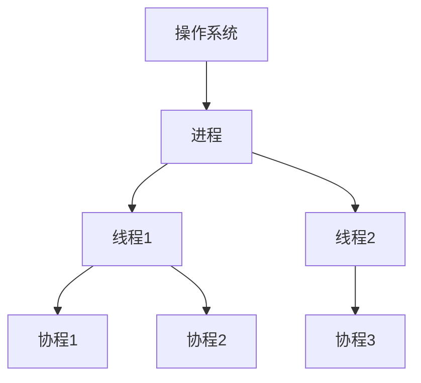
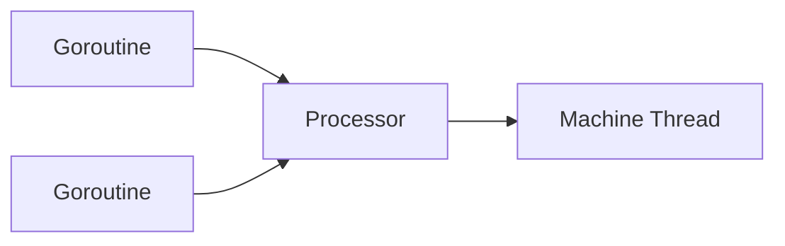
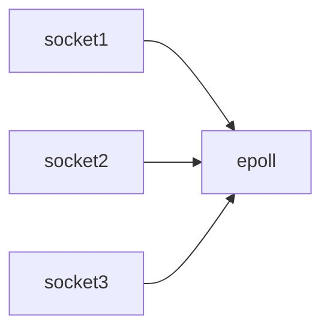
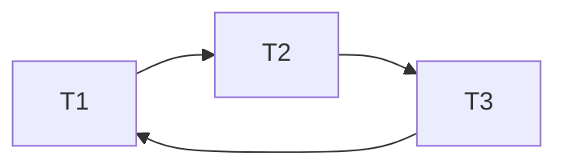
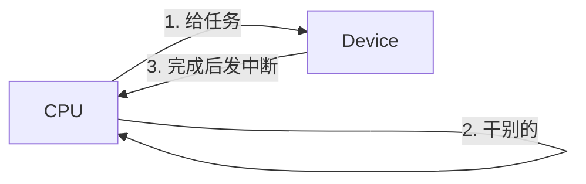
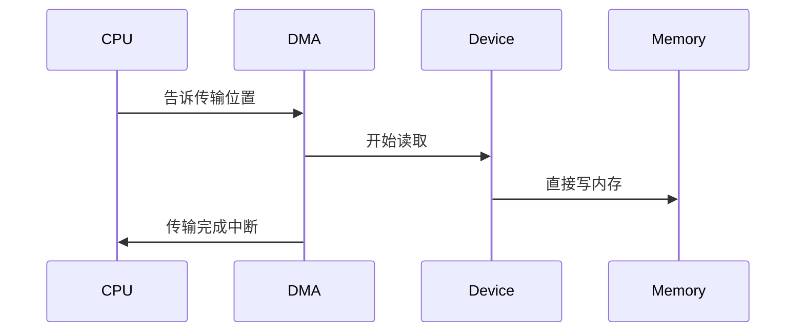

# 进程 / 线程 / 协程 区别，Go 协程优势

## 基本概念

- **进程**：进程（**Process**）是计算机中一个执行的程序实例，每个进程对应一个**运行中**的程序；进程是操作系统**资源分配**的最小单位，在未引入线程概念的操作系统中，同样是**调度**的最小单位。
- **线程**：线程（**Threads**）是比进程更小的概念，也称“轻量级进程，是将进程进一步细分的单位；在多道程序操作系统中，线程概念的引入可以进一步提高程序的并发执行程度，一个进程可以同时拥有多个线程，借助多个线程实现程序的并发执行（而不必借助进程）。

### 进程和线程的对比


- **调度单位**：引入内核级线程后，进程不再是调度的最小单位；线程是调度的最小单位。
- **资源分配**：无论是否引入“线程”，进程始终都是资源分配的最小单位；线程只拥有少量资源（来自创建它的进程）。
- **并发性**：多个进程间可以并发执行；一个进程的多个线程也能并发执行。
- **独立性**：进程之间默认不共享全局变量，且拥有独立的地址空间和不同资源；线程之间只有少数资源不能共享（例如线程的栈区）。
- **系统开销**：“进程通信”，“进程切换”开销大；“线程通信”，“线程切换”开销小。
- **多处理机**：单个进程只能运行在一个处理机上；多线程进程可以充分利用多处理机（内核级线程）。
- **协同工作**：进程之间互不影响；用户级线程的阻塞会影响到整个进程的执行。

| 对比项       | 进程           | 线程             | 协程             |
| ------------ | -------------- | ---------------- | ---------------- |
| 资源分配     | 独立地址空间   | 共享进程资源     | 用户态轻量任务   |
| 切换开销     | 很大           | 较大             | 很小             |
| 是否内核调度 | 是             | 是               | 否（用户态调度） |
| 通信方式     | IPC            | 共享内存         | 共享内存         |
| 崩溃影响     | 不影响其他进程 | 可能影响整个进程 | 一般影响较小     |

----

## 进程与线程的切换开销对比

|     项目     |  进程切换  | 线程切换（特指属于同一个进程的线程） |
| :----------: | :--------: | :----------------------------------: |
| 虚拟地址空间 |  需要切换  |             通常不用切换             |
|     页表     |  需要切换  |             通常不用切换             |
|     TLB      |  大量失效  |              大多可保留              |
| 文件描述符表 |    切换    |                 共享                 |
|   内核资源   |    独立    |               大量共享               |
| cache 局部性 | 更容易丢失 |              更容易保留              |

------

## 三者关系



------

## Go 协程（Goroutine）优势

Go 的 goroutine 本质是用户态协程。

### 1. 创建成本极低

- 线程：MB 级栈空间
- goroutine：初始仅几 KB

因此 Go 可以轻松创建几十万协程。

------

### 2. 调度开销小

线程切换：

- 用户态 → 内核态
- 保存寄存器
- 切换内核栈

goroutine 切换：

- 用户态完成
- 不进入内核

性能更高。

------

### 3. GMP 调度模型



- G：协程
- M：内核线程
- P：调度器

------

### 4. 天然适合高并发

典型场景：

- IM
- RPC
- Web 服务
- 网关
- 消息队列消费者

----

## 面试可能问的问题

### 系统是如何创建一个进程的，比如你 windows 双击了一个 exe 文件，发生了什么？

**注意，不要管它 windows，linux。按 linux 答就行，哪怕 linux 没有 exe**。或者直接说 windows 原理了解，说 linux 版本的

>当用户执行 `exe` 时，首先 shell 会解析命令，然后调用 fork 创建子进程。
>
>fork 并不会立即复制整个进程内存，父子进程先共享物理页，只有修改时才真正复制。
>
>接着内核会创建新的虚拟地址空间，建立页表，加载代码段、数据段以及依赖的动态库。现代 Linux 一般采用按需分页，不会一次性把整个程序读入物理内存，而是在访问页面时通过缺页异常再加载。
>
>之后系统创建主线程，初始化寄存器和栈，把线程加入运行队列，最后由 CPU 调度执行程序第一条指令。

------

# 进程通信方式

## 1. 管道 Pipe

管道通信机制适合进程间的简单数据传输，其又可细分为两类：

- **①匿名管道**：半双工通信，适用于父子进程或兄弟进程；

- **②命名管道**：具有文件名，适用于无关进程。

注意管道在 Linux 中本质上是一个特殊的文件，他没有磁盘中的对应实体


> ​												全双工的管道通信示例，全双工需要两个管道

------

## 2. 消息传递

进程之间可以调用由操作系统实现的通信命令来传递消息；实现消息传递即分别实现**Send** 和 **Receive**两个**原语**，用于消息的发送和接收。消息传递机制又可细分为两类：

- ①**直接通信方式**：发送进程直接将消息发送给接收进程，将信息挂载到**接收进程的消息队列**上，接收进程从自己的消息队列中获取信息；

- ②**间接通信方式**：操作系统额外**创建一片空间用于存储各种消息**，类似一个信箱，发送进程和接收进程依靠这个中间实体实现信息的发送和接收，这种方式也被称为 “信箱通信模式”，在计算机网络中被广泛运用

  

------

## 3. 共享内存

共享内存是一种高效的进程间通信方式，允许多个进程直接访问同一块内存区域。

共享存储机制又可细分为两种方式：

- ①**共享数据结构**的通信方式：进程间共享同一个数据结构，编程人员需要考虑进程间的同步互斥问题，传输效率低；

- ②**共享存储区**的通信方式：操作系统在内存中开辟一块共享存储区，多个进程可以对该内存区域进行读写，传输效率高。当进程希望对共享存储区进行存取时，会将自己的虚地址空间映射到共享存储区，并向操作系统提出申请。

------

## 4. 信号量

用于进程同步。

典型：

```text
P操作：申请资源
V操作：释放资源
```

------

## 5. Socket

最通用 IPC。

既能本机通信：

```text
Unix Domain Socket
```

也能网络通信：

```text
TCP Socket
```

------

# 常见进程调度算法

## 1. FCFS 先来先服务

- **工作原理**：进程按照到达顺序进入就绪队列，CPU依次执行队列中的进程。FCFS是**非抢占式**，一旦进程开始执行，直到完成才会释放CPU。
- **适用情景**：批处理系统，任务执行时间差异不大的场景。
- **优点**：实现**简单**，**公平**性较高。
- **缺点**：可能导致“饥饿”现象，长作业会阻塞短作业；平均等待时间较长，**不适合交互式系统**。

------

## 2. SJF 最短作业优先

优先执行耗时短的任务。

缺点：

- 长任务可能饿死

------

## 3. 时间片轮转

- **工作原理**：每个进程分配一个时间片（如10ms），时间片用完后切换到下一个进程。
- **适用情景**：**交互式系统**，如桌面操作系统。
- **优点**：公平性高，适合交互式系统。
- **缺点**：时间片过大会退化为FCFS。

------

## 4. 优先级调度

- **工作原理**：每个进程分配一个优先级，CPU选择优先级最高的进程执行；可以是**抢占式或非抢占式**。
- **适用情景**：适合**实时系统**或需要区分任务优先级的场景。
- **优点**：灵活，可根据任务重要性调整优先级。
- **缺点**：低优先级进程可能“饥饿”；动态调整优先级会增加开销。

------

## 5. 多级反馈队列（MLFQ）

- **工作原理**：将就绪队列分为多个子队列，每个队列的时间片大小不同；**新进程到达首先进入最高优先级队列，时间片用完后降级到下一队列**；低优先级队列的时间片较大，避免频繁切换。
- **适用情景**：通用操作系统，如Linux、Windows。
- **优点**：能较好地满足各类进程对处理器的需求；适合通用操作系统。
- **缺点**：实现复杂，开销较大。

## 详细回答

------

# 内核态与用户态

## 用户态

应用程序运行状态。

权限受限：

- 不能直接操作硬件
- 不能访问内核数据

------

## 内核态

操作系统运行状态。

拥有：

- 完全硬件权限
- 内存管理权限
- IO 权限

------

## 为什么要区分？

核心目的是：

```text
保护操作系统安全
```

避免应用程序破坏系统。

------

## 状态切换


------

# 系统调用概述

系统调用：

```text
用户程序请求内核服务的接口
```

典型系统调用：

|   功能   |  系统调用  |
| :------: | :--------: |
| 文件读写 | read/write |
| 网络通信 |   socket   |
| 进程创建 |    fork    |
| 内存申请 |    mmap    |

------

## 为什么系统调用慢？

因为涉及：

- 用户态/内核态切换
- CPU 上下文切换
- 权限切换

------

# 死锁

## 什么是死锁？

多个线程互相等待资源。


结果：

```text
永远等待
```

------

## 死锁的四个必要条件

### 1. 互斥

资源只能一个线程使用。

### 2. 请求并保持

拿到部分资源后继续申请，并且不释放之前持有的资源

### 3. 不可剥夺

资源不能强制回收。

### 4. 循环等待

形成等待环。

------

## 死锁处理方法

1. **死锁预防（Deadlock Prevention）**：
   死锁预防是通过**破坏死锁产生的必要条件**来避免死锁的发生。具体方法包括：
   **破坏互斥条件**（允许资源被多个进程共享，如只读文件）、
   **破坏请求和保持条件**（要求进程在请求资源时释放已持有的资源，或采用一次性分配策略）、
   **破坏不可抢占条件**（允许系统抢占进程持有的资源，如强制回收资源）、
   **破坏循环等待条件**（对资源进行排序，进程按顺序请求资源）。
   这些方法通过限制资源分配的方式，从根本上避免死锁的发生。
2. **死锁避免（Deadlock Avoidance）**：
   死锁避免是通过**动态**检查资源分配状态，确保系统不会进入不安全状态。最经典的算法是**银行家算法**，它要求每个进程声明其最大资源需求，系统在分配资源前检查是否存在**安全序列**（即是否存在**一种资源分配顺序，使得所有进程都能顺利完成**）。如果存在安全序列，则分配资源；否则拒绝分配。死锁避免的优点是不需要限制资源分配，但需要预先知道进程的资源需求，且计算开销较大。
3. **死锁检测（Deadlock Detection）**：
   死锁检测不需要事先采取任何限制性措施，并**允许死锁的出现**。通过定期检查系统中的进程和资源状态，检测是否存在死锁。常用的方法包括**资源分配图**和**定期检测算法**。资源分配图通过检查是否存在环路来判断死锁；定期检测算法则通过模拟资源分配过程，检查系统是否处于死锁状态。死锁检测的优点是不需要限制资源分配，但检测过程会消耗系统资源，且检测到死锁后需要进一步处理。
4. **死锁解除（Deadlock Recovery）**：
   死锁解除是在检测到死锁后，采取措施恢复系统的正常运行。常用的方法包括**终止进程**和**资源抢占**。
   终止进程是指选择一个或多个死锁进程终止，释放其持有的资源；
   资源抢占是指强制回收一个或多个死锁进程持有的资源，分配给其他进程。
   选择终止或抢占的进程时，通常会考虑进程的优先级、运行时间、资源占用情况等因素，以最小化对系统的影响。

------

# 虚拟内存

## 概念

虚拟内存是操作系统提供的一种从**逻辑上**扩充内存的方法，具有**请求调入**功能 和 **内存置换**功能。它为每个进程提供一个独立的、连续的地址空间，使得每个进程都认为自己独占整个内存。
  虚拟内存的核心思想是通过**将物理内存和磁盘空间结合起来**，扩展可用的内存空间，并实现内存隔离。
  在采用**非连续存储管理方式**的基础上，只调入程序文件的一部分页面进入内存，当进程需要用到未调入内存的程序文件页时，再从磁盘中调入，这一过程称为**请求调入**。
  当请求调入遇到“内存已满”的情况时，系统需要从内存中选择一部分暂时用不上的页面调出，腾出的空间用来调入当前需要的页面，这一过程称为**内存置换**。

----

## 主要作用

- **内存扩展**：
  通过将部分内存数据交换到磁盘，虚拟内存可以扩展可用的内存空间，使得程序可以运行在比物理内存更大的地址空间中；虚拟内存大小与较大的外存相近，而运行速度与较快的内存相近。
- **内存隔离**：
  每个进程都有自己的虚拟地址空间，避免了进程间的内存冲突，提高了系统的安全性和稳定性。
- **简化内存管理**：
  内存置换和请求调入都由**操作系统**完成，使得内存管理对于用户是透明的，用户不需要去关心虚拟内存的具体运作。

----

## 实现方式

----

### 请求分页方式

① 将虚拟内存和物理内存划分为**固定大小**的页（如4KB），通过**页表**映射虚拟地址和物理地址。
② 页表由操作系统维护，TLB（快表）则由硬件直接维护，用于加速地址转换。
③ 当访问的页不在物理内存中时，会发生缺页中断（Page Fault），此时操作系统会将所需的页从磁盘加载到内存。

----

### 请求分段方式

① 将虚拟内存划分为**不同大小**的段，通过段表映射虚拟地址和物理地址。
② 分段可以更好地支持程序的逻辑结构，但管理起来比分页更复杂。

----

## 优缺点

- **优点**：
  ① 提高内存利用率：通过将不常用的内存数据交换到磁盘，释放物理内存供其他进程使用。
  ② 简化编程：内存管理对于程序员是透明的，程序员无需关心物理内存的分配和管理。
  ③ 支持多任务：每个进程都有自己的虚拟地址空间，支持多任务并发执行。
- **缺点**：
  ① 性能开销：频繁的页表查找和缺页中断会影响系统性能。
  ② 复杂性：虚拟内存的实现增加了操作系统的复杂性。

----

## 实际应用

- **Linux**： 使用分页机制管理虚拟内存，通过页表和 TLB 加速地址转换。
- **Windows**： 使用**分页和分段结合**的方式管理虚拟内存（即“请求段页式存储管理方式”），支持大内存和多任务。

----

# Linux 进程虚拟地址空间


------

## 各区域作用

<table><thead><tr><th>组成部分</th><th>描述</th><th>功能</th></tr></thead><tbody><tr><td>代码区（Text Segment）</td><td>存放执行代码的机器语言指令。</td><td>执行程序的实际指令，通常是只读的。</td></tr><tr><td>数据区（Data Segment）</td><td>存放已初始化的全局变量和静态变量。</td><td>存储全局变量和静态变量的数据。</td></tr><tr><td>堆区（Heap Segment）</td><td>用于动态分配内存，大小可动态调整。</td><td>通过&nbsp;<code>malloc</code>、<code>calloc</code>&nbsp;等函数分配的动态内存。</td></tr><tr><td>栈区（Stack Segment）</td><td>存放函数的参数值、局部变量值、返回地址等。</td><td>支持函数调用、参数传递及局部变量的存储。</td></tr><tr><td>内存映射区域（Memory-mapped Segment）</td><td>映射文件或设备，如共享库、动态链接库等。</td><td>将文件或设备映射到进程的地址空间，使得它们可以像内存一样访问。</td></tr><tr><td>内核空间（Kernel Space）</td><td>保留给操作系统及其内核模块使用的地址空间。</td><td>只能通过系统调用访问，用于操作系统内部功能和服务。</td></tr></tbody></table>

------

## 堆和栈区别

| 对比     | 堆      | 栈   |
| -------- | ------- | ---- |
| 管理方式 | 手动/GC | 自动 |
| 速度     | 较慢    | 很快 |
| 空间     | 大      | 小   |

## 栈为什么快？

- 栈内存分配只需要“移动栈顶指针”
- 资源通常不需要手动释放，函数结束后对应栈区的数据会自动释放
- 有 CPU Cache 优势，局部性极强

## 堆为什么慢？

因为堆需要支持：

- 任意时间申请
- 任意时间释放
- 任意大小分配

例如：假设堆区总共256B，初始分成四块，即每块64B，

```c
p1 = malloc(64)
p2 = malloc(128)
free(p1)
p3 = malloc(32)
```

内存会变成：

```
[空闲64][已占128]
```

于是堆管理器必须：

- 维护空闲链表
- 查找合适块
- 分裂大块
- 合并碎片
- 处理并发
- 可能触发系统调用

在这个例子里，就应该更新为空闲96B，涉及各种处理

这远比栈复杂。

----

# epoll 多路复用、LT/ET 触发

## epoll 本质

一个线程监听多个 socket。

**事件驱动**：只**返回就绪的文件描述符**，无需遍历**所有fd**

**内核回调**：通过**回调机**制通知就绪事件，**O(1)时间复杂度**

**共享内存**：**避免**用户空间和内核空间的**数据拷贝**

**水平触发（LT）与边缘触发（ET）**：提供**更灵活的**事件**通知模式**



------

## 为什么比 select 高效？

### select

- 每次遍历全部 fd
- fd 数量有限

### epoll

- 事件驱动
- 就绪才通知

**epoll 核心原理：**

epoll_create：**创建epoll实例，返回epoll文件描述符**

epoll_ctl：**向epoll实例中添加/修改/删除监控的fd**

epoll_wait：**等待I/O事件发生**，只**返回就绪的fd列表**

------

# LT 与 ET

## LT（水平触发）

只要缓冲区还有数据：

```text
一直通知
```

优点：

- 简单
- 不易漏数据

------

## ET（边缘触发）

仅状态变化时通知一次。

```text
有数据到来时通知一次
```

要求：

```text
一次性读完
```

通常配合：

```text
非阻塞IO
```

------

# 阻塞 / 非阻塞 / IO 多路复用适用场景

| 模型       | 特点     | 场景           |
| ---------- | -------- | -------------- |
| 阻塞IO     | 简单     | 连接少         |
| 非阻塞IO   | 频繁轮询 | 不推荐单独使用 |
| IO多路复用 | 高并发   | Redis/Nginx    |

------

## 阻塞 IO

```text
recv() 没数据就睡眠
```

CPU 利用率低。

------

## 非阻塞 IO

```text
不断询问有没有数据
```

CPU 空转严重。

------

## IO 多路复用

```text
一个线程监听多个连接
```

高并发经典方案。

------

# 单 CPU 是怎么跑多线程任务的？

核心：

```text
时间片切换
```

------

## 执行过程



CPU 在极短时间内切换线程。

人眼感觉：

```text
像同时运行
```

------

## 上下文切换内容

- 寄存器
- 程序计数器
- 栈信息

------

## 为什么线程太多会变慢？

因为：

```text
上下文切换成本很高
```

------

# 硬链接和软链接的区别

软连接（符号链接）是独立的文件，存储目标文件的路径，可跨文件系统，删除原文件后软连接失效。

硬链接是原文件的别名，与原文共享相同的 inode 和数据块，不可跨文件系统，删除原文件不影响硬链接。

技术原理对比：

|    对比项    |                     硬链接（Hard Link）                      |    软链接 / 符号链接（Symbolic Link）     |
| :----------: | :----------------------------------------------------------: | :---------------------------------------: |
|  inode 层面  |           **共享相同的 inode**，链接 **计数递增**            | **拥有独立的 inode**，类型为 **符号链接** |
| 文件系统限制 |                  **必须位于同一文件系统内**                  |           可 **跨不同文件系统**           |
|   删除行为   | **删除原始文件后，硬链接仍可访问数据**，直到链接 **计数为 0** |  **删除原始文件后，软链接成为悬空链接**   |
|   链接目标   |                **只能链接文件，不能链接目录**                |           **可链接文件和目录**            |
|   存储内容   |                   **目录项直接引用 inode**                   |          **存储目标路径字符串**           |

------

## 硬链接工作原理

|    步骤    |                             说明                             |
| :--------: | :----------------------------------------------------------: |
| 创建目录项 |               **创建新的目录项指向相同 inode**               |
|  链接计数  |              inode 的 `i_links_count` **递增**               |
|  删除机制  | 只有 **当 `i_links_count = 0` 时**，inode 和数据块才会被真正释放 |

------

## 软链接工作原理

|    步骤    |                 说明                 |
| :--------: | :----------------------------------: |
| 创建 inode | **创建新的 inode**，类型为 `S_IFLNK` |
|  存储内容  |   数据块中保存 **目标路径字符串**    |
|  文件大小  |   文件大小等于 **路径字符串长度**    |

------


## inode 理解

```text
inode 类似文件身份证
```

硬链接：

```text
多个文件名指向同一 inode
```

----

### 一个容易考的面试点

为什么目录文件的链接数至少是2

例如：

```
/dir
```

因为目录里天然存在：

```
.
..
```

所以：

- `.` 指向自己
- 父目录里也有一个目录项指向它

因此目录链接数通常至少 2。

------

# 中断与异常

# 什么是中断？

外部设备通知 CPU。

例如：

- 键盘输入
- 网卡收包
- 磁盘完成 IO

------

# 什么是异常？

CPU 执行指令时发生错误。

例如：

- 除零
- 缺页
- 非法指令

------

# 中断和异常的区别

| 对比               | 中断     | 异常    |
| ------------------ | -------- | ------- |
| 来源               | 外部设备 | CPU内部 |
| 是否异步           | 是       | 否      |
| 是否与当前指令相关 | 无关     | 有关    |

------

# 完整的中断处理流程


------

# 零拷贝技术

# 零拷贝简述

目标：

```text
减少CPU拷贝次数
```

------

## 传统 IO


存在：

- 多次数据复制
- 多次上下文切换

------

## sendfile 零拷贝


减少用户态参与。

------

# 适用和不适用场景

## 适用

### 文件传输

例如：

- Nginx
- Kafka

------

## 不适用

### 需要修改数据

例如：

```text
加密
压缩
业务处理
```

因为数据必须进入用户态。

------

# I/O 控制方式

# 程序查询方式

CPU 不断轮询设备。

```text
你准备好了吗？
你准备好了吗？
```

缺点：

```text
CPU浪费严重
```

------

# 中断驱动方式

设备完成后主动通知 CPU。



优点：

```text
CPU不用一直等待
```

------

# DMA 方式

DMA：

```text
Direct Memory Access（直接存储器存取方式）
```

------

## 核心思想

- DMA控制器**接管数据传输**

- CPU**只需初始化DMA**（设置**源地址、目标地址、数据量**，即 DMA 预处理）

- DMA控制器在**设备**和**内存**间**直接传输数据**

- 传输完成后**DMA向CPU发送中断**

- 最后进行 DMA 后处理（CPU 完成）

------

## 传输模式

- 停止 CPU 访存：控制简单，但 CPU 对内存的利用率低
- 周期挪用：周期指访存周期，占用一个或几个内存访问周期完成数据的传输
- DMA 与 CPU 交替访存：对于一个 CPU 周期，C1 专供 DMA 访存，C2 专供 CPU 访存

----

## DMA 流程



------

## DMA 优势

### 1. CPU 开销小

CPU 不再负责搬运数据。

### 2. IO 吞吐高

适合：

- 网卡
- 磁盘
- 高速设备