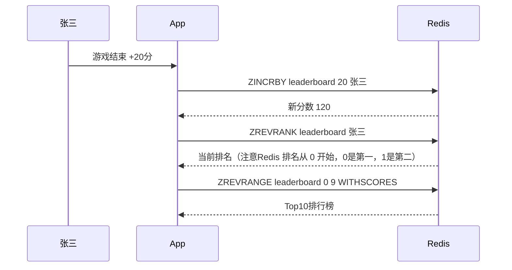
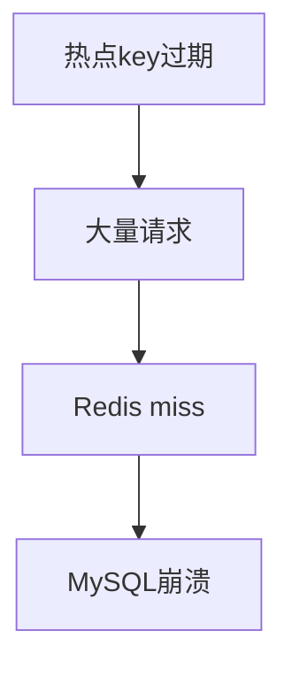
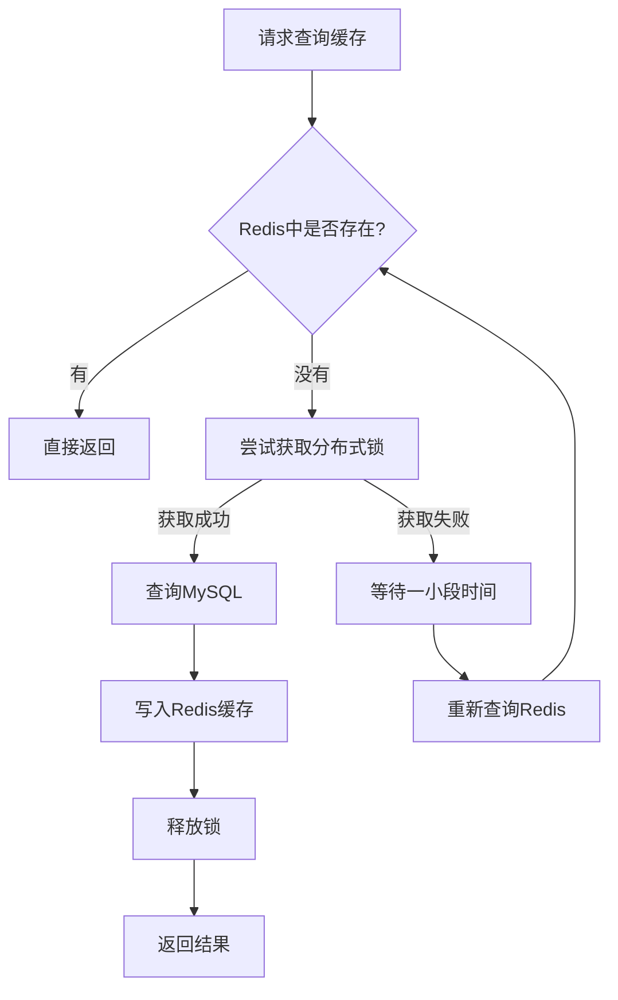
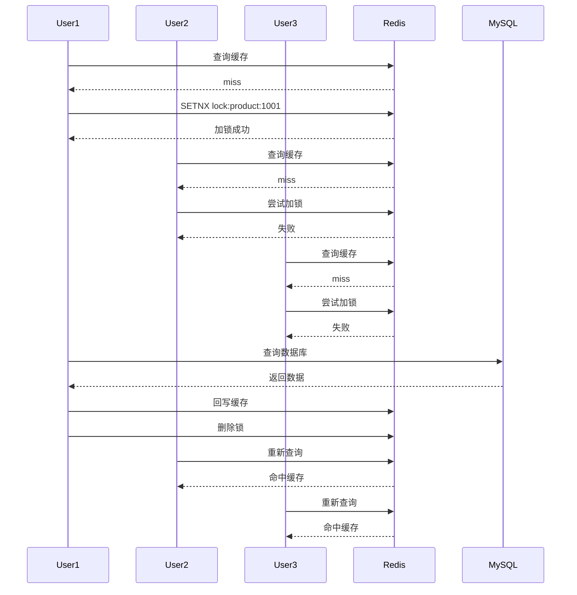
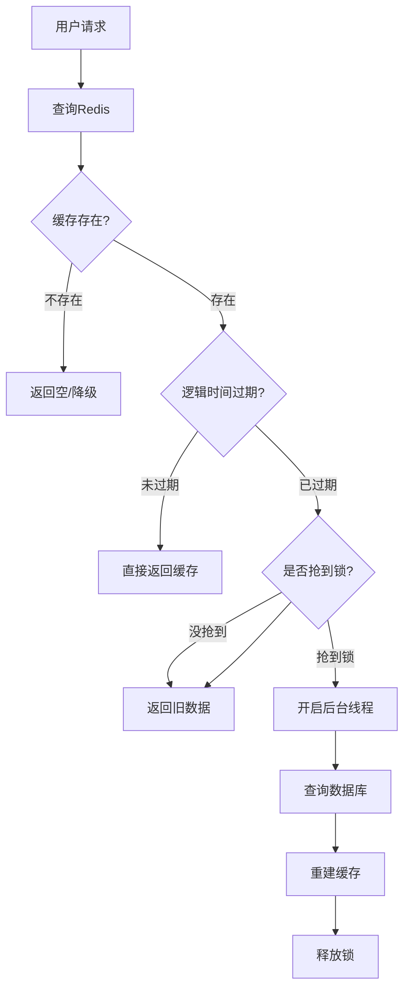
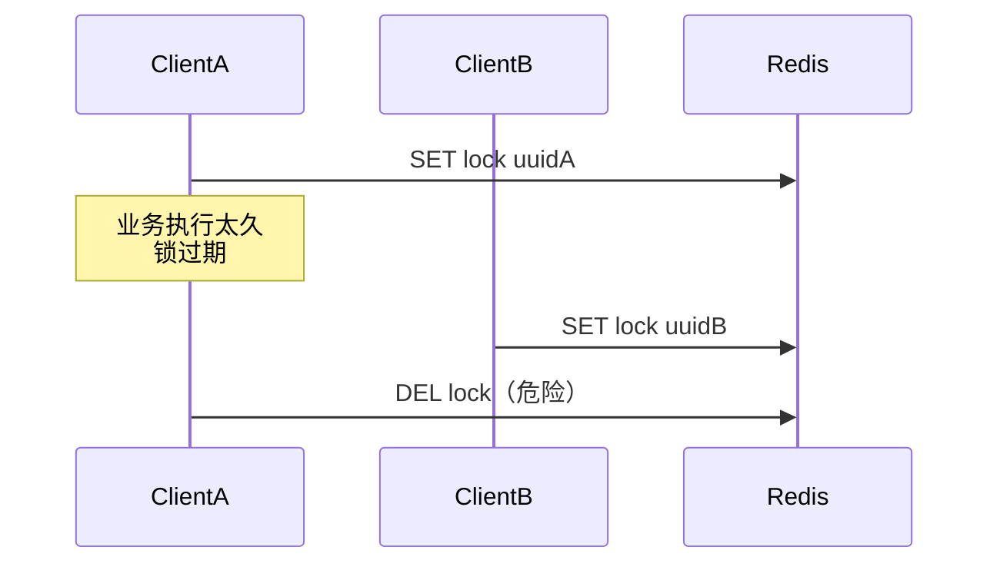
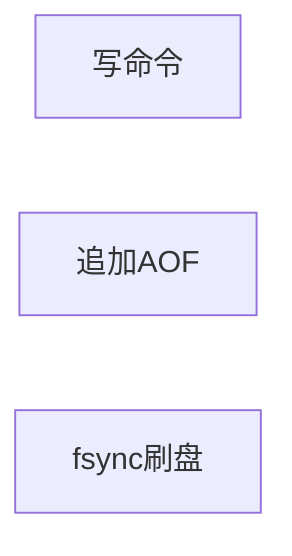
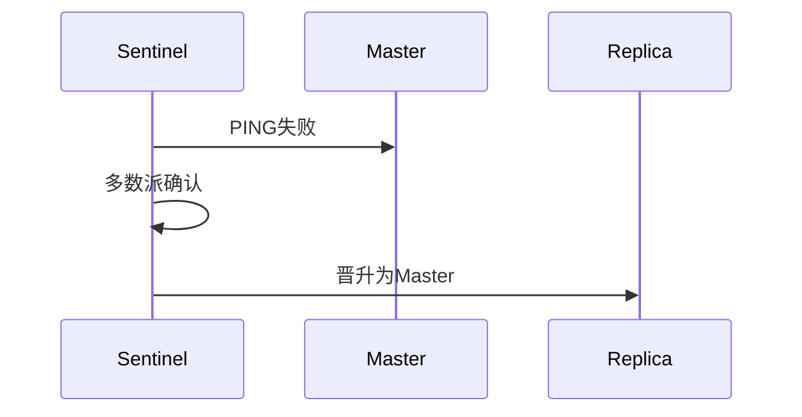

# 常用五大基础数据结构

Redis 本质上是一个 **Key-Value 内存数据库**，但 Value 并不只是字符串，而是支持多种高性能数据结构。

---

# 1. String（字符串）

最基础、最常用。

底层：

* int（整数）
* embstr（短字符串）
* raw（长字符串）

适合：

* 缓存对象
* 计数器
* token/session
* 分布式锁

```bash
SET user:1 "zhangsan"
INCR article:100:likes
```

---

## 常见面试点

### 为什么 Redis String 很快？

因为：

* 内存操作
* 单线程避免锁竞争
* IO 多路复用
* SDS（Simple Dynamic String）

---

## SDS 和 C 字符串区别

Redis 不直接用 `char*`。

因为 C 字符串：

* 获取长度 O(n)
* 容易缓冲区溢出

Redis SDS：

```c
struct sdshdr {
    int len;
    int free;
    char buf[];
}
```

优点：

* O(1) 获取长度
* 自动扩容
* 二进制安全

---

# 2. List（链表）

Redis List 现在底层：

* quicklist（Redis 3.2+）

本质：

```text
双向链表 + listpack
```

适合：

* 消息队列
* 最新动态
* 评论列表

```bash
LPUSH msg hello
RPOP msg
```

---

## quicklist 结构


> 请脑补把 ziplist 换成 listpack，没找到新版的图。但好像面试确实更爱问旧版，鉴定为面试官知识未更新

优势：

* 指针数量大幅减少
* 插入删除快
* 内存利用率高

显然，List 的查找长度 = 遍历过的quicklist 节点数 + listpack 内元素数。

**平均查找长度**  = O(N/k + k)，其中 `N` = 总元素数，`k` = 每个 listpack的元素数

----

### Listpack （紧凑列表）结构


- **tot-bytes：** 整个结构的字节数量，包括头部以及尾部，占4个字节。
- **num-elements：**元素的数量，占2个字节，最大表示65535个，超过则需要遍历获取长度。
- **entry-N：**具体的每个元素。
- **0xFF：**结尾标志，占1个字节，全是1。

----

### entry-n 的结构


> 编码 + 数据 + totalLen，其中 totalLen = 前两个字段的总长度

encoding-type表示编码类型，有下面几种：

a. 单字节编码

```text
0|xxxxxxx：1个字节，表示7位无符号整型，后7位为数据。
10|xxxxxx：1个字节，表示短字符串，后6位表示长度，最大可以表示63字节的字符串。
```

b. [多字节编码](https://zhida.zhihu.com/search?content_id=236918071&content_type=Article&match_order=1&q=多字节编码&zhida_source=entity)

```text
110|xxxxx yyyyyyyy：2个字节，表示13位有符号整数。
1110|xxxx yyyyyyyy：2个字节，后12位表示字符串长度，最大可以表示4095字节的字符串。

11110000|<4byte>：5个字节，后4个字节表示字符串长度，用来表示长字符串。
11110001|<2byte>：3个字节，后2个字节用来表示有符号整数。
11110010|<3byte>：4个字节，后3个字节用来表示有符号整数。
11110011|<4byte>：5个字节，后4个字节用来表示有符号整数。
11110100|<8byte>: 9个字节，后8个字节用来表示有符号整数。
11110101-11111110：未使用。
11111111：用来表示listpack结尾
```

假设要用listpack结构存放字符串`"hello"`以及整数`1024`，表示如下图:


> 注意 `1024` 的 encoding-type 和 encoding-data 放在了一起

----

## 老版本的 List 底层

```
双向链表 + ziplist
```

listpack 是 ziplist 的改良

----

## zipList （压缩列表）

老版本 Redis 使用字节数组表示一个压缩列表：


各字段含义如下：

- 1、**zlbytes**：压缩列表的字节长度，占4个字节，因此压缩列表最长(2^32)-1字节；
- 2、**zltail**：压缩列表尾元素相对于压缩列表起始地址的偏移量，占4个字节；
- 3、**zllen**：压缩列表的元素数目，占两个字节；那么当压缩列表的元素数目超过(2^16)-1怎么处理呢？此时通过zllen字段无法获得压缩列表的元素数目，必须遍历整个压缩列表才能获取到元素数目；
- 4、**entryX**：压缩列表存储的若干个元素，可以为字节数组或者整数；
- 5、**zlend**：压缩列表的结尾，占一个字节，恒为**0xFF**。

 entry 内部的编码就不提了，想看去：[(40 封私信 / 5 条消息) redis 压缩列表ziplist、quicklist - 知乎](https://zhuanlan.zhihu.com/p/375414918)

---

# 3. Hash（哈希）

适合存对象。

```bash
HSET user:1 name zhangsan age 20
```

比 String 存 JSON 更灵活。

---

## 底层结构


小数据量：

* 早期 ziplist

  > 优点：内存连续，省内存
  >
  > 缺点：需要记录前一个节点的长度（prevLen），如果前一个节点变大，后面所有节点都要后移（想一想顺序表的插入操作，O(n²)）

* 后期 listpack

  > 优点：依然是占用连续内存，结构还更简单。不再记录 preLen 

大数据量：

* hashtable

  ```mermaid
  graph TD
  
      T[Hash Table]
  
      T --> B1[Bucket1]
      T --> B2[Bucket2]
      T --> B3[Bucket3]
  
      B1 --> A1["name -> tom"]
  
      B2 --> A2["age -> 18"]
  
      B3 --> A3["city -> beijing"]
  ```

  > 优点：查询快 O(1)，field经过 hash 计算后直接定位到 Bucket

---

## 面试常问

### Hash 和 String 存对象区别？

Hash：

优点：

* 可以改单个字段
* 更节省空间

缺点：

* 序列化复杂

String(JSON)：

优点：

* 简单
* 跨语言方便

缺点：

* 改一个字段需要整体反序列化

### 为什么 Hash 不用 hashtable 存小 Hash

答：太浪费，元数据比数据本身还大，弊大于利，比如一个对象只有两个 field，如果用hashtable，元数据会包括：

bucket、dictEntry、key指针、value指针、next指针


---

# 4. Set（集合）

特点：

* 无序
* 去重

```bash
SADD user:1:tags go redis mysql
```

适合：

* 标签系统
* 共同好友
* 抽奖去重

---

## 常见操作

```bash
SINTER（交集）
SUNION（并集）
SDIFF（差集）
```

例如：

```text
共同关注
共同好友
```

---

# 5. ZSet（有序集合）

Redis 面试高频。

本质：

```text
Set + score
```

```bash
ZADD rank 100 zhangsan
```

---

## 底层结构

```text
hash table + skiplist
```

---

## 为什么用跳表？

因为 Redis 作者认为：

* 跳表实现简单
* 范围查询优秀
* 插入删除稳定

---

## 跳表结构


查找 `8` 的流程：

1. 在第二级索引从1开始找。查到13时，因为8 < 13，所以从7所在的节点开始向下往第一级索引查；
2. 查到9时，因为 8 < 9，所以从7所在的节点开始向下往原始链表查；
3. 最终在原始链表中找到了8。

可以看出，跳表的查询效率非常高

---

## ZSet 使用场景

### 排行榜



### 延时队列

score 存时间戳。

---

# 五种结构总结

| 数据结构   | 特点          | 场景     |
| ------ | ----------- | ------ |
| String | 最基础         | 缓存、计数器 |
| List   | 有序可重复       | 消息队列   |
| Hash   | field-value | 用户信息   |
| Set    | 无序去重        | 标签、好友  |
| ZSet   | 有序去重        | 排行榜    |

----

# 热 Key 与大 key

----

## 什么是热 Key

热 key 指的是：

> 在短时间内被大量高频访问的 Redis key。

例如：

- 热门商品详情
- 秒杀库存
- 热点新闻
- 明星直播间数据
- 首页推荐列表

------

## 热 Key 的问题

### （1）单点压力过大

Redis 虽然快，但：

- 一个 key 的所有请求
- 都会集中到同一个 Redis 实例
- 甚至同一个 CPU 核心

因为 Redis 主线程是事件驱动模型。

------

### （2）影响其他请求

因为 Redis 是单线程处理命令：

```
大量请求 -> 堵塞事件循环
          -> 其他普通 key 延迟升高
```

表现：

- RT 飙升
- QPS 下降
- CPU 100%
- 网络带宽打满

------

### （3）缓存击穿

如果热 key 恰好失效：

```
海量请求 -> Redis miss
         -> 全部打到 DB
```

可能直接把数据库冲垮。

这是：

> 热 key + 缓存击穿 的组合事故。

------

## 如何发现热 Key（高频）

### 方法1：Redis 自带命令（面试常答）

### monitor

```
redis-cli monitor
```

实时看请求。

缺点：

- 性能开销大
- 线上慎用

------

### hotkeys（Redis4.0+）

```
redis-cli --hotkeys
```

要求：

```
maxmemory-policy 不能是 noeviction
```

原理：

- 基于 LFU 统计

------

### 方法2：业务侧统计（更推荐）

在网关或业务层：

- 统计 key 访问次数
- 做 TopN

比如：

```
商品:1001 -> 1秒10万次
```

实际大厂更常用这种。

因为：

> Redis 自身不适合做全量热点统计。

----

## 热 Key 如何解决（核心）

### 方案1：本地缓存（最核心）

这是最标准答案。

------

### 思路

不要所有请求都打 Redis：

```
请求
 ↓
JVM/Go 本地缓存
 ↓ miss
Redis
```

------

### 常见实现

Java：

- Caffeine
- Guava Cache

Go：

- bigcache
- freecache

------

### 优势

因为：

```
本地缓存 = 内存访问
```

速度远高于 Redis。

并且：

```
Redis QPS 从 10w
下降到
几千
```

------

### 方案2：热点 key 拆分（重点）

------

### 原问题

一个 key：

```
stock:1001
```

QPS：

```
10w/s
```

------

### 拆分方案

变成：

```
stock:1001_1
stock:1001_2
stock:1001_3
```

请求随机打散。

------

### 本质

把：

```
单 key 压力
```

变成：

```
多 key 分摊
```

------

### 适用场景

适合：

- 计数器
- 点赞数
- 阅读量

不太适合：

- 强一致库存

因为数据聚合复杂。

----

### 方案3：多级缓存 (核心方案)

```
浏览器缓存
    ↓
Nginx缓存
    ↓
本地缓存
    ↓
Redis
    ↓
MySQL
```

----

## 什么是大 Key

大 key 指：

> value 占用内存特别大的 key。

例如：

- 10MB string
- 百万元素 list
- 超大 hash
- 超大 zset

----

## 大 Key 的危害

## （1）阻塞 Redis

Redis 单线程：

```
读取/删除大 key = 长时间阻塞
```

------

## （2）网络压力大

比如：

```
一次 GET 返回 20MB
```

会：

- 占满带宽
- 增加延迟

------

## （3）内存不均衡

Redis Cluster：

```
一个 slot 特别大
```

导致：

- 数据倾斜
- 某节点内存爆炸

------

## （4）删除危险（高频）

```
DEL bigkey
```

可能卡 Redis。

因为：

```
释放内存是阻塞操作
```

----

## 如何发现大 Key

### redis-cli

### 扫描 bigkey

```
redis-cli --bigkeys
```

Redis 官方最经典答案。

------

### memory usage

```
MEMORY USAGE key
```

查看 key 内存。

----

## 大 Key 怎么解决

### 方案1：拆分 Key（最标准）

------

### 错误设计

```
user:posts:1001
=> 存10万条帖子
```

------

### 正确设计

拆分：

```
user:posts:1001:1
user:posts:1001:2
```

分页存储。

------

### 方案2：压缩数据

例如：

- protobuf
- msgpack

减少：

```
value size
```

------

### 方案3：使用合适数据结构

例如：

不要：

```
string 存大 JSON
```

可以：

```
hash
```

按字段拆分。

------

### 方案4：异步删除（高频）

不要：

```
DEL bigkey
```

而是：

```
UNLINK bigkey
```

------

### 为什么？

### DEL

同步释放内存：

```
主线程阻塞
```

------

### UNLINK

Redis：

```
主线程只解除引用
```

真正内存回收：

```
后台线程异步做
```

----

## 热 Key 和 大 Key 区别

| 对比     | 热 Key        | 大 Key         |
| -------- | ------------- | -------------- |
| 核心问题 | 访问频率高    | value 太大     |
| 本质     | QPS 问题      | 内存问题       |
| 影响     | CPU、请求阻塞 | 内存、网络阻塞 |
| 危险场景 | 缓存击穿      | 删除阻塞       |
| 核心方案 | 多级缓存      | 拆分数据       |

---

# 缓存穿透、击穿、雪崩 原理 + 最简解决方案

这是 Redis 面试绝对高频。

---

# 1. 缓存穿透

## 原理

查询一个：

```text
数据库根本不存在的数据
```

导致：

```text
Redis miss -> MySQL
```

攻击者疯狂请求：

```text
id=-1
```

数据库直接被打爆。

---

## 流程


---

## 最简解决方案

### 1. 缓存空值（最常用）

在第一次访问user:999 Miss 之后

```bash
SET user:999 null EX 60
```

优点：

* 简单
* 有效

缺点：

* 占内存

---

### 2. BloomFilter（进阶）

先判断：

```text
key 是否可能存在
```

不存在：

```text
直接拦截
```

特点：

* 允许误判
* 不允许漏判

---

# 2. 缓存击穿

## 原理

某个：

```text
热点 key 过期
```

瞬间大量请求打到 DB。

---

## 流程



---

## 最简解决方案

### 1. 互斥锁（最常见，适合 CP 系统）

只有一个线程查数据库。

其他线程等待。

```go
SETNX lock
```

---

## 流程



> ​													分布式锁解决缓存击穿流程图



> ​															**详细时序图**

----

### 2. 热点数据永不过期

后台异步更新。

适合：

```text
排行榜
配置
```

---

### 3. 逻辑过期（适合 AP 系统）

缓存数据里额外带一个逻辑过期时间。业务线程读到已过期数据时，先返回旧值，再由后台线程异步重建缓存。这样能把可用性放在前面




----

# 3. 缓存雪崩

## 原理

大量 key：

```text
同一时间失效
```

或者：

```text
Redis 宕机
```

导致全部请求打数据库。 ([即答侠 - HireMe AI][1])

---

## 解决方案

### 1. 过期时间加随机值

```bash
EX 3600 + random(1,300)
```

避免同时过期。

---

### 2. Redis 集群高可用

避免 Redis 整体挂掉。

---

### 3. 限流降级

保护数据库。

例如：

* Sentinel
* 熔断
* 限流

----

#  三类缓存问题对比

|   问题   |            核心特征            |               典型场景               |         主要风险         |               常见方案               |
| :------: | :----------------------------: | :----------------------------------: | :----------------------: | :----------------------------------: |
| 缓存穿透 |      查询的数据根本不存在      |       恶意请求、错误参数、爬虫       |   数据库被无效请求打满   |    参数校验、缓存空值、布隆过滤器    |
| 缓存击穿 | 单个热点 key 失效瞬间并发回源  |     热门商品、热点店铺、活动库存     |   数据库被热点流量冲垮   |      互斥锁、逻辑过期、热点预热      |
| 缓存雪崩 | 大量 key 同时失效或 Redis 故障 | 批量导入缓存、整点统一过期、节点宕机 | 请求成片压垮数据库和下游 | 随机 TTL、高可用、多级缓存、限流熔断 |

---

# Redis 分布式锁：加锁、过期、续约

---

# 1. 为什么需要 Redis 分布式锁？

多服务实例：

```text
同时操作同一资源
```

例如：

* 秒杀
* 库存扣减
* 定时任务

---

# 2. 最基础加锁

错误写法：

```bash
SETNX lock 1
EXPIRE lock 10
```

问题：

```text
SETNX成功后宕机
EXPIRE没执行
```

死锁。

---

# 正确写法

```bash
SET lock uuid NX EX 10
```

原子操作。 ([Redis][2])

---

# 为什么 value 要用 uuid？

防止误删别人的锁。

---

## 解锁流程



---

# 正确解锁

Lua 保证原子性：

```lua
if redis.call("get",KEYS[1]) == ARGV[1]
then
    return redis.call("del",KEYS[1])
else
    return 0
end
```

---

# 3. 锁续约（看门狗）

问题：

```text
业务执行超过锁时间
```

锁提前过期。

---

## 解决方案

后台线程：

```text
自动续期
```

例如 Redisson WatchDog。

---

## 续约流程


看门狗不是万能的，**看门狗续期依赖网络连接**。如果你的客户端和 Redis 之间网络断了，续期请求发不出去，锁照样会过期。而你的业务代码可能还在本地跑着，完全不知道锁已经没了。

----

# RedLock 了解即可

Redis 官方提出的：

```text
多 Redis 节点分布式锁
```

核心思想：

```text
多数派成功才算加锁成功
```

但实际业务：

```text
大部分公司单 Redis + Lua 就够了
```

([Redis][2])

----

# 常用更新策略

## 先删缓存，再更新数据库

会出现的问题：

​	1、线程A删除缓存数据，此时还没更新数据库 

​	2、线程B查询缓存没有数据，查询数据库还是旧数据，放入缓存

​	3、线程C及其他线程使用旧缓存数据，缓存和数据库不一致


----

## 先更新数据库，再删缓存

会出现的问题：

​	1、线程A更新数据库，此时还没有删除缓存

​	2、线程B及其他线程此时使用的还是旧缓存数据，和数据库内容不一致


----

## 普通双删

1、线程A先删除缓存，再更新数据库，再删除缓存（删更删，即双删）

2、线程B查询缓存没有数据，在线程A更新数据库之前，查询到旧数据，此时系统时间片切换到线程A执行删除缓存，之后又轮到线程B放入缓存旧数据

3、线程C针对于线程A，查询缓存没有数据，查询到旧数据，放入缓存旧数据


**以上策略都不能满足缓存和数据一致性。**

----

## 延迟双删（重点）

1、线程A先删除缓存，之后更新数据库

2、线程B和线程C发现缓存没数据，查询数据库。线程B查询到的是旧数据，线程C查询到的是新数据。之后纷纷放入缓存

3、线程A延时3-5秒（时间一般要大于SQL执行时间+线程切换执行时间100ms足够），再将缓存删除。之后其他线程再查询缓存，发现没数据，再次查询数据库及放入缓存都是新数据

极端情况就是线程D，所以延时双删还是不一定能保证缓存及数据一致。

一个简单的解决方案：

​	在线程A执行双删前，对该Key进行加锁，之后执行删除缓存，更新数据库，放入新数据到缓存，在解锁。保证缓存和数据一致性

​	注意这个锁一定要加过期时间


---

# 过期淘汰策略、RDB/AOF 持久化区别

---

# Redis 为什么需要淘汰策略？

Redis 基于内存。

内存满了必须：

```text
淘汰数据
```

---

# 八大淘汰策略（重点记常见）

|      策略       |      含义      |         适用场景          |
| :-------------: | :------------: | :-----------------------: |
|   noeviction    |     不淘汰     |    不接受自动删除数据     |
|   allkeys-lru   |  所有 key LRU  |      纯缓存，最常见       |
|  volatile-lru   | 只淘汰过期 key | 临时缓存且 key 普遍有 TTL |
| allkeys-random  |      随机      |    简单粗暴，特殊场景     |
| volatile-random |  随机过期 key  |     对命中率要求不高      |
|  volatile-ttl   |  TTL 最小优先  |     临时数据明显分层      |
|   allkeys-lfu   |      LFU       |       热点长期稳定        |
|  volatile-lfu   | 只淘汰过期 key | 热点长期稳定且 key 有 TTL |

---

# 面试重点：LRU vs LFU

---

## LRU

最近最少使用。

```text
最近没用过 -> 淘汰
```

---

## LFU

最少频率使用。

```text
访问次数少 -> 淘汰
```

---

## 区别

| 算法  | 适合   |
| --- | ---- |
| LRU | 短期热点 |
| LFU | 长期热点 |

---

# Redis 持久化

为什么 Redis 需要持久化

- Redis 是内存数据库，数据默认存在内存里。如果进程宕机、机器重启、实例迁移，内存里的数据会丢失。
- 所以如果 Redis 不只是做纯缓存，而是还承载了重要业务数据，就需要持久化机制把数据落到磁盘。

---

# 1. RDB（Redis Database）

`RDB` 是在某个时间点把内存数据做成快照落盘，优点是文件紧凑、恢复速度快，缺点是两次快照之间的数据可能丢失。默认文件名通常是 `dump.rdb`。

---

## 工作原理


---

> ​															**BGSAVE 流程**

### 常见触发方式

根据配置规则自动触发，如 `save 900 1`、或者可以手动执行 `SAVE` 或 `BGSAVE`

**两个命令的区别**：`SAVE`会同步保存，会阻塞主线程，因此生产中很少直接使用。而`BGSAVE`是后台保存，Redis 会 `fork` 子进程生成快照，主线程继续处理请求

## 优点

* rdb 的文件体积通常更小
* 恢复快
* 适合备份、全量复制

---

## 缺点

两次快照之间的数据可能丢失。`fork` 子进程时会带来额外内存和短暂开销

---

# 2. AOF（追加日志 Append Only File） 

`AOF` 的思路是把每一条会修改数据的写命令追加到 AOF 文件中，Redis 重启时重新执行这些命令完成恢复

---

## 工作流程



---

## 优点

- 数据丢失窗口通常比 `RDB` 更小，安全性更高；文件里是写命令，可读性比二进制快照更强

---

## 缺点

* 文件通常比 `RDB` 大，恢复时需要重放命令，通常比 `RDB` 慢

---

# AOF 三种刷盘策略

常见刷盘策略由 `appendfsync` 控制：如果是`always`则每次写命令都刷盘，最安全但性能开销最大；`everysec`在每秒刷盘一次，性能和安全性比较均衡，生产中很常见；如果选择`no`，则由操作系统决定何时刷盘，性能最好但数据风险更高。

| 策略       | 性能 | 安全  |
| -------- | -- | --- |
| always   | 差  | 最安全 |
| everysec | 平衡 | 常用  |
| no       | 最快 | 最危险 |

---

# AOF 重写策略

如果 AOF 一直追加，文件会越来越大，所以 Redis 提供了 `BGREWRITEAOF` 机制，用更精简的命令重新生成一份新的 AOF 文件。例如对同一个 key 的多次 `INCR`、`SET`，重写后可以合并成更少的命令，减少文件体积

> 混合持久化的重写典型思路是：重写 AOF 时，前半段使用 RDB 快照格式保存全量数据，后半段再追加增量写命令。

# RDB vs AOF

| 对比   | RDB | AOF |
| ---- | --- | --- |
| 数据安全 | 较弱  | 更强  |
| 文件大小 | 小   | 大   |
| 恢复速度 | 快   | 慢   |
| 性能影响 | 小   | 较高  |

---

# 最佳实践

```text
RDB + AOF 混合
如果同时开启 RDB 和 AOF，Redis 重启时通常会优先使用 AOF 文件恢复，因为它通常更完整
```

---

# 代码示例

```
save 900 1
save 300 10
save 60 10000

# 开启 AOF
appendonly yes

# AOF 每秒刷盘一次
appendfsync everysec

# 手动触发 RDB 快照
BGSAVE

# 手动触发 AOF 重写
BGREWRITEAOF
```


----

# 主从复制、哨兵、集群基础认知

---

# 1. 主从复制

- Redis 主从同步实现了**读写分离**，让主节点负责写，从节点可以分担读的流量。同时是**高可用基础**，在哨兵和集群做故障转移时，底层都依赖复制链路。

- **复制连接建立**的过程是从节点连接主节点后发送 `PING` 确认链路可用，然后发送 `REPLCONF` 上报自己的监听端口、能力等信息，最后发送 `PSYNC` 请求同步数据。

- **全量同步流程：** 当从节点第一次复制，或者主节点发现无法做部分重同步时，就会走全量复制。

  首先由从节点发送 `PSYNC ? -1`，表示自己没有历史复制上下文。主节点回复全量同步指令，并执行 `BGSAVE` 生成 RDB 快照。然后主节点把 RDB 文件发送给从节点。从节点清空旧数据，加载这份 RDB。

  主节点在生成和发送 RDB 期间，并不会停止接收写请求，而是把新增写命令先写进复制缓冲区。RDB 发送完成后，主节点再把缓冲区里的增量命令补发给从节点。

  

- **增量同步流程：** Redis 复制不是每次断线都全量重来，而是尽量做增量复制，它能大幅减少全量同步成本。

  从节点会记录自己同步到哪个偏移量 `offset`，主节点也会维护自己的复制偏移量和一个**复制积压缓冲区** `repl_backlog_buffer`。当从节点短暂断线后重新连接，会把自己记住的 `replid + offset` 通过 `PSYNC` 发给主节点：如果主节点 backlog 里还保留着从这个 offset 之后的命令，就直接补发缺失数据。如果 backlog 已经覆盖不到了，或者复制 ID 对不上，就只能重新走全量同步。

  

- 主从同步在完成首次同步后，主节点会持续把后续写命令异步传播给从节点，这个过程也叫**命令传播**。从节点会周期性给主节点回 ACK，告诉主节点自己已经同步到哪个 offset。

  Redis 还会依赖以下几个核心状态来维持复制关系：如`master_replid`是当前复制流的唯一标识，`offset`是复制数据流的位置指针，还有`repl_backlog_buffer`会用于断线重连后的增量补偿。

- 主从同步实现时需要注意

  - 全量同步需要 `fork` 子进程、生成 RDB、走磁盘或网络传输，对大实例会有明显开销。
  - 如果积压缓冲区太小，网络一抖动就可能追不上，导致频繁全量同步，要设置合理的backlog大小。
  - 主从复制是最终一致，不是强一致，因为复制操作是异步的，主节点写成功，不代表所有从节点已经同步完成。

---

# 2. 哨兵 Sentinel

作用：

```text
Redis 高可用
```

主要功能：

* 监控
* 自动故障转移
* 通知客户端

([Redis][4])

---

## Sentinel 架构

哨兵模式是在主从复制基础上加入了哨兵节点，实现了自动故障转移。哨兵节点是一种特殊的Redis节点，它会监控主节点和从节点的运行状态。当主节点发生故障时，哨兵节点会自动从从节点中选举出一个新的主节点，并通知其他从节点和客户端，实现故障转移。


---

## 为什么至少 3 个 Sentinel？

因为：

```text
需要多数派投票
```

避免误判。 ([Redis][4])

---

# 故障转移流程



---

# 3. Redis Cluster

Cluster模式是Redis的一种高级集群模式，它通过数据分片和分布式存储实现了负载均衡和高可用性。在Cluster模式下，Redis将所有的键值对数据分散在多个节点上。每个节点负责一部分数据，称为槽位。通过对数据的分片，Cluster模式可以突破单节点的内存限制，实现更大规模的数据存储。

解决：

```text
Redis 单机容量问题
```

---

## 核心机制：16384 槽位

```text
slot = CRC16(key) % 16384
```

Redis Cluster将数据分为16384个槽位，每个节点负责管理一部分槽位。当客户端向Redis Cluster发送请求时，Cluster会根据键的哈希值将请求路由到相应的节点。具体来说，Redis Cluster使用CRC16算法计算键的哈希值，然后对16384取模，得到槽位编号

----

## 集群结构


---

# Cluster 和 Sentinel 区别

| 模式       | 作用       |
| -------- | -------- |
| Sentinel | 高可用      |
| Cluster  | 高可用 + 分片 |

---

# 面试高频总结

---

## Redis 为什么快？

* 内存

* IO 多路复用

  > 用一个线程，通过 epoll（Linux）同时监听大量 socket 连接，只在“有事件发生时”才处理 IO，而不是阻塞等待某一个连接

* 单线程

* 高效数据结构

* Redis 主循环：

  ```text
  while (true) {
      1. epoll_wait 等待“有事件的socket”
      2. 返回一批 ready fd（不是全部连接）
      3. 逐个处理：
          - 可读 → 读请求
          - 可写 → 写响应
      4. 执行命令（单线程）
  }
  ```

  

---

## Redis 为什么单线程还快？

Redis 节点的性能瓶颈是**网络 IO **，而不是CPU；

就是因为单线程才快，假设 Redis 是多线程，每一个客户端请求都对应一个线程，这样线程切换和内存占用的开销会非常的大。

Redis 通过IO多路复用，只在有网络IO请求发生时才处理，它会依次处理这些事件，不涉及额外的线程切换开销，全程都在 Redis 主线程的上下文中处理。

---

## 什么场景适合 Redis？

* 缓存
* 排行榜
* 分布式锁
* 计数器
* 朋友圈等 feed 流系统
* 消息队列
* GEO附近的人

----

## 如果让你设计朋友圈，用什么数据结构？（所有 feed 流都这么答即可）

朋友圈本质是一个 Feed 流系统。

核心数据通常：

- MySQL 存储朋友圈正文
- Redis 的 ZSet 存储用户 Feed 流

因为 ZSet 可以按时间排序，非常适合朋友圈按发布时间倒序展示，同时支持分页查询。

发朋友圈时通常有两种模式：

- 推模式（写扩散）：把动态推送到好友 Feed 中，读性能高
- 拉模式（读扩散）：读取时动态聚合好友内容，写性能高

工业界通常采用推拉结合：

- 普通用户使用推模式
- 大 V 使用拉模式

点赞通常用 Set 去重，评论可以用 List 存储时间序列。

这样既能保证高并发读性能，也能控制大规模社交关系下的写扩散问题。

---

## Redis 面试主线（一定记住）

```text
数据结构
→ 缓存问题
→ 持久化
→ 高可用
→ 分布式锁
→ 集群
```

## Redis IO 多路复用怎么实现？

你可以答：Redis 使用 Reactor 模式，在 Linux 上基于 epoll 实现 IO 多路复用。主线程通过 epoll_ctl 注册所有客户端 socket，然后通过 epoll_wait 阻塞等待事件发生。内核返回可读/可写的 fd 列表，Redis 再在单线程中依次处理这些事件，从而避免多线程开销，实现高并发连接处理能力。

----

这基本就是字节/腾讯/阿里面试 Redis 的主干路线。

[1]: https://interviewasssistant.com/en/interview-questions/redis-cache-penetration-breakdown-avalanche?utm_source=chatgpt.com "Cache Penetration Breakdown Avalanche - Redis Interview | HireMe AI | HireMe AI"
[2]: https://redis.io/docs/latest/develop/clients/patterns/distributed-locks/?utm_source=chatgpt.com "Distributed Locks with Redis | Docs"
[3]: https://redis.io/tutorials/operate/redis-at-scale/persistence-and-durability/introduction/?utm_source=chatgpt.com "Redis Persistence: RDB vs AOF Configuration and Recovery Guide"
[4]: https://redis.io/docs/latest/operate/oss_and_stack/management/sentinel/?utm_source=chatgpt.com "High availability with Redis Sentinel | Docs"
