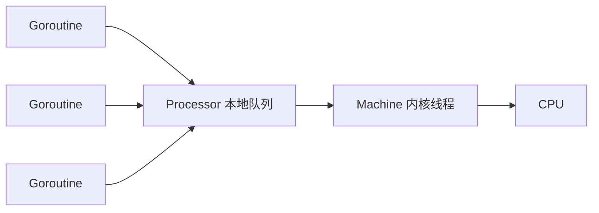
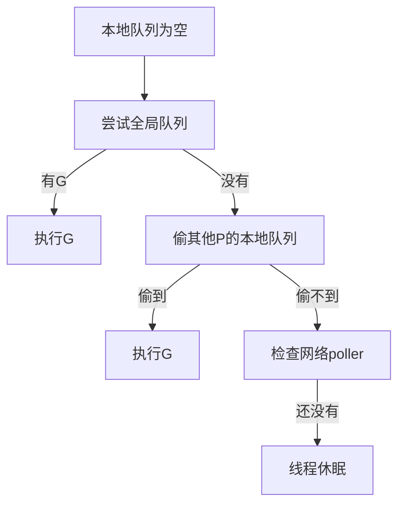
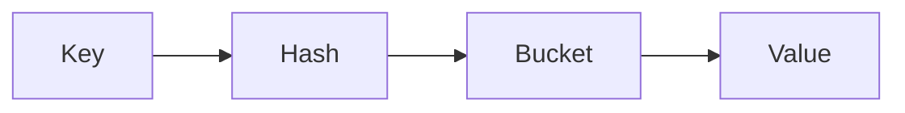
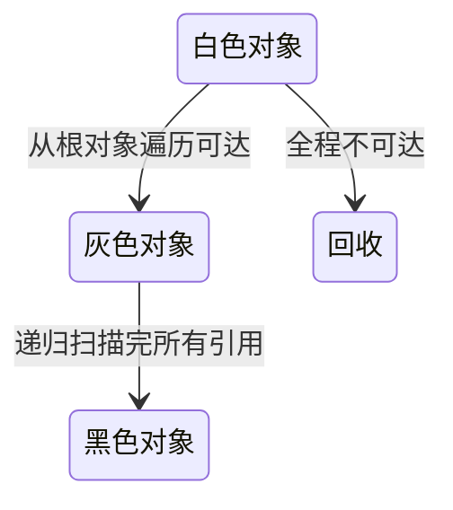
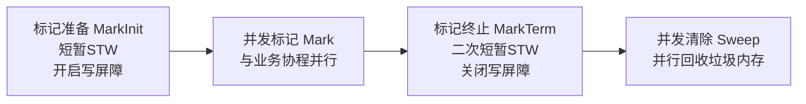

# Go 和 Java 的区别，优缺点

## 核心区别

| 维度   | Go                  | Java          |
| ---- | ------------------- | ------------- |
| 定位   | 云原生 / 高并发 / 工程效率    | 企业级生态         |
| 编译   | 静态编译成本地二进制          | 编译成 JVM 字节码   |
| 并发模型 | Goroutine + Channel | Thread + Lock |
| GC   | 轻量、低延迟              | 成熟、功能强        |
| 部署   | 单二进制部署              | 依赖 JVM        |
| 泛型   | 较晚支持                | 很成熟           |
| 面向对象 | 弱 OOP，无继承           | 强 OOP         |
| 启动速度 | 快                   | 相对慢           |
| 开发效率 | 简洁                  | 规范化强          |

---

## Go 的优点

### 1. 高并发简单

Go 原生支持协程：

```go
go func() {
    fmt.Println("hello")
}()
```

相比 Java：

```java
new Thread(() -> {
    System.out.println("hello");
}).start();
```

Go 的协程创建成本极低。

---

### 2. 部署方便

Go：

```bash
go build
./app
```

直接得到单个可执行文件。

Java：

```bash
java -jar app.jar
```

需要 JVM 环境。

---

### 3. 编译快

Go 编译速度非常快，适合云原生微服务。

---

### 4. 语言简单

Go 故意减少复杂特性：

* 无继承
* 无注解地狱
* 无复杂泛型
* 无 overloaded

适合团队协作。

---

## Go 的缺点

### 1. 生态不如 Java 完整

Java 在：

* 企业中间件
* 大数据
* ORM
* 企业框架

方面积累更深。

---

### 2. 错误处理比较“丑”

Go：

```go
if err != nil {
    return err
}
```

大量重复。

---

### 3. 泛型能力较弱

Go 泛型设计偏保守。

---

## Java 的优点

* 生态成熟
* Spring 全家桶强大
* JVM 调优成熟
* 面向对象体系完整

---

## Java 的缺点

* 项目偏重
* 启动慢
* 内存占用大
* 高并发编写复杂

---

## 面试高频总结

### 为什么 Go 更适合云原生？

因为：

* 协程轻量
* 部署简单
* 编译快
* 内存占用低
* 高并发友好

---

# GMP 模型

Go 调度器核心：

* G：goroutine
* M：内核线程
* P：调度器 Processor

Go 采用 GMP 调度模型。([Go语言学习][1])

---

# G、M、P 分别是什么

## G（Goroutine）

用户态协程。

特点：

* 极轻量
* 初始栈只有几 KB
* 可以创建几十万级别

---

## M（Machine）

真正的内核线程。

由 OS 调度。

---

## P（Processor）

调度上下文。

作用：

* 管理本地 G 队列
* 绑定 M
* 执行调度

P 的数量默认等于 CPU 核数。([Go语言学习][1])

---

# GMP 工作流程



---

# 本地队列 + 全局队列

每个 P 有自己的本地队列。

优势：

* 减少锁竞争
* 提高并发性能

---

# Work Stealing 偷 G

当某个 P 没任务：

会先从全局队列拿G，如果全局队列没有G，再尝试从其他 P 偷一半 G。



这是 Go 高并发的重要设计。

---

# Hand Off

如果 G 阻塞系统调用：

```go
syscall.Read(...)
```

对应 M 会阻塞。

此时：

* P 会解绑 M
* 找新的 M 继续执行

避免整个调度卡死。([深入Go语言之旅][2])

---

# 抢占式调度

早期 Go：

协作式调度。

问题：

死循环会卡住。

Go1.14 后：

支持基于信号的抢占调度。([Go语言学习][1])

---

# Channel

Go 的核心并发通信机制。

Go 推崇：

> 不要通过共享内存通信，而要通过通信共享内存。

**Channel**的底层是一个名为**hchan**的结构体，包含一个**环形缓冲区**、发送和接收的索引指针，以及两个**goroutine等待队列**。

**发送方**和**接收方**通过**互斥锁**保证并发安全，当缓冲区满或空时，goroutine会被挂起到对应的**等待队列**中。

**Channel**在三种情况下会触发**panic**：向已关闭的Channel发送数据、重复关闭Channel、关闭值为**nil**的Channel。


---

# Channel 底层结构

底层是：

* 环形队列
* 等待队列（双向链表）

结构：


---

# 无缓冲 Channel

```go
ch := make(chan int)
```

特点：

* 必须同时有发送和接收
* 同步通信

```go
ch <- 1 // 阻塞
```

直到有人接收。

---

# 有缓冲 Channel

```go
ch := make(chan int, 3)
```

特点：

* buffer 未满：发送不阻塞
* buffer 未空：接收不阻塞

---

# 阻塞条件

## 发送阻塞

发生条件：

* 无缓冲：没人接收
* 有缓冲：buffer 满

---

## 接收阻塞

发生条件：

* 无缓冲：没人发送
* 有缓冲：buffer 空

---

# close 后特点

```go
close(ch)
```

---

## 继续读

可以继续读取剩余数据：

```go
v, ok := <-ch
```

* ok=true：正常数据
* ok=false：channel 已关闭

---

## 遍历行为

```go
for v := range ch {

}
```

会：

* 读完剩余数据
* 自动退出循环

---

## close 已关闭 channel

会 panic：

```go
panic: close of closed channel
```

---

# Map

---

# 底层结构

* **Go的map底层核心结构是`hmap`，其中关键字段包括桶数组指针`buckets`、元素数量`count`、扩容状态`oldbuckets`等。**

  每个桶对应一个`bmap`结构，包含以下核心设计：

  1. **tophash数组**：存储每个key哈希值的高8位，用于快速比对，避免无效的全量key比较
  2. **键数组和值数组**：以非交叉方式分开存储，即先存所有key再存所有value，减少内存对齐损耗
  3. **overflow指针**：指向溢出桶，当当前桶存满8个元素后，通过链表方式串联新桶

  查找时，Go**先用哈希值低位确定桶编号，再用高8位与tophash比对，命中后才做完整key比较**，大幅提升查询效率。

  扩容分为两种策略：

  1. **翻倍扩容**：负载因子超过6.5时触发，桶数量翻倍
  2. **等量扩容**：溢出桶过多但元素不多时触发，整理内存碎片

  扩容采用渐进式迁移，每次写操作时迁移少量桶，避免长时间阻塞。

  

---

# Map 查找流程



---

# 扩容时机

## 1. 装载因子过高

元素太多。

---

## 2. 溢出桶太多

哈希冲突严重。

---

# 渐进式扩容

Go map 不会一次性搬迁。

而是：

* 每次操作搬一点

避免长时间卡顿。

---

# Map 并发不安全

错误示例：

```go
go func() {
    m["a"] = 1
}()

go func() {
    m["b"] = 2
}()
```

可能：

```text
fatal error: concurrent map writes
```

---

# 解决方案

## 1. 加读写锁（大多数场景）

```go
type SafeMap struct {
    mu sync.RWMutex
    m map[string]int
}
```

---

## 2. sync.Map

适合：

* 读多写少
* 用户信息缓存
* 白名单
* 并发场景

大量 Store/Delete下性能很差

---

# Slice

---

# 底层结构

Slice 本质：

```go
type slice struct {
    ptr *array
    len int
    cap int
}
```

---

# len 和 cap

```go
s := make([]int, 3, 5)
```

* len=3
* cap=5

---

# 扩容规则

append 时：

## 小于 256

一般扩容为 2 倍。

---

## 大于 256

逐渐降低增长倍率。

避免浪费内存。

---

# Slice 引用陷阱

```go
arr := [5]int{1,2,3,4,5}

s1 := arr[:2]
s2 := arr[:3]

s1[0] = 100
```

s2 也会变化。

因为：

共享底层数组。

---

# append 陷阱

```go
s1 := []int{1,2,3}
s2 := s1

s1 = append(s1, 4)
```

可能：

* 共用数组
* 也可能扩容后分离

面试很爱问。

---

# Defer

---

# 后进先出

```go
defer fmt.Println(1)
defer fmt.Println(2)
```

输出：

```text
2
1
```

类似栈。

---

# return 执行顺序

核心：

```text
return 先赋值
defer 后执行
最后真正返回
```

---

# 经典题

```go
func test() int {
    i := 0

    defer func() {
        i++
    }()

    return i
}
```

返回：

```text
0
```

因为 return 时已经复制返回值。

---

# 命名返回值

```go
func test() (i int) {
    defer func() {
        i++
    }()

    return i
}
```

返回：

```text
1
```

---

# 闭包变量捕获

```go
for i := 0; i < 3; i++ {
    defer func() {
        fmt.Println(i)
    }()
}
```

输出：

```text
3
3
3
```

因为闭包捕获的是变量本身。

---

# 逃逸分析

Go 编译器决定：

变量放：

* 栈
* 堆

---

# 栈的特点

优点：

* 分配快
* 自动回收

---

# 堆的特点

缺点：

* GC 压力大

---

# 哪些会逃逸

---

## 1. 返回局部变量指针

```go
func test() *int {
    a := 10
    return &a
}
```

a 必须放堆上。

---

## 2. 被 interface 引用

```go
fmt.Println(a)
```

可能逃逸。

---

## 3. 大对象

栈放不下。

---

# 查看逃逸分析

```bash
go build -gcflags="-m"
```

---

# Mutex / RWMutex

---

# Mutex

互斥锁：

```go
var mu sync.Mutex
```

同一时间：

只能一个协程进入。

---

# RWMutex

读写锁：

```go
var mu sync.RWMutex
```

支持：

* 多读
* 单写

---

# 使用场景

## Mutex

适合：

* 写多
* 简单场景

---

## RWMutex

适合：

* 读多写少

---

# 注意点

RWMutex：

* 写锁优先级高
* 不可锁升级

错误：

```go
RLock()
Lock()
```

会死锁。

---

# GC 三色标记

注意 goroutine 死亡后栈也会被回收，不需要 GC 的参与。只有那些需要长期存在的对象才会被分配到需要进行垃圾回收的堆中。

Go GC 核心：

三色标记法。

---

# 三种颜色

| 颜色 | 含义                                                |
| ---- | --------------------------------------------------- |
| 白色 | 未被扫描，默认是垃圾，等待回收                      |
| 灰色 | 自身已被扫描，但**引用的子对象还没扫描**            |
| 黑色 | 自身 + 所有引用对象都扫描完毕，**确定存活，不回收** |

---

# 工作流程



---

# 核心思想

从根对象开始遍历：

* 栈
* 全局变量
* 寄存器

找到所有活对象。

---

# STW

Stop The World：

GC 时暂停程序。

---

# 为什么要降低 STW

否则延迟会非常高。

---

# 写屏障

GC 时：

用户代码可能修改引用关系。

写屏障用于：

维护三色不变性。

降低 STW 时间。

----

# 四大执行阶段



1. **标记准备 MarkInit**

   触发**短暂 STW**；初始化 GC 环境、扫描所有根对象，把可达对象标为灰色。

   

2. **并发标记 Mark**

   **不阻塞业务协程**；GC 协程和用户协程并发运行，

   从灰色对象递归遍历引用，灰色→黑色；全程正常执行业务代码。

   

3. **标记终止 MarkTerm**

   再次**短暂 STW**；因为并发期间用户协程可能修改对象引用，需要重新扫描栈、补全标记，消除漏标。

   

4. **并发清除 Sweep**

   再次并行；遍历堆内存，把**残留白色对象**统一回收，内存归还堆，不阻塞业务。

   

> 重点：Go GC **只有两次短 STW**，全程大部分时间并发，卡顿极低。

## 写屏障（必须讲，面试高频）

### 为什么需要写屏障？

并发标记阶段，**用户协程修改对象引用**会出现两种问题：

1. 黑色对象 引用 白色对象 → 白色对象被漏标，误回收（严重 bug）
2. 产生浮动垃圾：已经标记完的对象变成垃圾，本轮回收不掉

**解决方案：写屏障**

在指针赋值操作前后插入一段逻辑，**强制维护三色标记的约束**：

- 保证黑色对象不会直接引用白色对象
- Go 1.19 后使用 **混合写屏障**，省去栈重扫描，进一步缩短 STW

------

## 五、STW 什么时候发生？

只在两个阶段停顿：

1. 标记准备阶段

2. 标记终止阶段

   

   其余全部

   并发执行

   ，这是 Go GC 低延迟的核心。

------

## 六、GC 触发时机

1. **内存阈值触发**：堆内存分配量达到增长阈值，自动触发
2. **手动触发**：调用 `runtime.GC()`
3. **定时触发**：后台强制定时 GC，防止长期不回收内存溢出

---

# 反射基础

Go 反射核心包：

```go
reflect
```

---

# 反射作用

运行时：

* 获取类型
* 获取字段
* 动态调用

---

# Type 和 Value

```go
t := reflect.TypeOf(x)
v := reflect.ValueOf(x)
```

---

# 修改值必须传指针

```go
func test(x interface{}) {
    v := reflect.ValueOf(x)

    v.Elem().SetInt(100)
}
```

必须：

```go
test(&a)
```

---

# 常见用途

---

## 1. ORM

GORM：

通过反射解析结构体。

---

## 2. JSON

```go
json.Marshal()
```

底层大量使用反射。

---

## 3. 框架

Gin 参数绑定：

```go
ShouldBind()
```

---

# 反射缺点

---

## 1. 性能差

因为：

* 动态类型检查
* 无法编译期优化

---

## 2. 不安全

容易 panic。

---

# 面试高频总结

## Go 为什么高并发强？

核心：

* GMP 调度
* Goroutine 轻量
* Channel CSP 模型
* 用户态调度

---

## Map 为什么并发不安全？

因为扩容和写入会修改内部结构。

---

## Slice 为什么会“互相影响”？

因为共享底层数组。

---

## defer 为什么容易出错？

因为：

* return/defer 执行顺序
* 闭包变量捕获

是高频陷阱。

---

# 字节面试建议（重点优先级）

你现在时间只有 10 天，建议优先级：

## 第一优先级（必须滚瓜烂熟）

* GMP
* Channel
* Map
* Slice
* GC
* defer

---

## 第二优先级

* 逃逸分析
* Mutex/RWMutex
* context
* sync.Once
* sync.Pool

---

## 第三优先级

* 反射
* unsafe
* runtime

---

Go GMP 调度相关内容参考：
([Go语言学习][1])

[1]: https://go.codetrue.net/concurrent-programming/goroutine-scheduling?utm_source=chatgpt.com "GMP 模型原理 | Go语言学习"
[2]: https://go.cyub.vip/gmp/gmp-model/?utm_source=chatgpt.com "调度机制概述 | 深入Go语言之旅"
