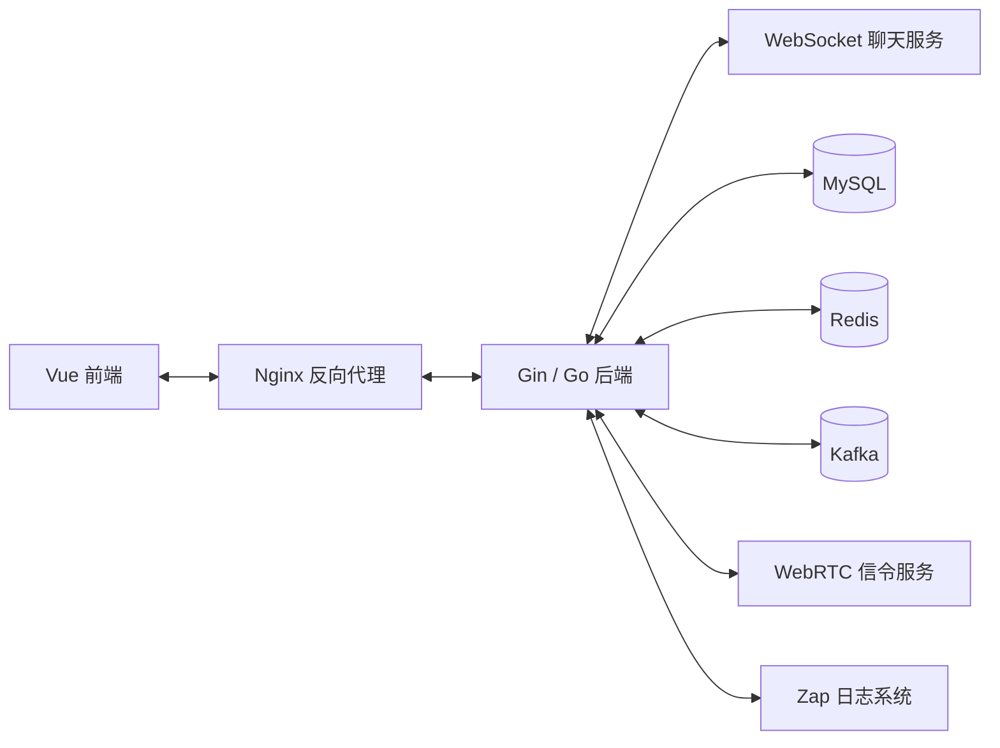
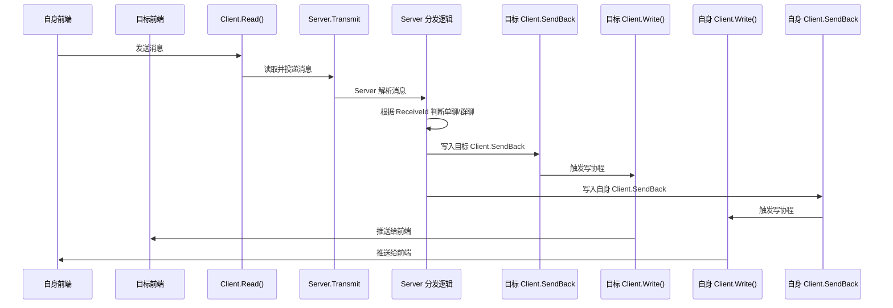
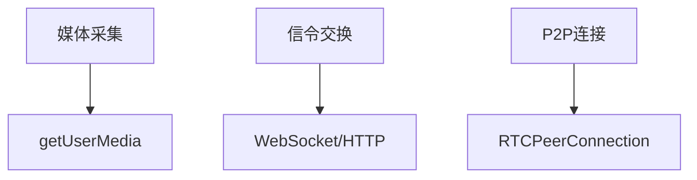
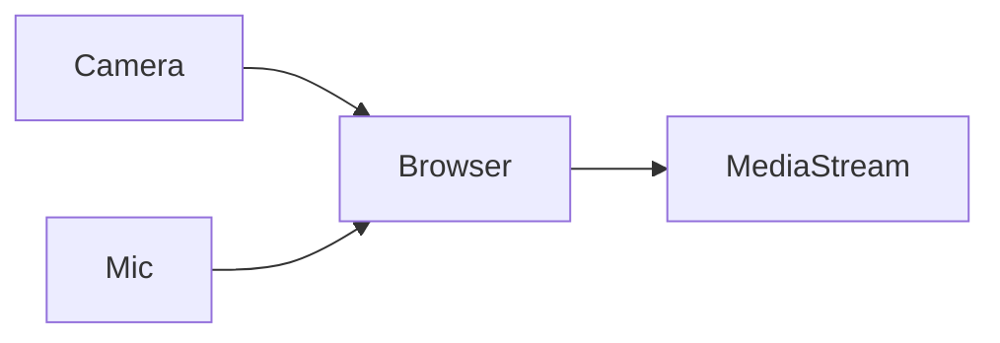
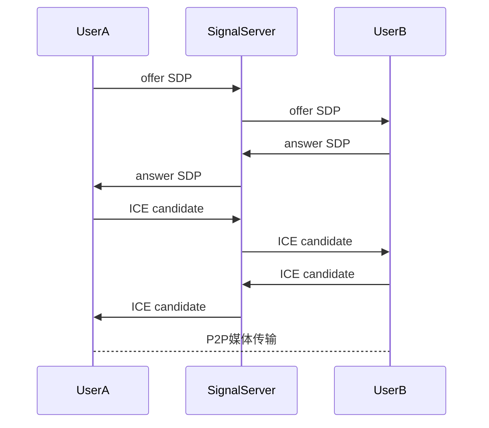
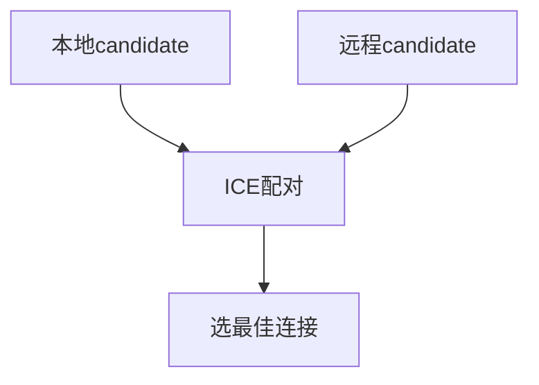
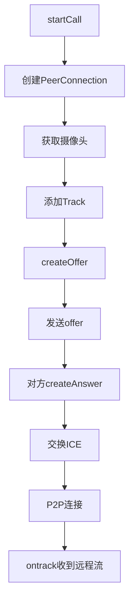
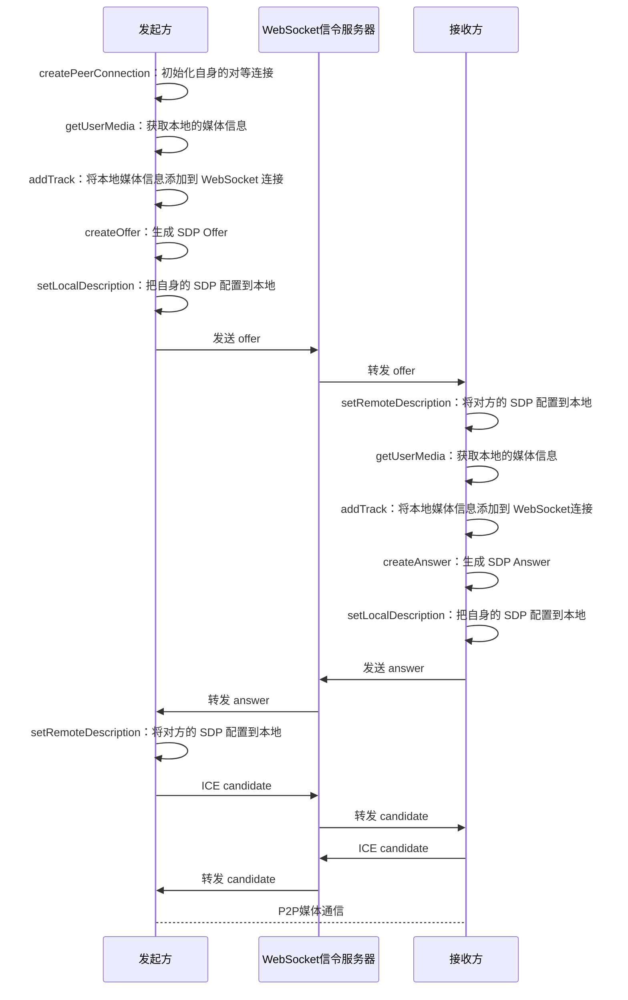

# YukoChat 聊天室 基于 Go 实现的仿微信 IM 系统 

-----

## 技术栈：Gin、GORM、Redis、MySQL、Kafka、Zap、Sarama、WebRTC、WebSocket、Nginx、Vue		[Github](https://github.com/Tensort-cat/yuko-chat-backend)

-----

## 项⽬描述：

- 基于 Go 实现的前后端分离 B/S 架构聊天室

- ⽀持后台管理、单聊群聊、联系⼈管理、多种消息（⽂本/⽂件）、处理离线消息、⾳视频通话等功能

- 主要⼯作和难点：

- 聊天模块：基于 WebSocket 实现⻓连接聊天服务，设计 Channel 消息分发机制，⽀持单聊、群聊、上下线通知及实时消息推送

- 跨域问题：基于gin路由框架搭建路由系统，外加cors跨域资源共享和recovery恢复err的路由中间件，解决跨域访问失败问题

- 视频通话：基于 WebRTC 实现“发起通话”“拒绝通话”“接收通话”“挂断通话”等功能（⽬前只⽀持⼀对⼀通话）

- 登陆与注册：登录注册提供邮箱验证⽅式，前端通过 Vuex 状态管理和会话对⽤⼾信息进⾏存储

- 流量削峰：利⽤ Sarama 操作 Kafka 实现消息异步投递与服务解耦，缓解⾼并发场景下 WebSocket 服务瞬时流量压⼒，实现削峰填⾕

- 管理员界⾯：⽀持后台管理，采⽤靓号措施，针对靓号⽤⼾可以进⼊管理界⾯在⼈员管控⽅⾯进⾏维护

- 反向代理：使⽤ Nginx 配置 HTTPS 与反向代理，统⼀转发 HTTP / WebSocket 请求，解决 WebRTC 与 WSS 的安全通信问题

- ⾃定义⽇志：利⽤ Uber 的开源⽇志库 Zap 设计⾃定义⽇志⼯具包，功能远超 Go 的原⽣ Log 包且⽀持结构化⽇志记录，使得项⽬的开发调试更加⾼效

----

## 个⼈收获：

- 技术深度提升：深⼊理解 WebSocket 的⼯作原理，掌握⾼并发场景下的连接池优化与消息队列设计；熟练使⽤Kafka 消息队列，掌握其在流量削峰与系统解耦中的应⽤；对 WebRTC 协议有了更深刻的理解，能独⽴设计⼀对⼀即时通信⽅案

- 系统设计能⼒：深⼊掌握 GORM 进⾏数据库操作；能设计合理表结构，熟悉了软删除机制并结合 Redis 缓存优化查询性能

----

# 聊天模块（WebSocket + Channel）

WebSocket 本身的原理去看[计网八股](https://www.yuque.com/u60046804/bxgyhg/ge4gbrrrbf14qkzi)，这里只说它在项目中是如何工作的。并且这里先不提 Kafka，项目中实际上 client 的 Read 协程从WebSocket 连接里读到数据的第一时间是发到 Kafka，Server 作为消费者根据自己情况消费 Kafka 中的消息，实现了模块间的解耦，为了方便讲解 WebSocket 的工作流程，暂且当 Kafka 不存在，消息直接发到 Server 的 Channel 中。

## 为什么使用 WebSocket？

IM 聊天需要：

```text
实时通信
```

如果使用 HTTP：

```text
需要频繁轮询
```

性能差、延迟高。

所以项目中使用：

```text
WebSocket 长连接
```

建立：

```text
客户端 ↔ 服务端
```

的双向实时通信。 ([Gin Web Framework](https://gin-gonic.com/ar/docs/server-config/websocket/?utm_source=chatgpt.com))

------

## 整体架构



------

## Client 设计

每个 WebSocket 连接对应一个 Client：

```go
type Client struct {
    Conn     *websocket.Conn
    Uuid     string
    SendTo   chan []byte // 开启 Kafka 后弃用
    SendBack chan *MessageBack
}
```

------

### Read 协程

负责：

```text
读取前端消息
```

流程：

```text
WebSocket
 ↓
Client.Read()
 ↓
Server.Transmit
```

如果：

```text
Server.Transmit 满了
```

则先缓存到：

```text
Client.SendTo // 没有 kafka 才用，开启 Kafka 后这个字段取消了
```

相当于：

```text
削峰缓冲
```

避免消息瞬时打爆服务器。

------

### Write 协程

负责：

```text
向前端推送消息
```

流程：

```text
Server
 ↓
Client.SendBack
 ↓
WebSocket
 ↓
前端
```

发送成功后：

```text
更新消息状态为已发送
```

------

### 为什么要 Read / Write 分离？

因为：

```text
WebSocket 读写都是阻塞操作
```

所以：

- 一个 goroutine 专门读
- 一个 goroutine 专门写

避免互相阻塞。

这是 WebSocket 服务常见设计。 ([Gin Web Framework](https://gin-gonic.com/ar/docs/server-config/websocket/?utm_source=chatgpt.com))

------

## Server 设计

```go
type Server struct {
    Clients  map[string]*Client
    Transmit chan []byte
    Login    chan *Client
    Logout   chan *Client
}
```

------

### Clients

```text
保存在线用户
```

key：

```text
用户ID
```

value：

```text
Client 指针
```

用于：

```text
快速找到在线用户
```

------

### Login / Logout 通道

负责：

```text
用户上下线
```

登录：

```text
加入 Clients map
```

退出：

```text
从 Clients map 删除
```

------

### Transmit 通道

核心转发通道：

```text
所有消息统一进入这里
```

Server 使用：

```go
select
```

持续监听：

- Login
- Logout
- Transmit

实现：

```text
事件驱动
```

------

## 双方都在线时的消息转发流程



------

## 单聊如何实现？

如果 `ReceiveId` 以 `U` 开头，说明是单聊。服务端会把消息转发给目标用户，同时给发送者自己回显一份，保证聊天窗口能立即显示自己发出的消息。

------

## 群聊如何实现？

如果 `ReceiveId` 以 `G` 开头，说明是群聊。服务端先查群成员，再遍历成员逐个发送。本质上是“服务端广播”。

------

## 为什么使用 Channel？

核心原因：

```text
解耦 + 并发安全
```

Channel 相当于：

```text
消息队列
```

优点：

- goroutine 通信简单
- 避免共享内存
- 降低锁竞争
- 异步处理消息

这是 Go 并发模型的典型用法。

------

## 离线消息如何实现？

核心思想：

```text
先落库，再转发
```

消息进入：

```text
Transmit
```

时：

```text
先存 Message 表
```

------

如果用户在线：

```text
实时 WebSocket 推送
```

如果用户不在线：

```text
只保存数据库
```

等用户上线后：

```text
/message/getMessageList
```

重新拉取聊天记录。

------

## 为什么这样设计？

好处：

```text
在线实时推送
离线可靠存储
```

兼顾：

- 实时性
- 可靠性

------

## 面试回答模板

```text
我的 IM 聊天模块基于 WebSocket 实现长连接通信。

每个连接对应一个 Client，
内部使用 Read 和 Write 两个 goroutine 分别负责读写，
避免 WebSocket 阻塞。

服务端维护一个 Clients 在线用户表，
并通过 Channel 实现消息分发。

所有消息先进入 Transmit 转发通道，
Server 再根据消息类型进行单聊、群聊或音视频信令转发。

同时消息会先落库，
在线用户通过 WebSocket 实时推送，
离线用户则在登录后从数据库拉取历史消息，
实现离线消息功能。
```

------

## 面试官可能追问

### 为什么消息先落库？

为了：

```text
保证消息可靠性
```

即使用户离线：

```text
消息也不会丢失
```

----

### 为什么群聊本质是遍历发送？

因为：

```text
WebSocket 是点对点连接
```

群聊本质上：

```text
是服务端循环转发
```

----

# 跨域问题（CORS）

## 什么是跨域？

浏览器有：

```text
同源策略（Same-Origin Policy）
```

协议、域名、端口三者任意一个不同，都算跨域。

例如：

```text
前端：http://localhost:8080
后端：http://localhost:8000
```

端口不同，所以浏览器会拦截请求。

------

## 为什么会出现跨域问题？

因为浏览器要防止：

```text
恶意网站跨站请求用户数据
```

所以默认禁止不同源之间互相访问。 ([zetcode.com](https://zetcode.com/golang/cors/?utm_source=chatgpt.com))

------

## 什么是 CORS？

CORS：

```text
Cross-Origin Resource Sharing
跨域资源共享
```

本质上：

```text
服务器通过 HTTP Header 告诉浏览器：
允许哪些跨域请求
```

例如：

```http
Access-Control-Allow-Origin: *
```

表示允许任意来源访问。

------

## 项目中如何解决跨域？

项目中使用：

```go
github.com/gin-contrib/cors
```

作为 Gin 的全局中间件：

```go
GE.Use(cors.New(corsConfig))
```

统一处理跨域请求。 ([GitHub](https://github.com/gin-contrib/cors?utm_source=chatgpt.com))

------

## 项目中的配置是什么意思？

### 1. AllowOrigins

```go
corsConfig.AllowOrigins = []string{"*"}
```

表示：

```text
允许所有域名跨域访问
```

开发环境常用，生产环境通常改成指定域名。

------

### 2. AllowMethods

```go
AllowMethods = []string{
    "GET", "POST", "PUT", "DELETE", "OPTIONS",
}
```

表示允许哪些 HTTP 方法跨域。

其中：

```text
OPTIONS 很重要
```

因为浏览器会先发送：

```text
预检请求（Preflight）
```

确认服务器是否允许跨域。

------

### 3. AllowHeaders

```go
AllowHeaders = []string{
    "Content-Type",
    "Authorization",
}
```

表示允许携带：

- Content-Type
- JWT Token

等请求头。

------

## Recovery 中间件是什么？

```go
gin.Default()
```

默认自带：

- Logger
- Recovery

Recovery 的作用：

```text
捕获 panic，防止服务崩溃
```

例如接口 panic 时：

```text
不会导致整个 Go 服务退出
```

而是返回：

```text
500 Internal Server Error
```

------

## 面试回答模板

```text
因为前后端分离开发时，
Vue 前端和 Gin 后端端口不同，
浏览器会触发同源策略导致跨域问题。

所以我使用 gin-contrib/cors 中间件统一处理 CORS，
配置了 AllowOrigins、AllowMethods 和 AllowHeaders，
允许前端跨域访问接口。

其中 OPTIONS 用于处理浏览器预检请求，
Authorization 用于支持 JWT Token 请求头。

另外 Gin 默认还带有 Recovery 中间件，
可以在 panic 时自动 recover，
避免服务直接崩溃。
```

----

# Kafka 在项目中的应用和作用

Kafka 的详细底层原理请去看消息队列八股文档，这里只说在项目中的作用

## Kafka 队列的应用

- **消息传递与存储**：在聊天服务器中，前端的 client 向中转服务器发送消息时，先将消息上传到 kafka 上，中转服务器从 kafka 上读取消息，实现消息解耦，流量削峰。Kafka 作为一个分布式的消息系统，能够高效地处理这些消息，并将它们持久化存储到磁盘上，确保消息不会丢失。

- **消息处理与分发**：聊天服务器中的后端服务会从 Kafka 队列中拉取消息，并进行处理。处理后的消息可能会被分发到不同的业务逻辑中，如用户登录登出，消息转发等。

- **日志记录与分析**：Kafka 还可以用于记录聊天服务器的日志信息。这些日志信息对于监控服务器状态、排查问题以及优化系统性能具有重要意义。通过将日志信息发送到 Kafka 队列，后端服务可以实时地分析和处理这些日志。

----

## Kafka 队列的作用

- **解耦系统组件**：Kafka 队列在聊天系统中起到了解耦系统组件的作用。它允许不同的服务以异步的方式通信，从而降低了系统间的依赖性和耦合度。这有助于提高系统的可扩展性和可维护性。

- **提高系统吞吐量**：由于 Kafka 具有高吞吐量的特性，它能够处理大量的并发请求。在聊天系统中，这意味着即使有成千上万的用户同时发送消息，Kafka 也能够保证消息的及时处理和传递。

- **保证消息顺序性**：Kafka 通过分区和副本机制保证了消息的顺序性。在聊天系统中，这意味着用户可以按照发送消息的顺序接收到它们，从而保证了聊天内容的连贯性和一致性。

- **实现削峰填谷**：在聊天高峰期，Kafka 队列可以作为一个缓冲区来存储大量的消息。这有助于平衡系统的负载，防止因过载而导致的服务崩溃或性能下降。当高峰期过后，系统可以逐渐处理这些缓存的消息，从而恢复正常的运行状态。

----

# 基于 WebRTC 的视频通话

## webRTC 介绍

**WebRTC（Web Real-Time Communication）**本质上是浏览器提供的一套 API，让两个客户端能够：

* 点对点（P2P）通信
* 实时传输：

  * 音频
  * 视频
  * 数据

典型场景：

* 视频通话
* 在线会议
* 屏幕共享
* 语音聊天
* P2P 文件传输

----

## 核心架构

WebRTC 实际由三部分组成：



---

## WebRTC 的两个核心 API

### 1. getUserMedia

负责：

* 获取摄像头
* 获取麦克风

项目中的代码：

```javascript
navigator.mediaDevices.getUserMedia({
  video: true,
  audio: true,
});
```

作用：



最终返回：

```javascript
MediaStream
```

里面包含：

* 视频轨道（video track）
* 音频轨道（audio track）

----

### 2. RTCPeerConnection

这是 WebRTC 的核心。

它负责：

* 建立 P2P 连接
* NAT 穿透
* 音视频传输
* 网络协商
* 编码解码

项目中的代码：

```javascript
data.rtcPeerConn = new RTCPeerConnection(data.ICE_CFG);
```

----

## 为什么 WebRTC 还需要服务器？

很多人误以为：

> WebRTC 完全 P2P，不需要服务器

错。

实际上：**WebRTC 必须需要 Signaling Server（信令服务器，由项目中的 go 后端服务充当）**

用于交换：

* SDP
* ICE Candidate

WebRTC 官方文档明确说明：
WebRTC 本身不规定 signaling 的实现，通常通过 WebSocket 或 HTTP 完成。([WebRTC][1])

项目中：

```javascript
store.state.socket.send(JSON.stringify(rtcMessageRequest));
```

就是：

* 用 WebSocket
* 发送 signaling 消息

----

## WebRTC 建立连接全过程（核心）

### 总体流程（简化版）



----

## 核心参数/方法详解

### SDP（Session Description Protocol）

虽然名字里有“Protocol”，但其实不是传输协议。

它只是：

> “描述双方媒体能力”的文本

比如：

* 支持哪些编码器
* 视频分辨率
* 音频格式
* 网络信息

----

#### createOffer()

发起方：

```javascript
peerConnection.createOffer()
```

生成自己的`SDP`：

```text
我支持：
- H264
- VP8
- opus
- 视频
- 音频
```

----

#### createAnswer()

接收方：

```javascript
peerConnection.createAnswer()
```

返回共同支持的`SDP`：

```text
我也支持：
- VP8
- opus
```

----

## ICE（Interactive Connectivity Establishment）

### 为什么需要 ICE

双方通常都在 NAT 后面。

例如：

```text
A: 192.168.1.2

B: 10.0.0.5
```

内网 IP 无法直接通信。

所以需要：

* NAT 穿透
* 寻找可连接路径

这就是 ICE。

----

## ICE Candidate

ICE Candidate：

就是：

> “我有哪些可能的网络地址”

例如：

```text
candidate:
192.168.x.x
公网IP
TURN relay
```

双方互相交换。

然后：



----

## 项目中视频通话发起方的代码架构



----

## 一对一视频通话的完整时序图




----

# 反向代理

## 什么是反向代理，为什么需要它？

### 1. 什么是反向代理？

**反向代理（Reverse Proxy）**本质上是：

```text
客户端 -> Nginx -> 后端服务
```

用户并不会直接访问 Go 服务，而是：

```text
浏览器只和 Nginx 通信
```

Nginx 再把请求转发给：

```text
127.0.0.1:8000
```

例如我项目里的：

```nginx
location /api/ {
    proxy_pass http://127.0.0.1:8000;
}
```

表示：

```text
/api 开头的请求
↓
由 Nginx 转发给 Go 服务
```

------

### 2. 为什么需要反向代理？

在我的 IM 项目里，反向代理主要解决了以下问题：

------

#### （1）统一入口

前端只访问：

```text
https://xxx.com
```

而不需要：

```text
http://127.0.0.1:8000
ws://127.0.0.1:8000
```

这样：

- HTTP
- HTTPS
- WebSocket
- WSS

都统一交给 Nginx 管理。

------

#### （2）隐藏后端服务

Go 服务只监听：

```text
127.0.0.1:8000
```

不会直接暴露公网。

真正暴露出去的是：

```text
Nginx 的 443 端口
```

这样更安全。

------

#### （3）解决 HTTPS + WebSocket 的兼容问题

浏览器有一个安全限制：

```text
HTTPS 页面不能连接 ws://
只能连接 wss://
```

否则会直接报错：

```text
Mixed Content
```

所以：

```text
Vue 页面是 HTTPS
↓
WebSocket 必须是 WSS
↓
Nginx 负责 SSL/TLS
↓
再转发给后端 ws
```

这就是：

```text
wss -> nginx -> ws -> Go
```

------

#### （4）Nginx 更适合处理网络层能力

比如：

- HTTPS
- SSL证书
- 长连接
- WebSocket Upgrade
- 静态资源
- 限流
- 负载均衡

这些都更适合交给 Nginx。([DeployWise](https://deploywise.dev/guides/nginx-reverse-proxy-guide?utm_source=chatgpt.com))

------

#### （5）静态资源直接由 Nginx 返回

例如：

```nginx
location / {
    root xxx/dist;
}
```

Vue 打包后的：

- js
- css
- html

都由 Nginx 直接返回。

Go 服务只负责：

```text
业务逻辑
```

降低后端压力。

------

## Nginx 在你的项目中是怎么工作的？

### 整体架构

```text
浏览器
   ↓
HTTPS / WSS
   ↓
Nginx（443）
   ↓
HTTP / WS
   ↓
Go Gin 服务（8000）
```

------

### 1. 前端访问 HTTPS

项目中：

```nginx
listen 443 ssl;
```

表示：

```text
Nginx 监听 HTTPS
```

并配置：

```nginx
ssl_certificate
ssl_certificate_key
```

用于 TLS 加密。

------

### 2. Vue 页面由 Nginx 提供

```nginx
location / {
    root xxx/dist;
    index index.html;
}
```

说明：

```text
Vue 打包后的 dist
由 Nginx 直接托管
```

浏览器访问：

```text
https://ip/
```

实际拿到的是：

```text
Vue SPA 页面
```

------

### 3. API 请求转发给 Go

```nginx
location /api/ {
    proxy_pass http://127.0.0.1:8000;
}
```

例如：

```text
https://xxx/api/user/info
```

会被转发成：

```text
http://127.0.0.1:8000/api/user/info
```

------

### 4. WebSocket 请求转发

项目中最关键的是：

```nginx
location /wss {
    proxy_pass http://127.0.0.1:8000;

    proxy_http_version 1.1;
    proxy_set_header Upgrade $http_upgrade;
    proxy_set_header Connection "Upgrade";
}
```

这是 WebSocket 的核心配置。

------

### 5. 为什么 WebSocket 需要特殊配置？

WebSocket 不是普通 HTTP。

它会先发起：

```http
HTTP Upgrade
```

请求：

```text
HTTP -> WebSocket
```

所以 Nginx 必须显式转发：

```text
Upgrade
Connection
```

两个请求头。

否则：

```text
WebSocket 握手失败
```

------

### 6. 我的 WebSocket 完整流程

前端：

```js
new WebSocket(wsUrl)
```

例如：

```text
wss://xxx/wss?client_id=123
```

浏览器：

```text
发起 WSS 请求
↓
Nginx 接收
↓
Upgrade 转发
↓
Go upgrader.Upgrade()
↓
升级成 WebSocket
↓
建立长连接
```

后端：

```go
upgrader.Upgrade(c.Writer, c.Request, nil)
```

这里真正把：

```text
HTTP 连接
```

升级成：

```text
WebSocket 长连接
```

------

### 7. 为什么后端仍然是 HTTP/WS？

因为：

```text
HTTPS/WSS 已经在 Nginx 终止了
```

这叫：

```text
SSL Termination（SSL 终止）
```

即：

```text
客户端 <-> Nginx 使用 HTTPS
Nginx <-> Go 使用 HTTP
```

这样：

- Go 不需要处理证书
- 简化后端开发
- 降低 TLS 开销

这是非常典型的生产架构。([DeployWise](https://deploywise.dev/guides/nginx-reverse-proxy-guide?utm_source=chatgpt.com))

------

## 为什么要实现 HTTPS 而不直接用 HTTP？

### 1. WebRTC 强制要求安全上下文

你的项目里有：

```text
音视频通信（WebRTC）
```

而现代浏览器要求：

```text
WebRTC 必须运行在 HTTPS 环境
```

否则：

- 摄像头
- 麦克风
- 屏幕共享

都会被浏览器拒绝。

所以：

```text
必须启用 HTTPS
```

这是项目里最核心的原因。

------

### 2. HTTPS 页面不能连接 ws://

浏览器安全策略规定：

```text
HTTPS 页面
不能连接不安全 ws://
```

只能：

```text
HTTPS -> WSS
```

否则浏览器会直接阻止。([Reddit](https://www.reddit.com/r/nginxproxymanager/comments/1q3azwl/cant_get_pythonmatterserver_to_work_with_nginx_if/?utm_source=chatgpt.com))

所以：

```text
Vue 页面 HTTPS
↓
WebSocket 必须 WSS
↓
必须部署 HTTPS
```

------

### 3. 防止数据被窃听

IM 项目里有：

- 聊天消息
- 用户信息
- WebRTC 信令

如果是 HTTP：

```text
明文传输
```

容易被：

- 中间人攻击
- 抓包
- 篡改

HTTPS 会通过 TLS 加密通信。

------

### 4. HTTPS 才符合真实生产环境

现代互联网服务：

- 登录
- IM
- WebSocket
- 音视频

基本都运行在 HTTPS。

面试里可以补一句：

```text
项目虽然是个人项目，但我尽量按照真实生产环境部署，
因此加入了 HTTPS、WSS 和 Nginx 反向代理。
```

这句话面试官通常会比较认可。

------

## 面试官可能继续追问的问题

### Q1：为什么 WebSocket 不能直接连接 Go？

可以。

但：

- 让后端直接管理 HTTPS 证书很麻烦
- WebSocket Upgrade 要自己处理
- 静态资源不好管理
- 不方便扩展负载均衡

所以通常：

```text
Nginx 做入口层
Go 做业务层
```

------

### Q2：为什么配置 `proxy_http_version 1.1`？

因为：

```text
WebSocket Upgrade
是 HTTP/1.1 的特性
```

HTTP/1.0 不支持。

------

### Q3：为什么必须配置 Upgrade 和 Connection？

因为：

```text
Upgrade 是 hop-by-hop header
```

代理默认不会转发。

需要显式设置：

```nginx
proxy_set_header Upgrade $http_upgrade;
proxy_set_header Connection "Upgrade";
```

否则后端不知道客户端想升级为 WebSocket。([Nginx](https://nginx.org/en/docs/http/websocket.html?utm_source=chatgpt.com))

----

# 自定义日志系统（Zap + Lumberjack）

## 为什么不用 Go 原生 log 包？

Go 原生 `log` 包的问题：

```text
1. 不支持日志级别
2. 不支持结构化日志
3. 不支持日志切割
4. 不支持高性能 JSON 日志
5. 不方便做日志检索
```

例如原生日志：

```go
log.Println("user login", userId)
```

输出：

```text
2026/05/17 12:00:00 user login 1001
```

问题：

- 不方便机器解析
- 无法按字段搜索
- 不利于 ELK / Loki 等日志系统分析

------

所以项目中使用了：

- Zap
- Lumberjack

来构建生产级日志系统。 ([Better Stack](https://betterstack.com/community/guides/logging/go/zap/?utm_source=chatgpt.com))

------

## 什么是 Zap？

Zap 是 Uber 开源的：

```text
高性能结构化日志库
```

特点：

- 高性能
- 零反射
- 低内存分配
- 支持 JSON 日志
- 支持结构化字段
- 支持日志级别

官方介绍中强调：

```text
Blazing fast, structured, leveled logging
```

即：

```text
超快 + 结构化 + 分级日志
```

([Go Packages](https://pkg.go.dev/go.uber.org/zap?utm_source=chatgpt.com))

------

## 什么是结构化日志？

传统日志：

```text
用户登录失败 id=1001 ip=127.0.0.1
```

结构化日志：

```json
{
  "level":"error",
  "msg":"用户登录失败",
  "user_id":1001,
  "ip":"127.0.0.1"
}
```

结构化日志的优势：

- 方便搜索
- 方便统计
- 方便 Kibana 查询
- 方便链路追踪
- 方便日志分析平台处理

------

## 我的日志系统整体架构

整体结构：

```text
业务代码
   ↓
zlog.Info()
   ↓
Zap Logger
   ↓
Zap Core
   ↓
JSON Encoder
   ↓
同时写入：
    1. 控制台
    2. 日志文件
```

------

## 项目中是怎么封装 Zap 的？

### 1. 封装统一日志入口

项目中：

```go
func Info(message string, fields ...zap.Field)
func Debug(message string, fields ...zap.Field)
func Error(message string, fields ...zap.Field)
func Warn(message string, fields ...zap.Field)
```

业务层直接：

```go
zlog.Info("用户上线",
    zap.String("uid", uid))
```

而不是每次都：

```go
logger.Info(...)
```

好处：

- 统一日志规范
- 降低重复代码
- 后续方便扩展

------

### 2. 使用 JSON 格式日志

项目中：

```go
encoder := zapcore.NewJSONEncoder(encoderConfig)
```

即：

```text
日志统一输出 JSON
```

例如：

```json
{
  "level":"info",
  "msg":"ws连接成功",
  "time":"2026-05-17T12:00:00Z"
}
```

相比普通文本日志：

```text
更适合生产环境
```

------

### 3. 自定义时间格式

项目中：

```go
encoderConfig.EncodeTime = zapcore.ISO8601TimeEncoder
```

即：

```text
2026-05-17T12:00:00Z
```

这种标准时间格式。

方便：

- 排查问题
- 日志排序
- ELK 分析

------

### 4. 同时输出到控制台 + 文件

项目中：

```go
zapcore.NewTee(...)
```

实现：

```text
一个日志
同时写多个目标
```

即：

```text
日志
 ├── stdout
 └── app.log
```

------

代码：

```go
zapcore.NewCore(
    encoder,
    zapcore.AddSync(os.Stdout),
    zapcore.DebugLevel,
)
```

控制台输出：

```text
方便开发调试
```

------

文件输出：

```go
zapcore.NewCore(
    encoder,
    fileWriteSyncer,
    zapcore.DebugLevel,
)
```

用于：

```text
持久化日志
```

------

## 为什么生产环境一般不输出控制台？

因为：

```text
stdout 日志量过大
```

会导致：

- IO 开销增加
- 容器日志膨胀
- 日志采集压力增大

所以生产环境通常：

```text
只写文件
或者只输出 stdout 给日志平台采集
```

------

## 日志切割（Log Rotate）

### 为什么需要日志切割？

如果：

```text
app.log 一直增长
```

可能：

- 占满磁盘
- 单文件过大
- 查询困难
- 打开缓慢

所以必须：

```text
自动切割日志
```

------

### Zap 为什么还要配合 Lumberjack？

Zap：

```text
本身不支持日志切割
```

所以项目中引入：

```go
github.com/natefinch/lumberjack
```

专门负责：

```text
Log Rotate
```

([GoLang Dev](https://www.golangdev.cn/pkgs/logs/zap.html?utm_source=chatgpt.com))

------

### 项目中的日志切割策略

```go
MaxSize: 100
```

表示：

```text
单文件超过 100MB 自动切割
```

------

```go
MaxBackups: 60
```

表示：

```text
最多保留 60 个历史日志
```

超过自动删除旧日志。

------

```go
MaxAge: 1
```

表示：

```text
日志保留 1 天
```

------

### 日志切割后的文件长什么样？

例如：

```text
app.log
```

切割后，文件名多了个时间戳：

```text
app-2026-05-17T12-00-00.log
```

------

## 封装中的一个亮点：自动记录调用位置

项目里最值得讲的部分之一：

```go
runtime.Caller(2)
```

------

### 这是干什么的？

你实现了：

```text
自动记录：
- 函数名
- 文件名
- 行号
```

------

例如：

```json
{
  "func":"UserLogin",
  "file":"user.go",
  "line":123
}
```

------

### 为什么这个功能很重要？

线上排查问题时：

```text
知道错误发生在哪一行
```

非常关键。

否则只能：

```text
全项目搜索日志
```

效率很低。

------

### 为什么是 `runtime.Caller(2)`？

调用链：

```text
业务代码
 ↓
zlog.Info()
 ↓
getCallerInfoForLog()
 ↓
runtime.Caller()
```

所以：

```text
需要回溯两层
```

才能拿到：

```text
真正业务代码的位置
```

------

## 结构化字段是怎么实现的？

项目里：

```go
zap.String("func", funcName)
zap.Int("line", line)
```

这些本质上是：

```text
key-value
```

结构化字段。

------

例如：

```go
zlog.Error("数据库连接失败",
    zap.String("db", "mysql"),
    zap.Int("retry", 3),
)
```

输出：

```json
{
  "msg":"数据库连接失败",
  "db":"mysql",
  "retry":3
}
```

------

## 面试回答模板

### Q：为什么项目里自己封装日志系统？

可以回答：

```text
Go 原生 log 包功能比较简单，
不支持结构化日志和日志级别。

所以我基于 Uber 的 Zap 封装了一层日志工具，
统一了日志输出格式，
支持 Debug / Info / Warn / Error 多级日志，
并且支持 JSON 结构化日志。

同时结合 Lumberjack 实现了日志切割，
避免日志文件无限增长。

另外我还通过 runtime.Caller 自动记录了函数名、文件名和行号，
方便线上问题排查。
```

------

## 面试官可能继续追问

------

### Q1：为什么用 JSON 日志？

因为：

```text
方便机器解析
```

适合：

- ELK
- Loki
- Grafana
- 链路追踪

------

### Q2：为什么日志级别重要？

因为：

```text
不同环境需要不同日志粒度
```

例如：

开发环境：

```text
Debug
```

生产环境：

```text
Info / Warn / Error
```

避免：

```text
无意义日志过多
```

------

### Q3：为什么日志不能无限写？

因为：

```text
磁盘会被占满
```

所以必须：

```text
日志切割 + 清理旧日志
```

------

### Q4：为什么线上排查时结构化日志更有优势？

例如：

```json
{
  "uid":"1001",
  "module":"chat",
  "error":"redis timeout"
}
```

日志平台可以直接：

```text
按 uid 搜索
按模块过滤
按错误聚合
```

这就是结构化日志最大的价值。