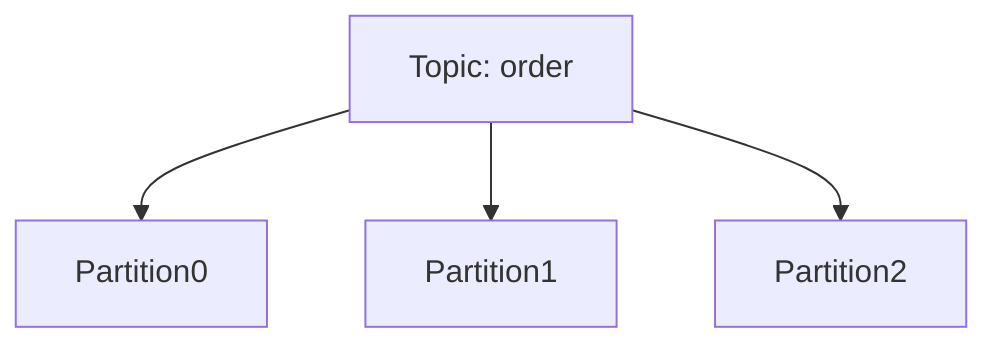
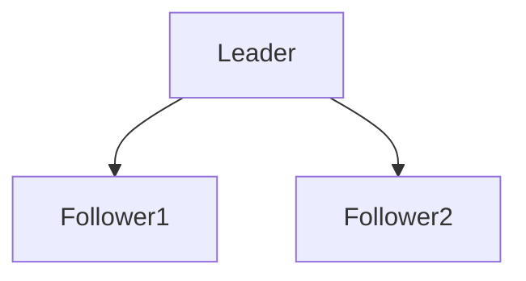
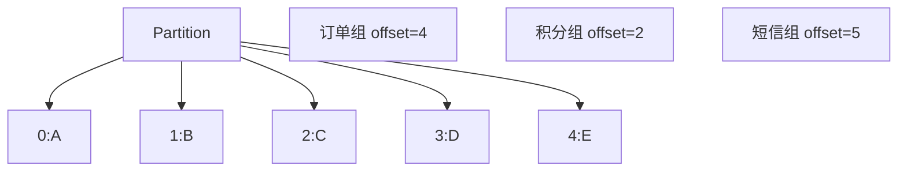
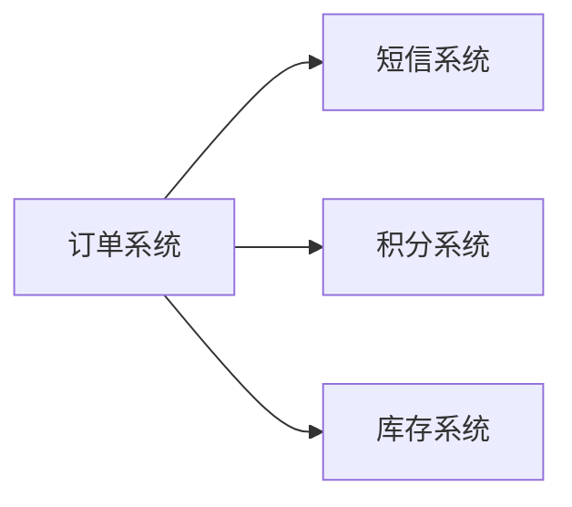
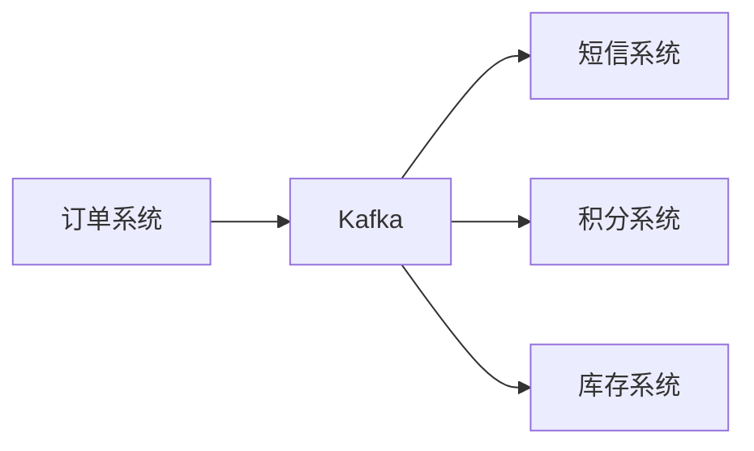
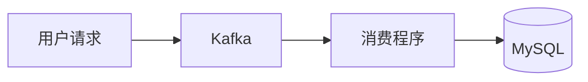
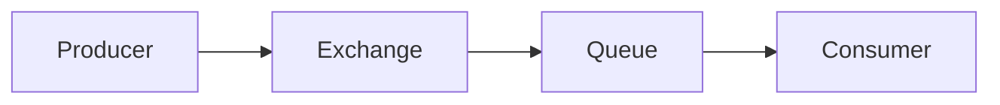
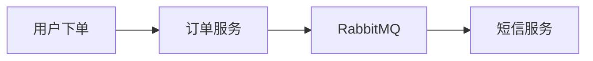

# Kafka 底层原理：分区、副本、消费组、偏移量，削峰 + 解耦

## 一、Kafka 是什么

Apache Kafka 本质上是一个**高吞吐量的分布式消息队列 / 流处理平台**。

典型作用：

* 服务解耦
* 异步处理
* 流量削峰
* 日志收集
* 实时数据处理

一句话理解：

> 生产者把消息写入 Kafka，消费者异步消费。

---

# 二、Kafka 核心架构


> 注意新版 Kafka 已经不使用 Zookeeper ，元数据由自己管理（KRaft）

---

# 三、Topic 和 Partition（分区）

## 1. Topic

Kafka 中的“主题”。

类似：

* MySQL 的表
* RabbitMQ 的队列

例如：

* order-topic
* user-topic

---

## 2. Partition（最核心）

Kafka 的 Topic 会被拆分成多个 Partition。



每个 Partition 本质：

> 一个顺序追加写的日志文件（Log）

Kafka 高性能的重要原因之一：

* 顺序写磁盘
* 避免随机 IO

---

## 3. 为什么要分区？

### （1）提高吞吐量

多个 Partition 可以并行读写。

```text
Partition0 -> Broker1
Partition1 -> Broker2
Partition2 -> Broker3
```

多个 Broker 一起工作。

---

### （2）提高消费并行度

一个消费者组中：

* 一个 Partition 同一时刻只能被一个 Consumer 消费
* 多个 Partition 可以被多个 Consumer 并行消费

---

## 4. 分区有序性

Kafka 只能保证：

> 单 Partition 内有序

不能保证整个 Topic 全局有序。

因此：

如果业务要求：

* 同一个用户订单有序
* 同一个账号操作有序

通常：

```text
按 userId 作为 key 分区 (比如 userId % Partition 数量)
```

这样同一个 userId 永远进入同一个 Partition。 ([Toolkit][1])

---

# 四、副本机制（Replica）

## 1. 为什么需要副本

防止 Broker 宕机导致数据丢失。

Kafka 会给 Partition 创建多个副本：



---

## 2. Leader 和 Follower

Partition 的副本分两种：

| 类型       | 作用           |
| -------- | ------------ |
| Leader   | 对外提供读写       |
| Follower | 同步 Leader 数据 |

生产者：

* 只写 Leader

消费者：

* 默认只读 Leader

Follower 只负责同步。

---

## 3. ISR（In-Sync Replica）

ISR：

> 与 Leader 保持同步的副本集合

只有 ISR 中的副本才有资格成为新 Leader。 ([Toolkit][1])

---

## 4. acks 机制（面试高频）

Producer 发消息时：

### acks=0

不等 Kafka 响应，发了就去干别的。

* 最快
* 最容易丢消息

---

### acks=1

确定 Leader 写成功才返回。

Follower 还没同步可能宕机，所以可能丢消息。

---

### acks=all（推荐）

ISR 中所有副本同步完成才返回。

最安全。 ([Toolkit][1])

---

# 五、Consumer Group（消费组）

## 1. 为什么需要消费组

Kafka 不是“一个消息只能被一个消费者消费”。

而是：

```text
不同消费组之间互不影响，他们各自维护自己的 offset，同一份消息可能会被不同消费组各自消费
```

例如：

```text
订单消息：
订单系统消费一次
积分系统消费一次
短信系统消费一次
```

因此：



| 消费组 |     下次消费位置     |
| :----: | :------------------: |
| 订单组 |          E           |
| 积分组 |          C           |
| 短信组 | 已消费完，等待新消息 |

---

## 2. 同一消费组内部

同一组内：一个 Partition 只能被一个 Consumer 消费

例如：

```
4 个 Partition
3 个 Consumer 组成的消费组
```

情况可能是：

```
Consumer0 -> P0
Consumer1 -> P1, p2
Consumer2 -> P3
```


---

## 3. 为什么这样设计？

为了避免：

```text
同一个消费组重复消费
```

Kafka 用消费组实现：

* 负载均衡
* 横向扩展

([Confluent 文档][2])

---

# 六、Offset（偏移量）

## 1. 什么是 Offset

Kafka 每条消息都有 Offset：

```text
0
1
2
3
4
...
```

本质：

> Partition 内消息的位置编号

---

## 2. Offset 的作用

消费者记录：

```text
自己消费到了哪里
```

例如：

```text
Offset=100
```

表示：

```text
下一次从 101 开始读
```

Kafka 通过 Offset 实现：

* 断点续传
* 重试
* 消费进度管理

([Confluent 文档][2])

---

## 3. Offset 存在哪里

Kafka 会把消费位点存到内部 Topic：

```text
__consumer_offsets
```

([Confluent 文档][2])

---

## 4. 为什么 Kafka 能重复消费？

因为：

Kafka 不会删除“已消费消息”。

消费者只是：

```text
记录 offset
```

因此：

```text
改 offset 就能重新消费
```

这也是 Kafka 很适合：

* 消息重放
* 日志回溯
* 大数据

的重要原因。

---

# 七、Kafka 为什么快（面试很爱问）

## 1. 顺序写磁盘

Kafka 采用：

```text
append-only
```

顺序追加。

顺序 IO 比随机 IO 快很多。

---

## 2. 零拷贝（Zero Copy）

Kafka 使用：

```text
sendfile
```

减少：

* 用户态
* 内核态

之间的数据拷贝。

---

## 3. Page Cache

Kafka 高度利用 OS Page Cache。

数据先写缓存。

磁盘异步刷盘。

---

## 4. 分区并行

多个 Partition：

* 并行生产
* 并行消费

提高吞吐。

---

# 八、Kafka 的“削峰”和“解耦”

---

# 1. 解耦

没有 Kafka：



问题：

* 强依赖
* 一个挂了全挂
* 调用链复杂

---

引入 Kafka：



订单系统：

```text
只负责发消息
```

其他系统：

```text
自己消费
```

实现：

* 服务解耦
* 异步化
* 降低耦合

---

# 2. 削峰

秒杀场景：

```text
瞬时 10w 请求
```

数据库扛不住。

---

引入 Kafka：



### 高峰期

消息先进入 Kafka。

Kafka 暂存消息。

---

### 后端慢慢消费

消费者按自己能力取消息处理。

例如：

```text
每秒处理 1000 条
```

避免数据库被打爆。

---

# 九、Kafka 怎么保证消息不丢

Kafka 只能做到：

> “尽量不丢”

真正的绝对不丢不存在。

需要：

* Producer
* Broker
* Consumer

三端一起保证。

---

# 一、Producer 防丢失

## 1. acks=all

必须等待 ISR 全部同步成功。 ([Toolkit][1])

---

## 2. retries 重试

发送失败自动重试。

---

## 3. enable.idempotence=true

开启幂等性。

避免 Producer 重试导致重复消息。

Kafka 会给消息分配：

```text
PID + Sequence Number
```

Broker 自动去重。

---

# 二、Broker 防丢失

## 1. 多副本

至少：

```text
replication.factor >= 3
```

表示：副本至少有三个

```
其中replication.factor = 一个 topic 的数据分布在的 leader 数量 + follower 数量
```

---

## 2. min.insync.replicas

例如：

```text
min.insync.replicas = 2
```

表示：至少两个 ISR 副本成功才算成功。

---

## 3. 禁止非 ISR 选主

关闭：

```text
unclean leader election
```

避免脏数据。

---

# 三、Consumer 防丢失

## 自动提交 offset 的问题

如果：

```text
消息还没处理完
offset 已提交
```

消费者宕机：

```text
消息丢失
```

---

## 正确做法

### 手动提交 offset

流程：

```text
1. 拉取消息
2. 业务处理成功
3. 提交 offset
```

---

# 十、Kafka 怎么避免重复消费

注意：

> Kafka 天然无法完全避免重复消费

因为：

```text
消费成功
但 offset 提交失败
```

会导致重复消费。

Kafka 只能做到：

```text
至少一次（At Least Once）
```

---

## 解决方案：业务幂等

这是面试标准答案。

---

## 1. 数据库唯一键

例如订单号：

```sql
unique(order_id)
```

重复插入直接失败。

---

## 2. Redis 去重

```text
SETNX messageId
```

---

## 3. 状态机

例如订单：

```text
未支付 -> 已支付
```

已经支付过不能再处理。

---

# 十一、Kafka 精准一次（Exactly Once）

Kafka 提供：

```text
EOS（Exactly Once Semantics）
```

但：

> 只能保证 Kafka 内部链路精准一次

例如：

```text
Kafka -> Kafka
```

---

如果涉及：

```text
Kafka -> MySQL
```

最终仍需要：

```text
业务幂等
```

## Kafka 内部 EOS 为什么能成立

例如：


Kafka 可以通过：

- Transaction
- Producer 幂等
- Offset 与消息一起提交

实现：

```
要么都成功
要么都失败
```

因此：

```
不会重复写入 TopicB
```

这就是 Kafka 官方说的：

```
Exactly Once Semantics
```

----

## Kafka -> MySQL 为什么不行？

因为：

```
MySQL 不受 Kafka 事务控制
```

Kafka 无法知道：

```
你的数据库到底有没有真正成功
```

---

# 十二、RabbitMQ 基础（入门级）

RabbitMQ 是经典消息队列。

特点：

* 功能丰富
* 延迟低
* 路由能力强
* 吞吐量不如 Kafka

适合：

* 中小型系统
* 业务消息
* 异步任务

---

# 十三、RabbitMQ 核心模型



注意：

Producer 不直接发 Queue。

而是：

```text
Producer -> Exchange -> Queue
```

---

# 十四、Exchange（交换机类型）

---

## 1. direct

精确匹配 routingKey。

```text
order.create -> QueueA
```

适合：

* 精确路由

---

## 2. fanout

广播。

```text
所有 Queue 都收到
```

适合：

* 群发通知
* 广播消息

---

## 3. topic（最常用）

模糊匹配。

例如：

```text
order.*
```

可匹配：

```text
order.create
order.pay
```

适合：

* 复杂业务路由

---

## 4. headers

按 header 匹配。

实际较少使用。

---

# 十五、RabbitMQ 异步任务场景

---

## 1. 下单后会发短信

用户在 APP 下单后：

```text
不应该等待短信发送才显示订单页面
```

---

## 2. 正确做法



订单服务：

```text
快速返回，先让用户立马知道下单成功了
```

短信：

```text
异步发送
```

---

# 十六、Kafka 和 RabbitMQ 区别（面试高频）

|  对比项  |        Kafka         |  RabbitMQ  |
| :------: | :------------------: | :--------: |
|   模型   |      分布式日志      |  消息队列  |
|  吞吐量  |         极高         |    较高    |
|  顺序性  |    Partition 有序    | Queue 有序 |
|  持久化  |          强          |     强     |
| 消费模式 |         Pull         |    Push    |
| 适合场景 | 大数据、日志、流处理 |  业务异步  |
| 削峰能力 |         很强         |    较强    |
|   延迟   |         略高         |    更低    |
| 路由能力 |         一般         |    很强    |

---

# 十七、面试高频总结（建议背诵）

## Kafka 为什么快？

* 顺序写磁盘
* Page Cache
* 零拷贝
* 分区并行

---

## Kafka 为什么能削峰？

Kafka 能缓存海量消息。

消费者按自己速度消费。

---

## Kafka 怎么保证不丢消息？

* Producer：acks=all + retries
* Broker：多副本 + ISR
* Consumer：手动提交 offset

---

## Kafka 怎么避免重复消费？

Kafka 无法完全避免。

核心方案：

```text
业务幂等
```

---

## Kafka 和 RabbitMQ 怎么选？

### Kafka：

* 高吞吐
* 日志
* 大数据
* 削峰

### RabbitMQ：

* 业务异步
* 延迟敏感
* 路由复杂
* 中小系统

----

## kafka 为什么要去 Zookeeper？

Kafka 早期依赖 ZooKeeper 管理元数据，比如 broker 注册、controller 选举、partition 元数据等。

但这样会导致 Kafka 强依赖 ZooKeeper，架构复杂、扩展性差、运维成本高。

因此 Kafka 后来推出了 KRaft 模式，基于 Raft 协议把元数据管理内置到 Kafka 自身中。

从 Kafka 3.x 开始逐渐成熟，Kafka 4.0 已经彻底移除了 ZooKeeper。
