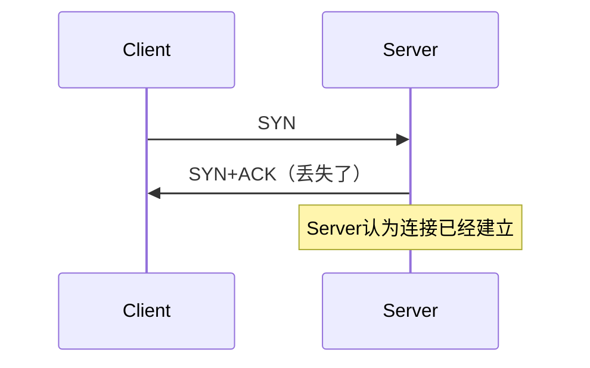
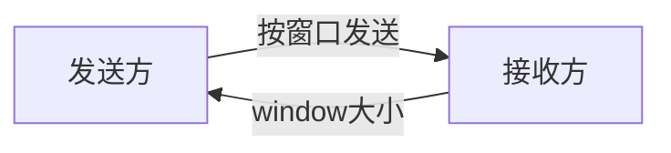
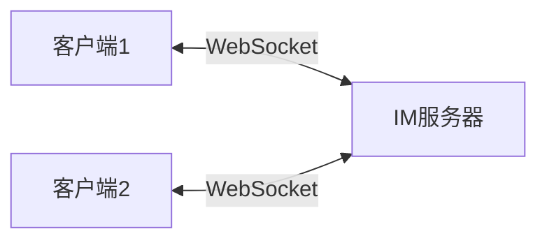

# 计算机网络体系结构

OSI、TCP/IP两种参考模型，最常接触的是适于教学的五层模型


----

# TCP 与 UDP

## 简述 TCP

TCP（Transmission Control Protocol，传输控制协议）是**面向连接、可靠、基于字节流**的传输层协议。
在正式传输数据前，需要先建立连接（三次握手），传输完成后还需要断开连接（四次挥手）。 ([CSDN博客](https://blog.csdn.net/weixin_45074807/article/details/133935824?utm_source=chatgpt.com))

TCP 的核心目标：

- 保证数据不丢失
- 保证数据按顺序到达
- 保证数据不重复
- 自动重传丢失的数据

TCP 为了实现可靠性，引入了：

- 序列号（Sequence Number）
- ACK 确认机制
- 超时重传
- 滑动窗口
- 流量控制
- 拥塞控制

典型应用：

- HTTP / HTTPS
- MySQL
- Redis
- 文件传输
- 邮件

------

## 简述 UDP

UDP（User Datagram Protocol，用户数据报协议）是**无连接、不可靠、面向报文**的传输层协议。 ([腾讯云](https://cloud.tencent.com/developer/article/1355783?utm_source=chatgpt.com))

特点：

- 不建立连接
- 直接发送数据
- 不保证是否到达
- 不保证顺序
- 不重传
- 开销小、速度快

UDP 更强调：

> “尽快发送，而不是一定送达”

典型应用：

- 视频直播
- 语音通话
- 游戏实时同步
- DNS 查询
- DHCP

------

## 区别与适合的场景

|    对比项    |    TCP     |  UDP   |
| :----------: | :--------: | :----: |
|   是否连接   |  面向连接  | 无连接 |
|   是否可靠   |    可靠    | 不可靠 |
|   是否有序   |    有序    |  无序  |
|   是否重传   |     会     |  不会  |
|     速度     |    较慢    |   快   |
|   数据形式   |   字节流   | 数据报 |
| 是否流量控制 |     有     |   无   |
| 是否拥塞控制 |     有     |   无   |
|   首部大小   | 20~60 字节 | 8 字节 |

------

### TCP 适合

适用于：

> “宁愿慢一点，也必须准确”

例如：

- 文件传输
- 登录请求
- 数据库通信
- HTTP 请求

因为：

- 数据不能丢
- 顺序必须正确

------

### UDP 适合

适用于：

> “允许少量丢失，但必须实时”

例如：

- 视频会议
- 直播
- 在线游戏
- 语音聊天

原因：

如果视频卡 1 秒再播放，用户体验会非常差。

所以：

- 少量丢包能接受
- 延迟低更重要

------

# TCP 三次握手、四次挥手

------

## TCP 三次握手

### 流程


------

### 第一次握手

客户端发送：

```text
SYN=1
seq=x
```

含义：

> “我要建立连接”

客户端进入：

```text
SYN_SENT
```

------

### 第二次握手

服务端回复：

```text
SYN=1
ACK=1
seq=y
ack=x+1
```

含义：

- 收到了客户端 SYN
- 服务端也想建立连接

服务端进入：

```text
SYN_RCVD
```

------

### 第三次握手

客户端发送：

```text
ACK=1
ack=y+1
```

含义：

> “我收到了你的 SYN”

双方进入：

```text
ESTABLISHED
```

连接建立。

------

## 为什么必须三次握手？

核心原因：

> 双方都要确认：
>
> - 自己能发
> - 自己能收
> - 对方能发
> - 对方能收

------

### 两次握手的问题

如果只有两次：



问题：

客户端可能根本没收到第二次响应。

此时：

- 客户端认为连接失败
- 服务端认为连接成功

会导致：

- 服务端资源浪费
- 出现“半连接”

------

### 经典面试回答

第三次握手的必要性

> 防止已经失效的重复连接请求（例如网络延迟的冗余`SYN`报文）导致服务器误开无效连接

为什么不是两次？

> 两次无法确认客户端是否具备接收能力。
>
> 两次握手无法防止历史`SYN`报文干扰，可能导致服务器资源浪费

为什么不是四次？

> 三次已经能确认双方收发能力，第四次多余。

------

# TCP 四次挥手

TCP 是全双工通信：

- Client → Server
- Server → Client

两个方向都要单独关闭。

所以通常需要四次挥手。

------

## 流程


------

## 第四次挥手的必要性

第四次挥手是客户端对服务器FIN报文的确认（ACK），如果缺少这一步，服务器发送FIN后（进入 **LAST-ACK** 状态）将无法确认客户端是否收到了它的FIN。如果该FIN丢失，客户端将永远停留在 **FIN-WAIT-2** 状态；如果客户端收到了FIN但其ACK（第四次挥手）丢失，服务器将因收不到ACK而超时重传FIN。客户端必须能够处理这种情况并重发ACK。

----

## 为什么不是五次

客户端和服务器各发一次`FIN`和`ACK`，能明确关闭双向连接。五次挥手会增加冗余步骤（例如重复确认），但不会提升可靠性

------

## 如果只有三次挥手？

① 当客户端发`FIN`后，服务器可能仍有数据要发送，需先回复`ACK`（第二次挥手），处理完数据再发`FIN`（第三次挥手）。若合并第二次和第三次挥手（直接发`FIN + ACK`），可能迫使服务器立即关闭，导致数据丢失。
② **RFC 793**规范了TCP是**全双工协议**，需独立关闭每个方向的数据流。

------

## TIME_WAIT 为什么存在？

客户端最后 ACK 后不会立刻关闭。

而是进入：

```text
TIME_WAIT
```

作用：

### 1. 防止最后 ACK 丢失

如果 ACK 丢失：

- 服务端会重发 FIN
- 客户端还能重新 ACK

------

### 2. 防止旧连接数据污染新连接

等待旧网络包彻底消失。

### 一句面试标准回答（建议背）

`TIME_WAIT` 是 TCP 主动关闭方在发送最后 ACK 后进入的状态，持续 2MSL。它有两个核心作用：

1. 防止最后 ACK 丢失，保证连接可靠关闭；
2. 防止旧连接中的延迟报文污染新的 TCP 连接。

之所以等待 2MSL，是为了保证网络中所有旧报文都已经彻底消失。

------

# TCP 流量控制、拥塞控制

------

# TCP 流量控制

目的：

> 别把接收方撑爆。

TCP 有三个窗口：

```text
发送窗口 swnd
拥塞窗口 cwnd
接收窗口 rwnd
```

------

## 原理

接收方告诉发送方：

```text
我还能接收多少数据
```

例如：

```text
rwnd = 5000
```

表示：

还能接收 5000 字节。

------

## 效果



如果接收方处理不过来：

```text
rwnd 会变小
```

发送方就会降速。

最后的发送窗口 = min(rwnd, cwnd)

------

# TCP 拥塞控制

目的：

> 别把网络打爆。

流量控制关注：

```text
接收方
```

拥塞控制关注：

```text
整个网络
```

------

## 四大算法（高频面试）

### 1. 慢启动

开始不知道网络能力。

所以：

```text
1 -> 2 -> 4 -> 8
```

指数增长。

------

### 2. 拥塞避免

达到阈值（慢开始门限ssthresh）后：

线性增长。

```text
8 -> 9 -> 10
```

------

### 3. 快重传

收到连续三个重复 ACK：

立即重传。

不用等超时。

------

### 4. 快恢复

发生丢包后：

不重新慢启动。

而是：

直接进入拥塞避免。

------

## 整体过程


------

# HTTPS 是什么？ 和 HTTP 的区别

HTTPS：

```text
HTTP + TLS/SSL
```

本质：

> 在 HTTP 和 TCP 之间加了一层加密。

----

## HTTP 的常见状态码

- 面试最高频的十个HTTP状态码如下：
  1. **200**：**OK**，表示请求已被**正确**处理（如网页加载成功、API 成功返回数据）。
  2. **301**：**Moved Permanently**，表示资源**永久**重定向到新 URL（如网站更换域名，旧链接跳转）。
  3. **302**：**Found**，表示资源**临时**重定向到新 URL（如登录后跳转回原页面）。
  4. **304**：**Not Modified**，表示资源**未修改**，客户端直接使用本地缓存（缓存机制的核心状态码）。
  5. **400**：**Bad Request**，表示客户端**请求**格式**错误**（如参数缺失、JSON 语法错误）。
  6. **401**：**Unauthorized**，表示**未认证**（如未登录时访问需权限的接口）。
  7. **403**：**Forbidden**，表示**无权限**访问资源（如普通用户访问管理员接口）。
  8. **404**：**Not Found**，表示资源**不存在**（如 URL 路径错误、文件被删除）。
  9. **500**：**Internal Server Error**，表示**服务器内部错误**（如代码异常、数据库崩溃）。
  10. **503**：**Service Unavailable**，表示**服务暂时不可用**（如服务器维护、过载熔断）。

----

## HTTP 常见请求方式

| 请求方式 |      主要作用       |                  特点                  |               适用场景               |
| :------: | :-----------------: | :------------------------------------: | :----------------------------------: |
|   GET    |      获取资源       | 参数放 URL；通常无请求体；幂等；可缓存 | 查询数据、获取文章列表、查看商品详情 |
|   POST   | 提交数据 / 创建资源 |  参数通常在请求体；非幂等；常用于新增  |     用户登录、提交表单、创建订单     |
|   PUT    |    整体更新资源     |        幂等；通常要求传完整资源        |     更新用户信息、覆盖式修改数据     |
|  PATCH   |    部分更新资源     |   只修改部分字段；一般比 PUT 更轻量    |      修改昵称、更新某个状态字段      |
|  DELETE  |      删除资源       |           幂等；删除指定资源           |     删除评论、删除用户、删除文件     |
|   HEAD   |     获取响应头      |       与 GET 类似，但不返回 body       |    检查资源是否存在、获取文件大小    |
| OPTIONS  |   查询支持的方法    |       返回服务器允许的 HTTP 方法       |     CORS 预检请求、接口能力探测      |

------

## HTTP 的问题

HTTP 明文传输：

```text
用户名
密码
Cookie
```

都可能被窃听。

------

## HTTPS 解决了什么？

### 1. 加密

防止被偷看。

------

### 2. 身份认证

确认服务器不是假的。

通过：

```text
数字证书 CA
```

------

### 3. 防篡改

防止中间人修改数据。

------

## HTTP vs HTTPS

|        **对比维度**         |          **HTTP**           |                 **HTTPS**                  |
| :-------------------------: | :-------------------------: | :----------------------------------------: |
|      **加密与安全性**       |      明文传输，无加密       | 使用 SSL/TLS 加密，确保数据机密性和完整性  |
|       **协议与端口**        |       默认端口 **80**       |              默认端口 **443**              |
|     **证书与身份验证**      |         无证书要求          |     需 CA 签发数字证书，验证服务器身份     |
| **协议版本与 HTTPS 强制性** | HTTP/1.1、HTTP/2 可明文传输 | HTTP/3 强制使用 HTTPS；HTTP/2 默认需 HTTPS |
|    **浏览器行为与 SEO**     |       标记为“不安全”        |       显示“安全”标识，提升 SEO 排名        |

------

# HTTP1.1 vs HTTP2

|   对比项   | HTTP1.1 | HTTP2  |
| :--------: | :-----: | :----: |
|  传输格式  |  文本   | 二进制 |
|  多路复用  | 不支持  |  支持  |
|  头部压缩  | 不支持  | HPACK  |
|  队头阻塞  |  存在   |  改善  |
| 服务器推送 |   无    |   有   |

------

## HTTP1.1 问题

一个 TCP 连接：

```text
同一时刻只能处理一个请求
```

容易：

```text
队头阻塞
```

------

## HTTP2 多路复用

1. **多路复用（Multiplexing）**：允许在 **单个**TCP连接 上并行交错发送 **多个**请求和响应 ，解决队头阻塞，提升传输效率。
2. **头部压缩（Header Compression）**：引入了 **HPACK** 压缩算法，减少冗余头部数据，节省带宽。
3. **二进制协议（Binary Protocol）**：采用 **二进制帧** 替代 HTTP/1.1的 文本协议，使得解析更快更高效。
4. **流优先级（Stream Prioritization）**：允许按 **权重和依赖关系** 优先传输关键资源，优化用户体验。
5. **服务器推送（Server Push）**：服务器 **主动推送** 资源给客户端，而不需要客户端明确请求，减少额外请求延迟。


------

# HTTPS TLS 握手流程

------

- HTTPS 的工作原理：

  - HTTPS (Hypertext Transfer Protocol Secure)：HTTPS 通过在 HTTP 协议和 TCP 协议之间加入 **SSL/TLS 协议层**来实现安全传输。它确保数据在客户端和服务器之间的传输过程中得到**加密**、**身份验证**和**完整性保护**，使得数据在传输过程中无法被窃听或篡改。HTTPS 默认使用 `443` 端口。

- HTTPS 实现数据加密的步骤：

  1. **建立 TCP 连接：** 客户端首先通过 TCP 三次握手与服务器建立连接，这是可靠传输的基础。
  2. **SSL/TLS 握手：** 建立 TCP 连接后，客户端和服务器开始进行 SSL/TLS 握手，协商加密算法和密钥。**握手过程如下：**
     **① Client Hello（客户端问候）：** 客户端发送 Client Hello 消息，包含客户端支持的 **SSL/TLS 版本**、**加密算法套件列表**、**随机数**等信息。
     **② Server Hello（服务器问候）：** 服务器从客户端提供的加密算法套件列表中选择一个，并返回服务器的 **SSL/TLS 版本**、**选择的加密算法套件**、**随机数**等信息。
     **③ Certificate（证书）：** 服务器将自己的数字证书发送给客户端。 证书包含了服务器的公钥、域名、有效期等信息。
     **④ Certificate Verification（证书验证）：** 客户端验证服务器的数字证书是否有效，包括：证书是否由受信任的 CA 机构颁发；证书是否过期；证书上的域名是否与服务器域名一致。
     **⑤ Key Exchange（密钥交换）：** 客户端生成一个**预主密钥 (Pre-master secret)** ，使用服务器证书中的**公钥**对其进行加密，然后发送给服务器 (注意：不同的密钥交换算法会进行不同的处理，例如 RSA, Diffie-Hellman 等) 。服务器接收到加密的预主密钥后，使用自己的**私钥**进行解密，获得明文的预主密钥（这一步是在服务器内部完成的，不会产生额外的网络消息）
     **⑥ Session Key Generation（会话密钥生成）：** 客户端和服务器分别使用客户端随机数、服务器随机数和**预主密钥**，通过相同的算法生成**会话密钥（Session Key）**。 会话密钥用于后续加密数据的对称加密算法。
     **⑦ Change Cipher Spec（更改密码规范）：** 客户端和服务器分别发送 Change Cipher Spec 消息，通知对方后续使用**加密通信**。
     **⑧ Finished（完成）：** 客户端和服务器分别发送 Finished 消息，**验证**握手过程是否成功。
  3. **加密通信：** 握手完成后，客户端和服务器使用会话密钥对后续传输的数据进行加密和解密，保证数据传输的安全。

  

------

# WebSocket 和 HTTP 区别

|      对比项      |   HTTP   | WebSocket |
| :--------------: | :------: | :-------: |
|     通信方式     | 请求响应 |  全双工   |
|    是否长连接    | 通常不是 |    是     |
|  服务端主动推送  |  不支持  |   支持    |
| 是否适合实时通信 |   一般   | 非常适合  |

------

## WebSocket 建立过程

先通过 HTTP：

```http
Upgrade: websocket
```

升级协议。

之后：

直接走 WebSocket 长连接。

------

# 为什么 WebSocket 适合 IM 长连接？

IM（即时通讯）要求：

- 实时推送
- 低延迟
- 高频通信

如果用 HTTP：

客户端需要不断轮询：

```text
有没有新消息？
有没有新消息？
```

浪费资源。

------

## WebSocket 优势

### 1. 长连接

只建立一次 TCP。

------

### 2. 服务端主动推送

新消息能立刻推送。

------

### 3. 全双工

双方同时发消息。

------

## IM 架构中的 WebSocket



------

# DHCP 协议

## DHCP 简述

DHCP（Dynamic Host Configuration Protocol）：

> 动态给设备分配 IP 地址。

否则：

每台电脑都手动配 IP。

非常麻烦。

------

## DHCP 工作流程


- `DHCP DISCOVER`：DHCP 客户广播消息，询问有没有 DHCP 服务器能为其提供 IP
- `DHCP OFFER`：DHCP 服务器广播消息（带有分配的IP，但客户还不能用），让客户知道有服务器能为其提供 IP
- `DHCP REQUEST`：DHCP 客户广播信息，让服务器为其提供 IP
- `DHCP ACK`：DHCP 服务器广播消息，允许客户使用新 IP（这之后客户才能真正使用`DHCP OFFER` 中得到的 IP）

------

# IPv4 与 IPv6

| 对比项   | IPv4        | IPv6        |
| -------- | ----------- | ----------- |
| 地址长度 | 32 位       | 128 位      |
| 地址数量 | 少          | 极多        |
| 写法     | 192.168.1.1 | 2001:db8::1 |
| NAT      | 常用        | 基本不需要  |
| 广播     | 支持        | 不支持广播  |

------

## 为什么 IPv6 出现？

IPv4 地址：

不够用了。

IPv6：

```text
2^128
```

地址几乎无限。

------

## IPv6 优势

### 1. 地址更多

根本用不完。

------

### 2. 路由效率更高

头部更简洁。

------

### 3. 更适合物联网

每个设备都能有公网 IP。

----

## 面试可能问

为什局域网的IP通常以192.168开头？

- 192.168.x.x 属于 RFC1918 规定的私有 IP 地址段之一，专门用于局域网内部通信，不能直接在公网路由。

  之所以家庭网络大量使用 192.168 开头，是因为路由器厂商通常默认选择这个私有网段，并不是协议强制要求，像10.0.0.5，172.20.1.8这些也是局域网。

  私有 IP 的存在主要是为了解决 IPv4 地址不足问题，局域网设备通过 NAT 共享一个公网 IP 访问互联网。

------

# 跨域原理 + Gin CORS 中间件解决思路

------

# 什么是跨域？

浏览器的：

```text
同源策略
```

限制了：

不同源之间的访问。

------

## 什么叫同源？

必须同时满足：

- 协议相同
- 域名相同
- 端口相同

例如：

```text
http://a.com:8080
```

访问：

```text
http://a.com:9090
```

也算跨域。

------

# 为什么浏览器要限制跨域？

防止恶意网站：

盗取用户信息。

例如：

用户登录银行网站后：

恶意网站偷偷发请求。

------

# CORS 原理

服务器告诉浏览器：

```text
我允许这个域访问
```

通过响应头：

```http
Access-Control-Allow-Origin
```

------

# Gin CORS 中间件

Go 中通常使用：

[gin-contrib/cors 官方仓库](https://github.com/gin-contrib/cors?utm_source=chatgpt.com)

------

## 示例

```go
import (
	"github.com/gin-contrib/cors"
	"github.com/gin-gonic/gin"
	"time"
)

func main() {
	r := gin.Default()

	r.Use(cors.New(cors.Config{
		AllowOrigins:     []string{"http://localhost:5173"}, // 允许的 url
		AllowMethods:     []string{"GET", "POST", "PUT", "DELETE"}, // 允许的请求方式
		AllowHeaders:     []string{"Origin", "Content-Type", "Authorization"}, // 允许携带的请求头
		AllowCredentials: true,
		MaxAge:           12 * time.Hour,
	}))

	r.Run(":8080")
}
```

------

## 面试常问

### 为什么 Postman 不存在跨域？

因为：

```text
跨域是浏览器的安全策略
```

Postman 不是浏览器。

------

### CORS 是谁拦截的？

浏览器。

不是服务器。

------

### OPTIONS 预检请求是什么？

复杂请求前：

浏览器先问服务器：

```text
你允许我跨域吗？
```

这就是：

```http
OPTIONS
```

预检请求。